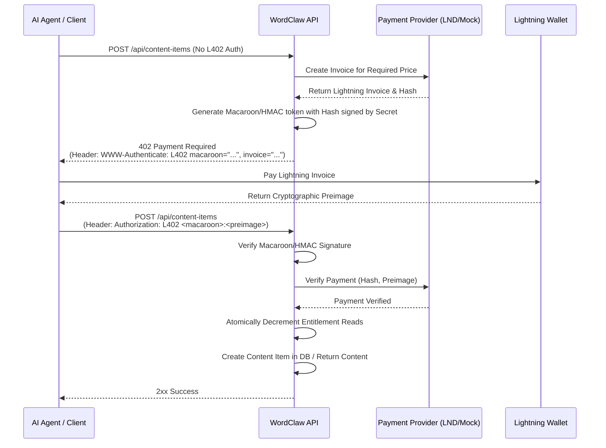

# L402 Payments And Entitlements

This document describes the core L402 payment lane within WordClaw. L402 is an HTTP `402 Payment Required` pattern that combines Macaroons for authorization and Lightning Network invoices for payment-gated access.

## Architecture Overview

The L402 integration in WordClaw acts as the built-in Lightning-gated access layer for paid routes and offer flows. When enabled on qualifying resources, it challenges requests with a `402 Payment Required` response, providing a Lightning invoice and a Macaroon (or equivalent token). Once the client pays the invoice, they present the Macaroon and the payment preimage in the `Authorization: L402` header to access the resource.

### Components

1.  **Payment Provider (`src/interfaces/payment-provider.ts`)**: An interface defining the contract for generating Lightning invoices and returning explicit states (`pending`, `paid`, `expired`, `failed`). This enables switching underlying Lightning backends.
2.  **Payment Providers (`src/services/*-payment-provider.ts`)**: We implement both a test/dev `mock-payment-provider.ts` and a production `lnbits-payment-provider.ts` that connects to Lightning backends.
    *   **Self-Hosted Node Provisioning (LNbits)**: If you are running your own Lightning node (or using a managed LNbits instance), you can provision WordClaw to use it as the production L402 backend. Set the following environment variables:
        *   `PAYMENT_PROVIDER=lnbits`
        *   `LNBITS_BASE_URL=https://your-lnbits-domain.com` (or your internal network URL/IP)
        *   `LNBITS_ADMIN_KEY=your_wallet_admin_key`
    *   When `NODE_ENV=production` is set, WordClaw automatically defaults to requiring the `lnbits` provider to prevent mocked payments from succeeding in production unless explicitly overridden.
3.  **L402 Middleware (`src/middleware/l402.ts`)**: A Fastify middleware that handles the core L402 logic. It generates true Macaroons (with tenant and route caveats) and challenges requests lacking payments.
4.  **Payment Settlement & Reconciliation**: Support is built for asynchronous settlement webhooks (e.g. `LNbits`) and a timed background reconciliation worker (`PaymentReconciliationWorker`) that cleans up stale pending payments deterministically.

## L402 Payment Flow Sequence Diagram

```mermaid
sequenceDiagram
    participant Client as AI Agent / Client
    participant Server as WordClaw API
    participant Payment as Payment Provider (LND/Mock)
    participant Wallet as Lightning Wallet

    %% 1. Unauthenticated Request
    Client->>Server: POST /api/content-items (No L402 Auth)
    Server->>Payment: Create Invoice for Required Price
    Payment-->>Server: Return Lightning Invoice & Hash
    Server->>Server: Generate Macaroon/HMAC token with Hash signed by Secret
    Server-->>Client: 402 Payment Required <br> (Header: WWW-Authenticate: L402 macaroon="...", invoice="...")

    %% 2. Payment
    Client->>Wallet: Pay Lightning Invoice
    Wallet-->>Client: Return Cryptographic Preimage

    %% 3. Authenticated Request
    Client->>Server: POST /api/content-items <br> (Header: Authorization: L402 <macaroon>:<preimage>)
    Server->>Server: Verify Macaroon/HMAC Signature
    Server->>Payment: Verify Payment (Hash, Preimage)
    Payment-->>Server: Payment Verified
    Server->>Server: Atomically Decrement Entitlement Reads
    Server->>Server: Create Content Item in DB / Return Content
    Server-->>Client: 2xx Success
```

## Offer And Entitlement Flow

For paid content purchases, L402 is the currently enabled settlement rail in the RFC 0015 flow:

1. `POST /api/offers/:id/purchase` creates:
- `payments` in `pending`
- `entitlements` in `pending_payment`
- a `402` challenge (`WWW-Authenticate: L402 ...`)

2. `POST /api/offers/:id/purchase/confirm` verifies `Authorization: L402 <macaroon>:<preimage>` and transitions:
- `payments` to `paid`
- `entitlements` to `active`

3. `GET /api/content-items/:id` enforces offer-first entitlement reads when active offers exist; entitlement metering and denial reasons are handled in the content route logic (`ENTITLEMENT_EXPIRED`, `ENTITLEMENT_EXHAUSTED`, etc.).

Legacy pay-per-request behavior remains available for routes or items where no active offers are present, but it now sits inside the same supported payment lane rather than outside the default product story.

### Default Accessibility Policy

In WordClaw, paid content is not universally guaranteed to be accessible forever—it depends on the License Policy attached to the purchased Offer. However, **the default policy is permanent, unlimited access** for the buyer. 

Unless explicitly configured otherwise by the publisher, the default `license_policies` enforce:
- **Unlimited Reads** (`maxReads`: `null`)
- **No Expiration** (`expiresAt`: `null`)
- **No Redistribution** (`allowRedistribution`: `false`)
- **No Platform Restrictions** (`allowedChannels`: `[]`)

If a publisher has not specified an Offer but has instead set a `basePrice` directly on the `ContentType` schema, WordClaw falls back to its legacy L402 "pay-per-request" behavior safely. This behaves exactly like an unlimited default offer—the buyer pays the invoice once, receives the L402 Macaroon, and that Macaroon grants permanent read access to the created item.

## Future Enhancements

*   **LND gRPC Native Support**: Add an additional production payment provider communicating natively over gRPC with LND implementations instead of standard REST.
*   **Agent SDK Integration**: Update the WordClaw Agent SDK to automatically handle L402 challenges, pay invoices, and append the required `Authorization` header to subsequent requests natively.
*   **Coinbase AgentKit Support**: Expose custom ActionProviders (demonstrated in `demos/agentkit-l402-client.ts`) that bridge popular LLM toolkits (Langchain, Autotools) to WordClaw LLM execution paths via autonomous Lightning wallet intercepts. 
    * *Note on Provisioning:* Because AgentKit is modular, implementing this demo does **not** require a Coinbase Developer Platform (CDP) API key. Instead of injecting the CDP EVM wallet tools, we inject our own custom `LightningL402ActionProvider`. The Langchain agent only needs an `OPENAI_API_KEY` to run the reasoning loop. In local development, the custom provider resolves invoices using WordClaw's mock preimage (`mock_preimage_12345`), but in production, this same modular provider could be configured to pass API credentials (e.g., `STRIKE_API_KEY` or an Alby OAuth token) to hit a live Lightning network backend.

## Testing

Unit and integration tests for the middleware and reconciliation verify the challenge generation, the caveat parsing, and the state-machine transition handling. Test files correspond with `src/middleware/__tests__/`, `src/services/__tests__/`, and the `L402` integration tests.
