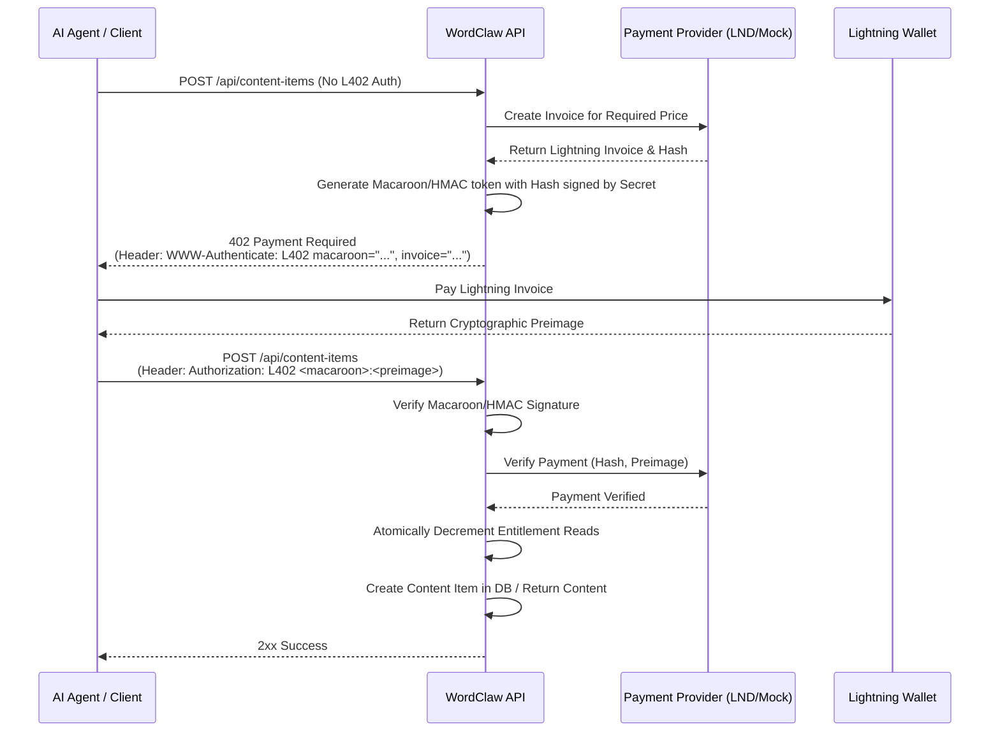

# L402 Protocol Implementation

This document describes the implementation of the L402 protocol within Wordclaw. The L402 protocol is an HTTP 402 Payment Required standard that combines Macaroons for authorization and Lightning Network invoices for micro-payments.

## Architecture Overview

The L402 integration in Wordclaw acts as a metering and monetization layer for API endpoints. It challenges unauthenticated requests with a `402 Payment Required` response, providing a Lightning invoice and a Macaroon (or equivalent token). Once the client pays the invoice, they present the Macaroon and the payment preimage in the `Authorization: L402` header to access the resource.

### Components

1.  **Payment Provider (`src/interfaces/payment-provider.ts`)**: An interface defining the contract for generating Lightning invoices and returning explicit states (`pending`, `paid`, `expired`, `failed`). This enables switching underlying Lightning backends.
2.  **Payment Providers (`src/services/*-payment-provider.ts`)**: We implement both a test/dev `mock-payment-provider.ts` and a production `lnbits-payment-provider.ts` which connects to real Lightning backends.
3.  **L402 Middleware (`src/middleware/l402.ts`)**: A Fastify middleware that handles the core L402 logic. It generates true Macaroons (with tenant and route caveats) and challenges requests lacking payments.
4.  **Payment Settlement & Reconciliation**: Support is built for asynchronous settlement webhooks (e.g. `LNbits`) and a timed background reconciliation worker (`PaymentReconciliationWorker`) that cleans up stale pending payments deterministically.

## L402 Payment Flow Sequence Diagram

## Agentic Content Licensing (RFC 0004)

For paid content purchases, L402 is used as the currently enabled settlement rail in RFC 0015 flow:

1. `POST /api/offers/:id/purchase` creates:
- `payments` in `pending`
- `entitlements` in `pending_payment`
- a `402` challenge (`WWW-Authenticate: L402 ...`)

2. `POST /api/offers/:id/purchase/confirm` verifies `Authorization: L402 <macaroon>:<preimage>` and transitions:
- `payments` to `paid`
- `entitlements` to `active`

3. `GET /api/content-items/:id` enforces offer-first entitlement reads when active offers exist; entitlement metering and denial reasons are handled in the content route logic (`ENTITLEMENT_EXPIRED`, `ENTITLEMENT_EXHAUSTED`, etc.).

Legacy L402 pay-per-request behavior remains for routes/items where no active offers are present.

## Future Enhancements (Phase 6 Roadmap)

*   **LND gRPC Native Support**: Add an additional production payment provider communicating natively over gRPC with LND implementations instead of standard REST.
*   **Agent SDK Integration**: Update the Wordclaw Agent SDK to automatically handle L402 challenges, pay invoices, and append the required `Authorization` header to subsequent requests natively.

## Testing

Unit and integration tests for the middleware and reconciliation verify the challenge generation, the caveat parsing, and the state-machine transition handling. Test files correspond with `src/middleware/__tests__/`, `src/services/__tests__/`, and the `L402` integration tests.
