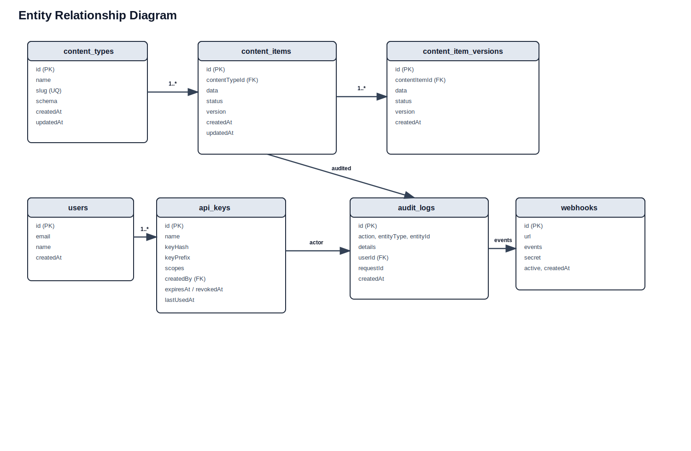
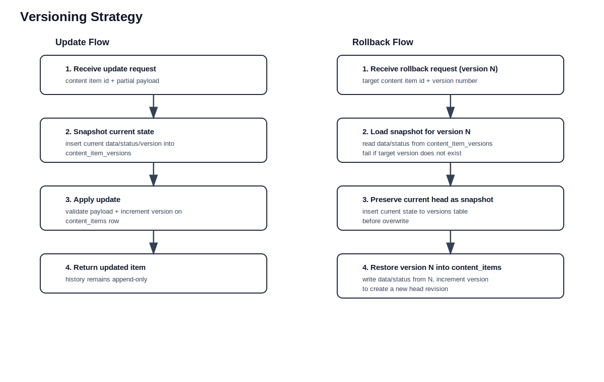

# Data Model

## Entity Relationship Diagram

```
┌──────────────────┐       ┌──────────────────────┐       ┌───────────────────────────┐
│   content_types  │       │    content_items      │       │  content_item_versions    │
├──────────────────┤       ├──────────────────────┤       ├───────────────────────────┤
│ id          PK   │──1:*──│ id             PK    │──1:*──│ id                PK     │
│ name             │       │ contentTypeId  FK    │       │ contentItemId     FK     │
│ slug        UQ   │       │ data                 │       │ data                     │
│ schema           │       │ status               │       │ status                   │
│ createdAt        │       │ version              │       │ version                  │
│ updatedAt        │       │ createdAt            │       │ createdAt                │
└──────────────────┘       │ updatedAt            │       └───────────────────────────┘
                           └──────────────────────┘

┌──────────────────┐       ┌──────────────────────┐
│     users        │       │     api_keys         │
├──────────────────┤       ├──────────────────────┤
│ id          PK   │──1:*──│ id             PK    │
│ name             │       │ name                 │
│ email            │       │ keyHash              │
│ createdAt        │       │ keyPrefix            │
│ updatedAt        │       │ scopes               │
└──────────────────┘       │ createdBy      FK    │
                           │ expiresAt            │
                           │ revokedAt            │
                           │ lastUsedAt           │
                           │ createdAt            │
                           └──────────────────────┘

┌──────────────────┐       ┌──────────────────────┐
│   audit_logs     │       │     webhooks         │
├──────────────────┤       ├──────────────────────┤
│ id          PK   │       │ id             PK    │
│ action           │       │ url                  │
│ entityType       │       │ events               │
│ entityId         │       │ secret               │
│ details          │       │ active               │
│ userId      FK   │       │ createdAt            │
│ requestId        │       │ updatedAt            │
│ createdAt        │       └──────────────────────┘
└──────────────────┘

┌──────────────────┐       ┌──────────────────────┐
│    payments      │       │ policy_decision_logs │
├──────────────────┤       ├──────────────────────┤
│ id          PK   │       │ id             PK    │
│ paymentHash UQ   │       │ principalId          │
│ paymentRequest   │       │ operation            │
│ amountSatoshis   │       │ resourceType         │
│ status           │       │ resourceId           │
│ resourcePath     │       │ environment          │
│ actorId          │       │ outcome              │
│ details          │       │ remediation          │
│ createdAt        │       │ policyVersion        │
│ updatedAt        │       │ evaluationDurationMs │
└──────────────────┘       │ createdAt            │
                           └──────────────────────┘
```

Rendered image:



## Tables

### content_types

Defines the shape of content items via a JSON schema.

| Column      | Type      | Notes                     |
|-------------|-----------|---------------------------|
| `id`        | serial PK | Auto-increment            |
| `name`      | text      | Required                  |
| `slug`      | text      | Unique, URL-safe          |
| `schema`    | text      | JSON schema string        |
| `createdAt` | timestamp | Default `now()`           |
| `updatedAt` | timestamp | Updated on mutation       |

### content_items

Versioned content entities. The `data` field is validated against the parent content type's schema on every write.

| Column          | Type      | Notes                                  |
|-----------------|-----------|----------------------------------------|
| `id`            | serial PK |                                        |
| `contentTypeId` | integer   | FK → `content_types.id`               |
| `data`          | text      | JSON content                           |
| `status`        | text      | `draft`, `published`, or `archived`    |
| `version`       | integer   | Auto-incremented on update             |
| `createdAt`     | timestamp |                                        |
| `updatedAt`     | timestamp |                                        |

### content_item_versions

Immutable snapshots created before every content item update. Cascade-deleted when the parent item is deleted.

| Column          | Type      | Notes                          |
|-----------------|-----------|--------------------------------|
| `id`            | serial PK |                                |
| `contentItemId` | integer   | FK → `content_items.id`       |
| `data`          | text      | Snapshot of data at version    |
| `status`        | text      | Snapshot of status at version  |
| `version`       | integer   | Version number                 |
| `createdAt`     | timestamp |                                |

### audit_logs

Every mutation emits an audit record.

| Column       | Type      | Notes                                       |
|--------------|-----------|---------------------------------------------|
| `id`         | serial PK |                                             |
| `action`     | text      | `create`, `update`, `delete`, `rollback`    |
| `entityType` | text      | `content_type`, `content_item`, `webhook`, `api_key` |
| `entityId`   | integer   |                                             |
| `details`    | text      | JSON payload of the change                  |
| `userId`     | integer   | FK → API key ID (nullable)                  |
| `requestId`  | text      | Correlates with `x-request-id` header       |
| `createdAt`  | timestamp |                                             |

### api_keys

Database-managed authentication keys with scope-based authorization.

| Column       | Type      | Notes                                 |
|--------------|-----------|---------------------------------------|
| `id`         | serial PK |                                       |
| `name`       | text      | Human-readable label                  |
| `keyHash`    | text      | SHA-256 hash of the raw key           |
| `keyPrefix`  | text      | First 8 chars for identification      |
| `scopes`     | text      | Comma-separated scope list            |
| `createdBy`  | integer   | FK → `users.id` (nullable)           |
| `expiresAt`  | timestamp | Nullable                              |
| `revokedAt`  | timestamp | Set on revocation                     |
| `lastUsedAt` | timestamp | Updated on each authenticated request |
| `createdAt`  | timestamp |                                       |

### webhooks

Event delivery endpoints with HMAC signing.

| Column      | Type      | Notes                                |
|-------------|-----------|--------------------------------------|
| `id`        | serial PK |                                      |
| `url`       | text      | Callback URL                         |
| `events`    | text      | Comma-separated event patterns       |
| `secret`    | text      | HMAC-SHA256 signing key              |
| `active`    | boolean   | Delivery enabled/disabled            |
| `createdAt` | timestamp |                                      |
| `updatedAt` | timestamp |                                      |

### payments

Tracks Lightning Network (L402) invoice states across API interactions.

| Column           | Type      | Notes                                |
|------------------|-----------|--------------------------------------|
| `id`             | serial PK |                                      |
| `paymentHash`    | text      | Unique hash of the LN invoice        |
| `paymentRequest` | text      | The BOLT11 invoice string            |
| `amountSatoshis` | integer   | Cost in satoshis                     |
| `status`         | text      | `pending`, `paid`, or `consumed`     |
| `resourcePath`   | text      | The API route triggering the payment |
| `actorId`        | text      | Identity of the caller               |
| `details`        | jsonb     | Request context and agent headers    |
| `createdAt`      | timestamp |                                      |
| `updatedAt`      | timestamp |                                      |

### policy_decision_logs

Audit trail of PolicyEngine outcome evaluations for strict authorization parity.

| Column                 | Type      | Notes                                |
|------------------------|-----------|--------------------------------------|
| `id`                   | serial PK |                                      |
| `principalId`          | text      | Identity invoking the rule           |
| `operation`            | text      | Abstract capability (e.g. `content.write`) |
| `resourceType`         | text      | Type of resource being accessed      |
| `resourceId`           | text      | Specific resource                    |
| `environment`          | text      | `rest`, `graphql`, or `mcp`          |
| `outcome`              | text      | `allow`, `deny`, `challenge`         |
| `remediation`          | text      | Error resolution suggestions         |
| `policyVersion`        | text      | Semantic version of the engine       |
| `evaluationDurationMs` | integer   | P95 profiling data                   |
| `createdAt`            | timestamp |                                      |

## Versioning Strategy

```
Update request
     │
     ▼
  Save current (data, status, version) → content_item_versions
     │
     ▼
  Apply update, increment version
     │
     ▼
  Return updated item

Rollback request (to version N)
     │
     ▼
  Load version N snapshot from content_item_versions
     │
     ▼
  Save current state as new version snapshot
     │
     ▼
  Overwrite item with version N data, increment version
```

Rendered image:



Versions are append-only. Rollback does not delete history — it creates a new version that restores the old state.
