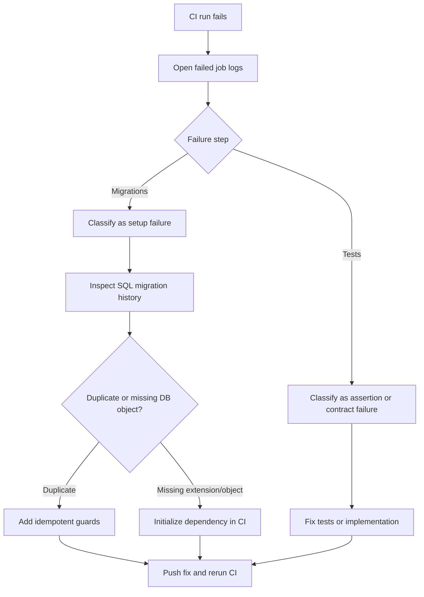

# CI Migrations and Test Failures: Problems and Solutions

This guide captures recurring CI failure patterns and the fixes that worked, so future contributors and automation can resolve incidents quickly.

> [!TIP]
> Treat this file as operational memory. Add new incidents with concrete dates, root causes, and prevention steps.

## Fast Triage Flow



## Incident: Duplicate Table Creation in Drizzle Migrations

- Date: 2026-02-25
- Symptom in CI:
  - Step: `Run Backend Migrations`
  - Error: `relation "api_keys" already exists`
- Root cause:
  - Multiple migration files created the same tables/objects without consistent idempotency guards.
  - Specifically:
    - `drizzle/0004_agent_hardening.sql` and `drizzle/0005_cute_shooting_star.sql`
    - `drizzle/0014_l402_production_readiness.sql` and `drizzle/0015_curved_zzzax.sql`

### Detection Commands

List all table creation statements:

```bash
rg -n '^CREATE TABLE( IF NOT EXISTS)? "' drizzle/*.sql
```

Find duplicated table names:

```bash
rg -n '^CREATE TABLE( IF NOT EXISTS)? "([^"]+)"' drizzle/*.sql \
  | sed -E 's/.*"([^"]+)".*/\1/' \
  | sort \
  | uniq -d
```

### Fix Pattern

Use idempotent SQL for migration safety in CI and fresh databases:

- `CREATE TABLE IF NOT EXISTS ...`
- `ALTER TABLE ... ADD COLUMN IF NOT EXISTS ...`
- `CREATE INDEX IF NOT EXISTS ...`
- Wrap constraint creation in `DO $$ ... IF NOT EXISTS ... THEN ALTER TABLE ... ADD CONSTRAINT ... END IF; $$`

Constraint-safe example:

```sql
DO $$ BEGIN
  IF NOT EXISTS (
    SELECT 1 FROM information_schema.table_constraints
    WHERE constraint_name = 'api_keys_created_by_users_id_fk'
  ) THEN
    ALTER TABLE "api_keys"
      ADD CONSTRAINT "api_keys_created_by_users_id_fk"
      FOREIGN KEY ("created_by") REFERENCES "public"."users"("id")
      ON DELETE no action ON UPDATE no action;
  END IF;
END $$;
```

## Incident Class: Missing `pgvector` Extension

- Symptom in CI:
  - Migration fails when creating `vector(1536)` columns or vector indexes.
  - Typical error: `type "vector" does not exist`.
- Root cause:
  - Database extension `vector` not initialized in the CI database before running migrations.

### Fix Pattern

Either:

1. Run the project migration entrypoint that initializes the extension first (`src/db/migrate.ts`), or
2. Add an explicit CI pre-step:

```bash
psql "$DATABASE_URL" -c 'CREATE EXTENSION IF NOT EXISTS vector;'
```

## Prevention Checklist for New Migrations

- Use idempotent DDL for shared objects where feasible.
- Avoid introducing duplicate object creation across migration files.
- If a migration already shipped to shared environments, prefer a corrective follow-up migration over rewriting history.
- Validate migration chain locally on a clean database before pushing.
- Keep CI migration command and local migration command behavior aligned (same bootstrap assumptions).

## Add New Incidents

When a new CI failure pattern appears, add:

1. Date and exact failing step.
2. Exact error text.
3. Root cause summary.
4. Detection command(s).
5. Fix pattern.
6. Prevention update.
