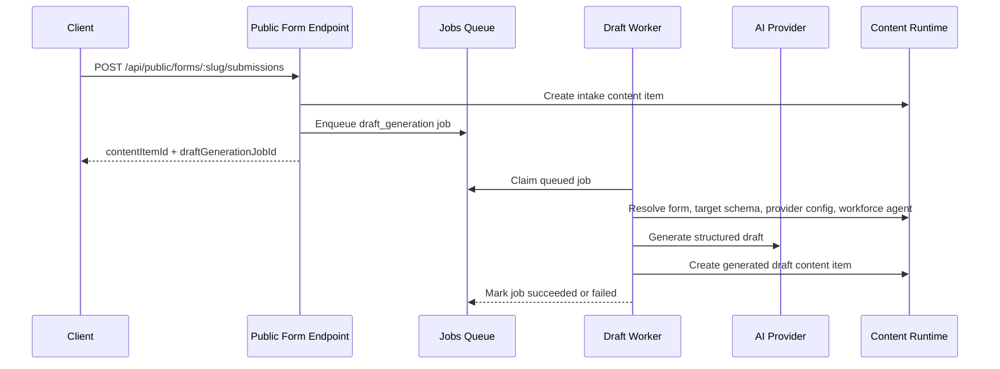

# Form-Driven Draft Generation

This guide explains how WordClaw turns a form submission into a background AI drafting job that creates a governed content item.

Use this flow when you want a tenant to accept structured intake from a website or internal form and hand that intake to a reusable workforce agent with a specific SOUL, provider, and model.

> [!IMPORTANT]
> This feature is asynchronous. `POST /api/public/forms/:slug/submissions` stores the intake item and returns `draftGenerationJobId`. The generated draft is created later by the jobs worker.

## What the Runtime Does

At a high level, the runtime composes five existing pieces:

1. A tenant-scoped external AI provider config such as `openai`, `anthropic`, or `gemini`
2. A tenant-scoped workforce agent with a stable slug, a purpose, a SOUL, and provider/model defaults
3. An intake content type for the submitted request
4. A target content type for the generated draft
5. A form definition whose `draftGeneration` block maps intake fields into the target draft job



## Prerequisites

Before wiring the feature:

- The tenant already exists and you are operating inside the correct domain.
- A platform-scoped or tenant-scoped supervisor can access the tenant.
- The jobs worker is running. Check `GET /api/deployment-status` and confirm `checks.backgroundJobs.workerStarted` is `true`.
- The target draft content type is a top-level JSON object schema with declared properties.
- If you use provider-backed generation, the tenant has configured its own provider credential. This is separate from any process-global `OPENAI_API_KEY` used for embeddings.

For discovery-first operator flows, use:

- `node dist/cli/index.js integrations guide`
- MCP `guide_task { "taskId": "manage-integrations" }`

Those surfaces now describe tenant AI provider provisioning, workforce agents, and the reactive `integration-admin` recipe for watching provisioning changes.

## Supervisor UI Path

The control-plane UI is split across three pages:

- **API Keys** at `/ui/keys`: WordClaw access keys and tenant onboarding
- **Agents** at `/ui/agents`: tenant-scoped AI provider credentials and reusable workforce agents
- **Forms** at `/ui/forms`: intake forms and draft-generation wiring

### 1. Configure the Provider

Open **Agents** and configure the provider the tenant wants to use.

Current provider types:

- `openai`
- `anthropic`
- `gemini`

The provider record is tenant-scoped. Each tenant keeps its own API key and optional default model.

### 2. Create a Workforce Agent

Still on **Agents**, create a workforce agent with:

- a stable slug or id
- a short purpose
- a SOUL that describes the agent's role
- a provider type
- a specific model for that provider, or a tenant default where supported
- optional instructions that further shape the output

This is the reusable runtime identity that forms reference later. It is the right place to encode intent such as `software-development-proposal-writer`, `sales-followup-drafter`, or `job-description-editor`.

### 3. Create the Target Draft Content Type

Create the content type that should receive the generated draft. For example:

- `proposal_draft`
- `response_letter`
- `job_posting_draft`

The current runtime expects a top-level object schema. For OpenAI-backed jobs, WordClaw now normalizes the target schema internally for strict structured outputs, so operators do not need to author an OpenAI-specific schema variant.

### 4. Create the Intake Form

Open **Forms** and create a form that points at the intake content type. Then enable `draftGeneration` and set:

- `targetContentTypeId`
- `workforceAgentId` or a direct provider override
- `fieldMap`
- `defaultData`
- optional post-generation workflow transition

Use `fieldMap` when intake field names do not match the target draft field names.

Example:

- intake `requirements` -> target `brief`
- intake `requestedTimeline` -> target `requestedTimeline`

If you want generated drafts to appear in the approval queue, also set `postGenerationWorkflowTransitionId` to a valid review transition for the target content type. Without that transition, the generated draft is created and stored, but it stays a plain draft and never becomes a review task.

When the same form also has `webhookUrl` configured, later approval or rejection emits:

- `form.draft_generation.review.approved`
- `form.draft_generation.review.rejected`

### 5. Submit the Public Form

Clients can now call the public form endpoint:

```bash
curl -X POST "https://your-host.example.com/api/public/forms/proposal-intake/submissions?domainId=7" \
  -H "Content-Type: application/json" \
  -d '{
    "data": {
      "company": "Lightheart Holding",
      "requirements": "Draft a concise software development proposal for a tenant-scoped AI content platform.",
      "requestedTimeline": "6 weeks",
      "budget": "EUR 20,000 to 35,000"
    }
  }'
```

The response includes:

- `contentItemId`
- `draftGenerationJobId`
- `status`
- `successMessage`

The generated draft is not returned inline.

### 6. Track the Job and Open the Generated Draft

Poll the job:

```bash
curl -H "x-api-key: YOUR_TENANT_ADMIN_KEY" \
  "https://your-host.example.com/api/jobs/5"
```

When the job succeeds, inspect:

- `data.result.generatedContentItemId`
- `data.result.strategy`
- `data.result.provider`

Then fetch the generated content item:

```bash
curl -H "x-api-key: YOUR_TENANT_ADMIN_KEY" \
  "https://your-host.example.com/api/content-items/11"
```

If the form configured `postGenerationWorkflowTransitionId`, the generated draft is also submitted into the review queue. Reviewers can approve or reject it from `/ui/approvals` or via `POST /api/review-tasks/:id/decide`.

That approval step is also the handoff point for notifying the original requester through the existing form webhook lane.

## REST Setup Path

The same flow is available over REST if you want to provision it programmatically.

### Configure the Provider

```bash
curl -X PUT "https://your-host.example.com/api/ai/providers/openai" \
  -H "x-api-key: YOUR_TENANT_ADMIN_KEY" \
  -H "Content-Type: application/json" \
  -d '{
    "apiKey": "YOUR_OPENAI_KEY",
    "defaultModel": "gpt-4.1-mini",
    "settings": {}
  }'
```

### Create the Workforce Agent

```bash
curl -X POST "https://your-host.example.com/api/workforce/agents" \
  -H "x-api-key: YOUR_TENANT_ADMIN_KEY" \
  -H "Content-Type: application/json" \
  -d '{
    "name": "Proposal Writer",
    "slug": "proposal-writer",
    "purpose": "Draft software development proposals from public intake submissions.",
    "soul": "software-development-proposal-writer",
    "provider": {
      "type": "openai",
      "model": "gpt-4.1-mini",
      "instructions": "Write a concise but concrete software development proposal."
    },
    "active": true
  }'
```

### Create the Form With Draft Generation Enabled

```bash
curl -X POST "https://your-host.example.com/api/forms" \
  -H "x-api-key: YOUR_TENANT_ADMIN_KEY" \
  -H "Content-Type: application/json" \
  -d '{
    "name": "Proposal Intake",
    "slug": "proposal-intake",
    "contentTypeId": 11,
    "fields": [
      { "name": "company", "label": "Company" },
      { "name": "requirements", "label": "Requirements" },
      { "name": "requestedTimeline", "label": "Timeline", "required": false }
    ],
    "active": true,
    "publicRead": true,
    "submissionStatus": "draft",
    "requirePayment": false,
    "successMessage": "Thanks, your proposal request was queued.",
    "draftGeneration": {
      "targetContentTypeId": 10,
      "workforceAgentId": 2,
      "fieldMap": {
        "company": "company",
        "requirements": "brief",
        "requestedTimeline": "requestedTimeline"
      },
      "defaultData": {
        "title": "Software development proposal draft"
      }
    }
  }'
```

## Current Runtime Boundaries

The current implementation is intentionally narrow:

- Provider credentials are tenant-scoped, not process-global.
- Workforce agents are tenant-scoped and reusable across forms.
- Draft generation runs in the background jobs system.
- Public submissions return quickly and do not block on model execution.
- Review notifications reuse the form webhook lane. When a generated draft is later approved or rejected, the runtime emits `form.draft_generation.review.approved` or `form.draft_generation.review.rejected` if the form has `webhookUrl` configured.
- Multimodal support is image-only for now. Image assets can be forwarded into OpenAI, Anthropic, and Gemini requests. Non-image files are not yet part of the generation prompt path.

## Common Failure Modes

### Provider Not Provisioned

If a form or workforce agent references `openai`, `anthropic`, or `gemini` but the active tenant has not configured that provider, the job fails with a provisioning error.

### No Model Configured

OpenAI can fall back to `OPENAI_DRAFT_GENERATION_MODEL` when needed. Anthropic and Gemini require either:

- a tenant default model, or
- an explicit `provider.model` on the workforce agent or form config

### Submission Succeeds But Draft Generation Fails

This is expected behavior when the failure is in the provider-backed drafting step. The intake content item is already stored. The operator should inspect `GET /api/jobs/:id` and either retry operationally or fix the configuration before accepting more submissions.

### Embeddings and Draft Generation Are Different Systems

`OPENAI_API_KEY` for semantic search and embeddings is not the same thing as tenant-scoped draft-generation provider provisioning. A tenant can use provider-backed draft generation even if embeddings are disabled globally, and vice versa.

## Verifying a Live Deployment

Use the authenticated runtime endpoint to confirm the deployed build before testing:

```bash
curl -H "x-api-key: YOUR_TENANT_ADMIN_KEY" \
  "https://your-host.example.com/api/runtime"
```

Then use:

- `GET /api/deployment-status`
- `GET /api/ai/providers`
- `GET /api/workforce/agents`
- `GET /api/jobs/:id`

to confirm the full path is available and healthy.

For the broader REST surface, see the [API Reference](../reference/api-reference.md). For the onboarding and supervisor-shell basics, see [Getting Started](../tutorials/getting-started.md).
