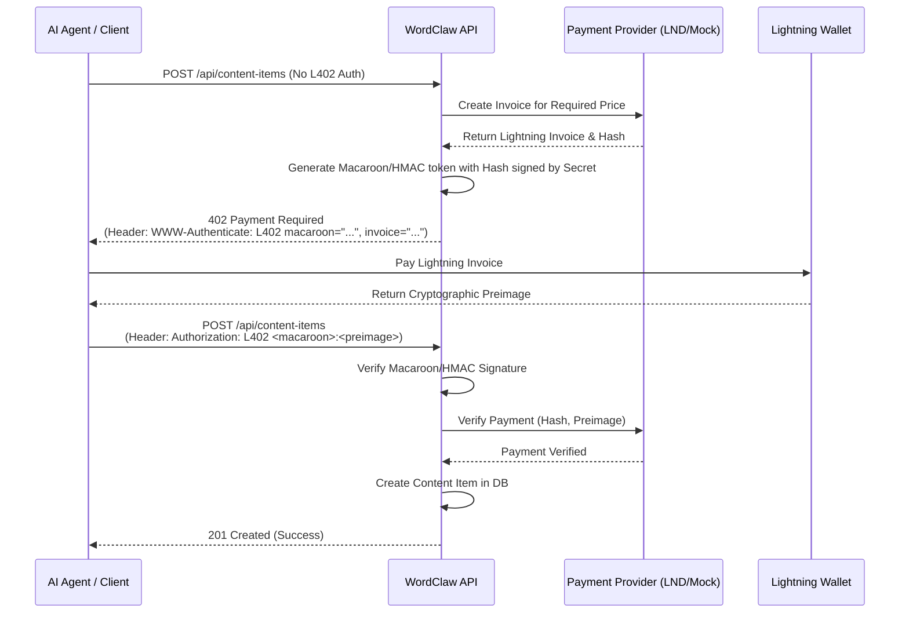

# L402 Protocol Implementation

This document describes the implementation of the L402 protocol within Wordclaw. The L402 protocol is an HTTP 402 Payment Required standard that combines Macaroons for authorization and Lightning Network invoices for micro-payments.

## Architecture Overview

The L402 integration in Wordclaw acts as a metering and monetization layer for API endpoints. It challenges unauthenticated requests with a `402 Payment Required` response, providing a Lightning invoice and a Macaroon (or equivalent token). Once the client pays the invoice, they present the Macaroon and the payment preimage in the `Authorization: L402` header to access the resource.

### Components

1.  **Payment Provider (`src/interfaces/payment-provider.ts`)**: An interface defining the contract for generating Lightning invoices and verifying payments. This allows swapping out the underlying Lightning node implementation (e.g., LND, Core Lightning, Alby).
2.  **Mock Payment Provider (`src/services/mock-payment-provider.ts`)**: A mock implementation used for testing and development. It generates static invoices and accepts a known preimage (`mock-preimage-123`).
3.  **L402 Middleware (`src/middleware/l402.ts`)**: A Fastify middleware that handles the core L402 logic:
    *   **Challenge**: Intercepts requests without a valid L402 header. It requests an invoice from the Payment Provider, generates a token (currently HMAC-based, acting as a Macaroon placeholder), and returns a `402` status with the `WWW-Authenticate` header containing the Macaroon and Invoice.
    *   **Verification**: Parses the `Authorization: L402 <macaroon>:<preimage>` header. It validates the Macaroon's authenticity (using the server's secret) and verifies the payment preimage against the Payment Provider.

## L402 Payment Flow Sequence Diagram

## Future Enhancements (Phase 6 Roadmap)

*   **Full Macaroon Support**: Replace the HMAC token placeholder with full Macaroon implementation using the `macaroons.js` library to support caveats (e.g., rate limits, specific endpoint access).
*   **Real Lightning Node Integration**: Implement a `PaymentProvider` that connects to a real Lightning node (e.g., via LND's REST API or gRPC) or a Lightning Service Provider (LSP) like Alby.
*   **Agent SDK Integration**: Update the Wordclaw Agent SDK to automatically handle L402 challenges, pay invoices, and append the required `Authorization` header to subsequent requests.

## Testing

Unit tests for the middleware are located in `src/middleware/__tests__/l402.test.ts`. They verify the challenge generation and the successful verification of valid L402 credentials using the mock payment provider.
