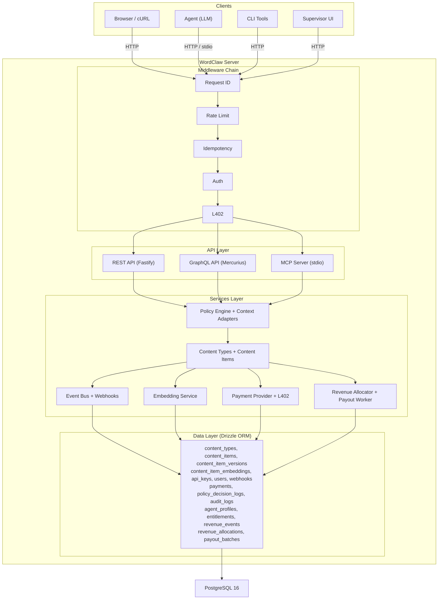
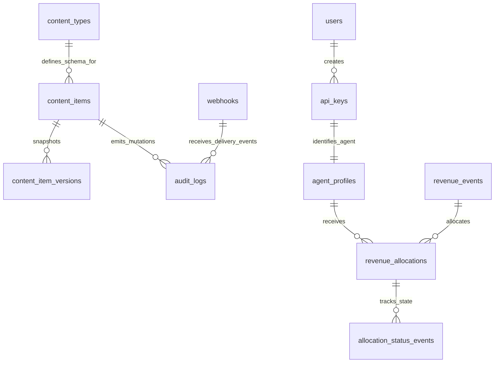

# Architecture Overview

WordClaw is an AI-first headless CMS that exposes identical capabilities over three protocols — REST, GraphQL, and MCP (Model Context Protocol) — so both human operators and AI agents can manage content through a single runtime.

## System Diagram



## Layer Responsibilities

### Middleware Chain

Every incoming HTTP request passes through a shared middleware pipeline before reaching any API handler:

| Middleware       | Purpose                                                    |
|------------------|------------------------------------------------------------|
| **Request ID**   | Assigns or propagates `x-request-id` for traceability      |
| **Rate Limit**   | Fastify rate-limit plugin, per-IP throttling                |
| **Idempotency**  | Caches POST/PUT/DELETE responses keyed by `Idempotency-Key` |
| **Auth**         | Validates `x-api-key` or `Authorization: Bearer` headers   |
| **L402**         | Optional micropayment gate using Lightning invoices         |

### API Layer

Three protocol interfaces expose the same set of operations, alongside a dedicated UI:

- **REST** — RESTful routes under `/api/*` with OpenAPI documentation at `/documentation`.
- **GraphQL** — Full query and mutation schema at `/graphql` with GraphiQL playground.
- **MCP** — Model Context Protocol over stdio; exposes tools, resources, and prompts for LLM agents.
- **Supervisor UI** — A SvelteKit application served at `/ui` for human oversight, schema management, and audit log review.

Feature parity across the three is enforced by an automated [capability parity contract](../src/contracts/capability-parity.test.ts) that runs in CI.

### Services Layer

Business logic lives in isolated service modules. No API handler accesses the database directly — all operations route through services that own validation, versioning, audit emission, and webhook delivery.

#### Policy Engine & Context Adapters
The `PolicyEngine` enforces rigorous cross-protocol parity. A request from REST, GraphQL, or MCP traverses through a `ContextAdapter` to map into a flat, protocol-agnostic `OperationContext`. The engine parses the active rules against the principal's scope and produces an immutable `PolicyDecision` (allow/deny) and automatically populates the `policy_decision_logs` database table.

#### Embedding Service (Vector RAG)
An asynchronous `EmbeddingService` listens to the WordClaw `EventBus` for `content_item.published` events. It chunks the document payload, hits an external LLM Embeddings Provider (e.g. OpenAI), and stores vectors in a `pgvector` enabled Postgres table. This powers out-of-the-box semantic search endpoints for AI agents.

### Data Layer

Drizzle ORM maps TypeScript types to PostgreSQL tables. Migrations live in `drizzle/` and are generated with `drizzle-kit`.

## Data Model



Key relationships:

- A **content type** defines a JSON schema; many **content items** reference it.
- Every update to a content item creates an immutable **version** snapshot.
- All mutations emit **audit logs**; matching **webhooks** receive HMAC-signed delivery.
- **API keys** carry scopes (`content:read`, `content:write`, `audit:read`, `admin`).
- An **API key** maps to an **agent profile**, which receives fractions of **revenue events** via **revenue allocations** based on their content contributions.

## Request Lifecycle

```mermaid
flowchart TD
  A[Client request] --> B[Assign or propagate x-request-id]
  B --> C{Rate limit passed?}
  C -- No --> C1[Return 429 Too Many Requests]
  C -- Yes --> D{Idempotency hit?}
  D -- Yes --> D1[Return cached response]
  D -- No --> E{Authenticated?}
  E -- No --> E1[Return 401 / 403]
  E -- Yes --> F[Route handler (REST / GraphQL / MCP)]
  F --> G[Service layer: validate, execute, version]
  G --> H[Write audit log]
  G --> I[Emit event bus message]
  G --> J[Queue webhook delivery (non-blocking)]
  H --> K[Cache response for idempotency writes]
  I --> K
  J --> K
  K --> L[Return response with x-request-id]
```

## Technology Stack

| Component      | Technology               |
|----------------|--------------------------|
| Runtime        | Node.js 20+              |
| Language       | TypeScript (strict)      |
| HTTP framework | Fastify 5.x              |
| GraphQL        | Mercurius 16.x           |
| MCP            | @modelcontextprotocol/sdk |
| ORM            | Drizzle 0.45             |
| Database       | PostgreSQL 16            |
| Validation     | Zod + TypeBox            |
| Testing        | Vitest                   |
| Containers     | Docker Compose           |
