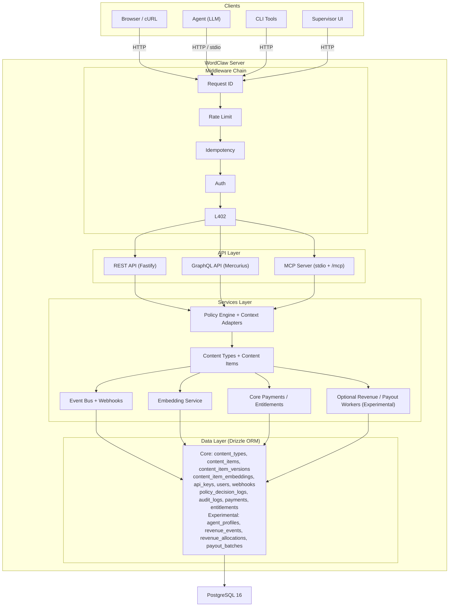
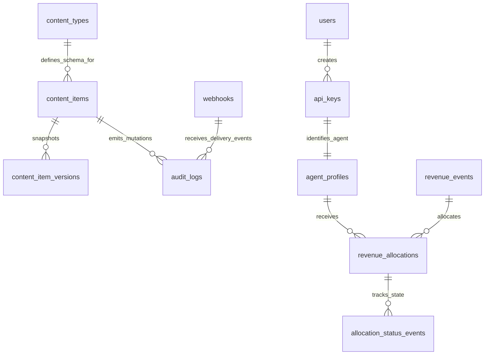
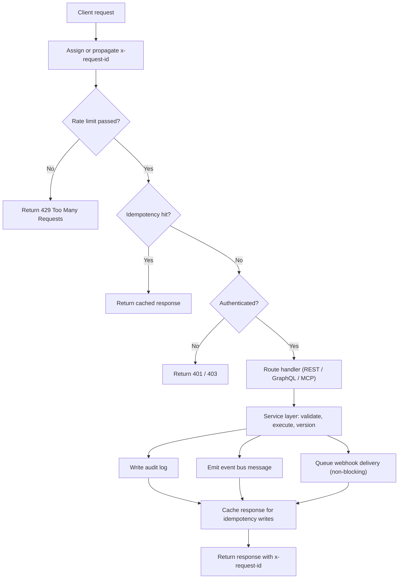

# Architecture Overview

WordClaw is a safe content runtime for AI agents and human supervisors. The current runtime is available through REST, MCP (Model Context Protocol), and GraphQL, but REST and MCP are the primary product surfaces while GraphQL is maintained as a compatibility layer. Agent-run orchestration remains an incubating capability behind `ENABLE_EXPERIMENTAL_AGENT_RUNS`, not part of the default supervisor control plane.

## System Diagram

```mermaid
flowchart TB
  subgraph Clients
    Browser["Browser / cURL"]
    Agent["Agent (LLM)"]
    CLI["CLI Tools"]
    Supervisor["Supervisor UI"]
  end

  subgraph WordClaw["WordClaw Server"]
    subgraph Middleware["Middleware Chain"]
      RequestId["Request ID"] --> RateLimit["Rate Limit"] --> Idempotency["Idempotency"] --> Auth["Auth"] --> L402["L402"]
    end

    subgraph APIs["API Layer"]
      REST["REST API (Fastify)"]
      GraphQL["GraphQL API (Mercurius)"]
      MCP["MCP Server (stdio + /mcp)"]
    end

    subgraph Services["Services Layer"]
      Policy["Policy Engine + Context Adapters"]
      Content["Content Types + Content Items"]
      Events["Event Bus + Webhooks"]
      Embeddings["Embedding Service"]
      Payments["Core Payments / Entitlements"]
      Revenue["Optional Revenue / Payout Workers (Experimental)"]
    end

    subgraph Data["Data Layer (Drizzle ORM)"]
      Tables["Core: content_types, content_items, content_item_versions<br/>content_item_embeddings, api_keys, users, webhooks<br/>policy_decision_logs, audit_logs, payments, entitlements<br/>Experimental: agent_profiles, revenue_events, revenue_allocations, payout_batches"]
    end

    L402 --> REST
    L402 --> GraphQL
    L402 --> MCP
    REST --> Policy
    GraphQL --> Policy
    MCP --> Policy
    Policy --> Content
    Content --> Events
    Content --> Embeddings
    Content --> Payments
    Content --> Revenue
    Events --> Tables
    Embeddings --> Tables
    Payments --> Tables
    Revenue --> Tables
  end

  Browser -->|HTTP| RequestId
  Agent -->|HTTP / stdio| RequestId
  CLI -->|HTTP| RequestId
  Supervisor -->|HTTP| RequestId
  Tables --> Postgres["PostgreSQL 16"]
```

## Layer Responsibilities

### Middleware Chain

Every incoming HTTP request passes through a shared middleware pipeline before reaching any API handler:

| Middleware       | Purpose                                                    |
|------------------|------------------------------------------------------------|
| **Request ID**   | Assigns or propagates `x-request-id` for traceability      |
| **Rate Limit**   | Fastify rate-limit plugin, per-IP throttling                |
| **Idempotency**  | Caches POST/PUT/DELETE responses keyed by `Idempotency-Key` |
| **Auth**         | Validates `x-api-key` or `Authorization: Bearer` headers   |
| **L402**         | Optional micropayment gate using Lightning invoices         |

### API Layer

WordClaw exposes two core interfaces, one compatibility surface, and a dedicated UI:

- **REST** — Primary HTTP contract under `/api/*` with OpenAPI documentation at `/documentation`.
- **MCP** — Primary Model Context Protocol surface for LLM agents, available locally over stdio and remotely at `/mcp`.
- **GraphQL** — Compatibility surface at `/graphql` with GraphiQL playground.
- **Supervisor UI** — A SvelteKit application served at `/ui` for human oversight, schema management, and audit log review.

Experimental agent-run APIs exist only when operators explicitly enable the incubator flag. They should be treated as optional runtime surfaces rather than part of the default control-plane contract.

The capability contract requires REST and MCP coverage for core features. GraphQL coverage is tracked when explicitly declared in the compatibility matrix.

### Services Layer

Business logic lives in isolated service modules. No API handler accesses the database directly — all operations route through services that own validation, versioning, audit emission, and webhook delivery.

#### Policy Engine & Context Adapters
The `PolicyEngine` remains protocol-agnostic. A request from REST, MCP, or the current GraphQL compatibility surface traverses through a `ContextAdapter` to map into a flat, protocol-agnostic `OperationContext`. The engine parses the active rules against the principal's scope and produces an immutable `PolicyDecision` (allow/deny) and automatically populates the `policy_decision_logs` database table.

#### Embedding Service (Vector RAG)
An asynchronous `EmbeddingService` listens to the WordClaw `EventBus` for `content_item.published` events. It chunks the document payload, hits an external LLM Embeddings Provider (e.g. OpenAI), and stores vectors in a `pgvector` enabled Postgres table. This powers out-of-the-box semantic search endpoints for AI agents.

### Data Layer

Drizzle ORM maps TypeScript types to PostgreSQL tables. Migrations live in `drizzle/` and are generated with `drizzle-kit`.

## Data Model

```mermaid
erDiagram
  content_types ||--o{ content_items : defines_schema_for
  content_items ||--o{ content_item_versions : snapshots
  content_items ||--o{ audit_logs : emits_mutations
  webhooks ||--o{ audit_logs : receives_delivery_events
  users ||--o{ api_keys : creates
  api_keys ||--|| agent_profiles : identifies_agent
  agent_profiles ||--o{ revenue_allocations : receives
  revenue_events ||--o{ revenue_allocations : allocates
  revenue_allocations ||--o{ allocation_status_events : tracks_state
```

Key relationships:

- A **content type** defines a JSON schema; many **content items** reference it.
- Every update to a content item creates an immutable **version** snapshot.
- All mutations emit **audit logs**; matching **webhooks** receive HMAC-signed delivery.
- **API keys** carry scopes (`content:read`, `content:write`, `audit:read`, `admin`).
- **Payments** and **entitlements** are part of the core runtime for paid reads and offer purchases.
- An **API key** can map to an **agent profile** for entitlement ownership; revenue allocation and payout tables remain optional experimental runtime areas.

## Request Lifecycle

```mermaid
flowchart TD
  A["Client request"] --> B["Assign or propagate x-request-id"]
  B --> C{"Rate limit passed?"}
  C -->|No| C1["Return 429 Too Many Requests"]
  C -->|Yes| D{"Idempotency hit?"}
  D -->|Yes| D1["Return cached response"]
  D -->|No| E{"Authenticated?"}
  E -->|No| E1["Return 401 / 403"]
  E -->|Yes| F["Route handler (REST / GraphQL / MCP)"]
  F --> G["Service layer: validate, execute, version"]
  G --> H["Write audit log"]
  G --> I["Emit event bus message"]
  G --> J["Queue webhook delivery (non-blocking)"]
  H --> K["Cache response for idempotency writes"]
  I --> K
  J --> K
  K --> L["Return response with x-request-id"]
```

## Technology Stack

| Component      | Technology               |
|----------------|--------------------------|
| Runtime        | Node.js 20+              |
| Language       | TypeScript (strict)      |
| HTTP framework | Fastify 5.x              |
| GraphQL        | Mercurius 16.x           |
| MCP            | @modelcontextprotocol/sdk |
| ORM            | Drizzle 0.45             |
| Database       | PostgreSQL 16            |
| Validation     | Zod + TypeBox            |
| Testing        | Vitest                   |
| Containers     | Docker Compose           |
