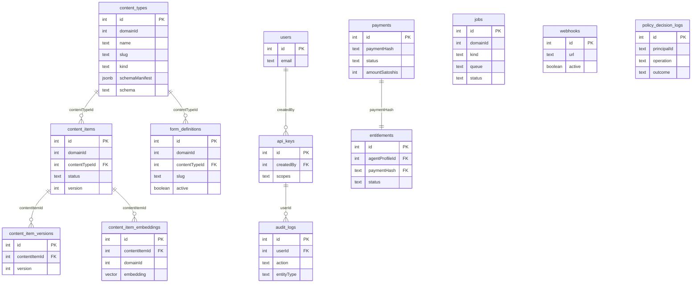

# Data Model

## Entity Relationship Diagram



## Tables

### content_types

Defines the shape of content items via a JSON schema.

| Column      | Type      | Notes                     |
|-------------|-----------|---------------------------|
| `id`        | serial PK | Auto-increment            |
| `domainId`  | integer   | Tenant boundary           |
| `name`      | text      | Required                  |
| `slug`      | text      | Unique, URL-safe          |
| `kind`      | text      | `collection` or `singleton` |
| `schemaManifest` | jsonb | Optional editor-oriented schema manifest |
| `schema`    | text      | JSON schema string        |
| `createdAt` | timestamp | Default `now()`           |
| `updatedAt` | timestamp | Updated on mutation       |

### content_items

Versioned content entities. The `data` field is validated against the parent content type's schema on every write. The current `content_items` row is the latest working copy; published reads can resolve against the most recent published snapshot in `content_item_versions`.

| Column          | Type      | Notes                                  |
|-----------------|-----------|----------------------------------------|
| `id`            | serial PK |                                        |
| `domainId`      | integer   | Tenant boundary                        |
| `contentTypeId` | integer   | FK → `content_types.id`               |
| `data`          | text      | JSON content                           |
| `status`        | text      | Workflow/runtime state, including `draft` and `published` |
| `version`       | integer   | Auto-incremented on update             |
| `createdAt`     | timestamp |                                        |
| `updatedAt`     | timestamp |                                        |

### content_item_versions

Immutable snapshots created before every content item update. Cascade-deleted when the parent item is deleted.

| Column          | Type      | Notes                          |
|-----------------|-----------|--------------------------------|
| `id`            | serial PK |                                |
| `contentItemId` | integer   | FK → `content_items.id`       |
| `data`          | text      | Snapshot of data at version    |
| `status`        | text      | Snapshot of status at version  |
| `version`       | integer   | Version number                 |
| `createdAt`     | timestamp |                                |

## Derived Runtime Read Model

These are current runtime concepts exposed by REST, MCP, GraphQL compatibility, and the supervisor UI, but they are derived rather than persisted as top-level columns:

- **Globals** — A `content_types.kind = singleton` model is read and written through the dedicated globals surface. The schema remains on `content_types`; the singleton document remains a normal `content_items` row.
- **Publication State** — Reads expose `publicationState`, `workingCopyVersion`, and `publishedVersion`. `published` means the current row is live, `changed` means a newer working copy exists than the last published snapshot, and `draft` means no published snapshot exists yet.
- **Localized Reads** — Localization is declared in schema metadata via `x-wordclaw-localization` and per-field `x-wordclaw-localized`. Stored data remains canonical locale maps; localized read values and `localeResolution` are computed at read time.
- **Preview Tokens** — Preview access is stateless and signed. Tokens are not persisted in the database; they are issued and verified from the runtime signing secret.
- **Reverse References** — Usage graphs for content items and assets are derived from `content_items` plus `content_item_versions`. They are query-time projections rather than separate stored join tables.
- **Generated Artifacts** — Generated TypeScript/Zod/client files are built from `content_types.schema`, `content_types.schemaManifest`, and the capability manifest; the artifacts themselves are not stored in the database.

### form_definitions

Reusable bounded public-intake definitions backed by a target content type.

| Column                 | Type      | Notes                                                      |
|------------------------|-----------|------------------------------------------------------------|
| `id`                   | serial PK |                                                            |
| `domainId`             | integer   | Tenant boundary                                            |
| `name`                 | text      | Human-readable operator label                              |
| `slug`                 | text      | Public form identifier within the domain                   |
| `description`          | text      | Optional operator-facing description                       |
| `contentTypeId`        | integer   | FK → `content_types.id`                                    |
| `fields`               | jsonb     | Allowed public fields mapped onto top-level schema fields  |
| `defaultData`          | jsonb     | Optional bounded defaults merged before validation         |
| `active`               | boolean   | Submission enable/disable switch                           |
| `publicRead`           | boolean   | Whether the sanitized public contract is exposed           |
| `submissionStatus`     | text      | Initial status assigned to created content items           |
| `workflowTransitionId` | integer   | Optional auto-submit review transition                     |
| `requirePayment`       | boolean   | Enables L402 challenge on the public submission route      |
| `webhookUrl`           | text      | Optional follow-up callback target                         |
| `webhookSecret`        | text      | Optional HMAC signing secret for follow-up delivery        |
| `successMessage`       | text      | Optional message returned after successful submission      |
| `createdAt`            | timestamp |                                                            |
| `updatedAt`            | timestamp |                                                            |

### jobs

Domain-scoped background work queue for scheduled and deferred runtime tasks.

| Column         | Type      | Notes                                                            |
|----------------|-----------|------------------------------------------------------------------|
| `id`           | serial PK |                                                                  |
| `domainId`     | integer   | Tenant boundary                                                  |
| `kind`         | text      | `content_status_transition` or `outbound_webhook`                |
| `queue`        | text      | Logical lane such as `content` or `webhooks`                     |
| `status`       | text      | `queued`, `running`, `succeeded`, `failed`, or `cancelled`       |
| `payload`      | jsonb     | Kind-specific execution payload                                  |
| `result`       | jsonb     | Optional execution result payload                                |
| `attempts`     | integer   | Claimed attempt count                                            |
| `maxAttempts`  | integer   | Retry ceiling                                                    |
| `runAt`        | timestamp | When the worker is allowed to claim the job                      |
| `claimedAt`    | timestamp | When the current/last worker claim happened                      |
| `startedAt`    | timestamp | Handler start time                                               |
| `completedAt`  | timestamp | Final completion time for terminal states                        |
| `lastError`    | text      | Last error message when the handler fails                        |
| `createdAt`    | timestamp |                                                                  |
| `updatedAt`    | timestamp |                                                                  |

### content_item_embeddings (RFC 0012)

Vector embeddings generated from published content payload chunks.

| Column          | Type      | Notes                                  |
|-----------------|-----------|----------------------------------------|
| `id`            | serial PK |                                        |
| `contentItemId` | integer   | FK → `content_items.id`               |
| `domainId`      | integer   | Used for tenant isolation              |
| `chunkIndex`    | integer   | Order index of chunk                   |
| `textChunk`     | text      | Raw extracted string chunk             |
| `embedding`     | vector    | `pgvector` stored float array          |

### audit_logs

Every mutation emits an audit record.

| Column       | Type      | Notes                                       |
|--------------|-----------|---------------------------------------------|
| `id`         | serial PK |                                             |
| `action`     | text      | `create`, `update`, `delete`, `rollback`    |
| `entityType` | text      | `content_type`, `content_item`, `form_definition`, `job`, `webhook`, `api_key` |
| `entityId`   | integer   |                                             |
| `details`    | text      | JSON payload of the change                  |
| `userId`     | integer   | FK → API key ID (nullable)                  |
| `requestId`  | text      | Correlates with `x-request-id` header       |
| `createdAt`  | timestamp |                                             |

### api_keys

Database-managed authentication keys with scope-based authorization.

| Column       | Type      | Notes                                 |
|--------------|-----------|---------------------------------------|
| `id`         | serial PK |                                       |
| `name`       | text      | Human-readable label                  |
| `keyHash`    | text      | SHA-256 hash of the raw key           |
| `keyPrefix`  | text      | First 8 chars for identification      |
| `scopes`     | text      | Comma-separated scope list            |
| `createdBy`  | integer   | FK → `users.id` (nullable)           |
| `expiresAt`  | timestamp | Nullable                              |
| `revokedAt`  | timestamp | Set on revocation                     |
| `lastUsedAt` | timestamp | Updated on each authenticated request |
| `createdAt`  | timestamp |                                       |

### webhooks

Event delivery endpoints with HMAC signing.

| Column      | Type      | Notes                                |
|-------------|-----------|--------------------------------------|
| `id`        | serial PK |                                      |
| `url`       | text      | Callback URL                         |
| `events`    | text      | Comma-separated event patterns       |
| `secret`    | text      | HMAC-SHA256 signing key              |
| `active`    | boolean   | Delivery enabled/disabled            |
| `createdAt` | timestamp |                                      |
| `updatedAt` | timestamp |                                      |

### payments

Tracks Lightning Network (L402) invoice states across API interactions.

| Column              | Type      | Notes                                              |
|---------------------|-----------|----------------------------------------------------|
| `id`                | serial PK |                                                    |
| `domainId`          | integer   | Tenant boundary                                    |
| `paymentHash`       | text      | Unique invoice/payment lookup hash                 |
| `provider`          | text      | Payment provider (`mock`, `lnbits`, etc.)         |
| `providerInvoiceId` | text      | Provider-side invoice identifier                   |
| `paymentRequest`    | text      | BOLT11 invoice string                              |
| `amountSatoshis`    | integer   | Cost in satoshis                                   |
| `status`            | text      | `pending`, `paid`, `consumed`, `expired`, `failed` |
| `expiresAt`         | timestamp | Invoice expiry timestamp                           |
| `settledAt`         | timestamp | Settlement timestamp                               |
| `failureReason`     | text      | Provider failure reason                            |
| `lastEventId`       | text      | Last applied provider webhook event id             |
| `resourcePath`      | text      | API route linked to the payment                    |
| `actorId`           | text      | Identity of caller                                 |
| `details`           | jsonb     | Request context and safe headers                   |
| `createdAt`         | timestamp |                                                    |
| `updatedAt`         | timestamp |                                                    |

### entitlements (RFC 0015)

Durable buyer access grants tied to an agent profile and payment hash.

| Column           | Type      | Notes                                                                |
|------------------|-----------|----------------------------------------------------------------------|
| `id`             | serial PK |                                                                      |
| `domainId`       | integer   | Tenant boundary                                                      |
| `offerId`        | integer   | Purchased offer                                                      |
| `policyId`       | integer   | Pinned policy snapshot                                               |
| `policyVersion`  | integer   | Pinned policy version                                                |
| `agentProfileId` | integer   | Buyer identity                                                       |
| `paymentHash`    | text      | Linked payment hash (unique)                                         |
| `status`         | text      | `pending_payment`, `active`, `exhausted`, `expired`, `revoked`      |
| `remainingReads` | integer   | Nullable (`null` means unlimited)                                    |
| `expiresAt`      | timestamp | Entitlement expiry                                                   |
| `activatedAt`    | timestamp | Set when payment confirmation activates entitlement                  |
| `terminatedAt`   | timestamp | Set when entitlement enters terminal state (`exhausted/expired/revoked`) |
| `delegatedFrom`  | integer   | Parent entitlement id for delegated grants                           |

`delegatedFrom` exists for delegation experiments in the current runtime, but entitlement delegation is not part of the default supported WordClaw product path and is disabled by default unless explicitly enabled.

### Optional / Experimental Financial Tables

The following financial tables exist in the current runtime, but they should be treated as optional or experimental rather than core WordClaw primitives:

| Table | Purpose | Product Status |
|-------|---------|----------------|
| `agent_profiles` | Maps API keys to monetization-oriented identity records | Optional / experimental |
| `revenue_events` | Records monetized events for ledger-style accounting | Experimental |
| `revenue_allocations` | Splits revenue across agent profiles | Experimental |
| `allocation_status_events` | Tracks pending, disputed, and cleared allocation states | Experimental |
| `payout_batches` | Groups payout transfer attempts | Experimental |
| `payout_transfers` | Tracks individual payout attempts | Experimental |

### policy_decision_logs

Audit trail of PolicyEngine outcome evaluations for strict authorization parity.

| Column                 | Type      | Notes                                |
|------------------------|-----------|--------------------------------------|
| `id`                   | serial PK |                                      |
| `principalId`          | text      | Identity invoking the rule           |
| `operation`            | text      | Abstract capability (e.g. `content.write`) |
| `resourceType`         | text      | Type of resource being accessed      |
| `resourceId`           | text      | Specific resource                    |
| `environment`          | text      | `rest`, `graphql`, or `mcp`          |
| `outcome`              | text      | `allow`, `deny`, `challenge`         |
| `remediation`          | text      | Error resolution suggestions         |
| `policyVersion`        | text      | Semantic version of the engine       |
| `evaluationDurationMs` | integer   | P95 profiling data                   |
| `createdAt`            | timestamp |                                      |

## Versioning Strategy

```mermaid
flowchart LR
  subgraph UpdateFlow[Update Flow]
    U1[Update request] --> U2[Save current data, status, version to content_item_versions]
    U2 --> U3[Apply update and increment version]
    U3 --> U4[Return updated item]
  end

  subgraph RollbackFlow[Rollback Flow (to version N)]
    R1[Rollback request] --> R2[Load version N snapshot from content_item_versions]
    R2 --> R3[Save current head as new snapshot]
    R3 --> R4[Overwrite item with version N data and increment version]
    R4 --> R5[Return restored head revision]
  end
```

Versions are append-only. Rollback does not delete history — it creates a new version that restores the old state.
