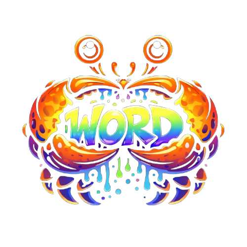
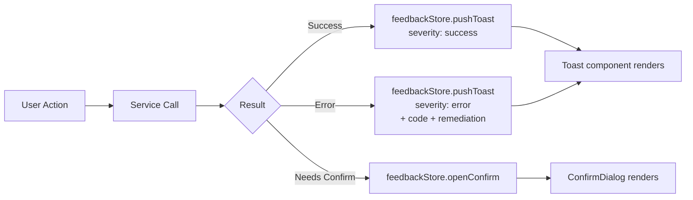

# WordClaw Design System

> **Version**: 1.0 — distilled from the WordClaw v1.51.0 codebase  
> **Surfaces**: Supervisor UI (SvelteKit) · Documentation Site (VitePress) · CLI Output  
> **Last updated**: 2026-04-03

---

## 1. Brand Identity



### Logomark

| Asset | File | Usage |
|---|---|---|
| Full color crab | `doc/images/logos/wordclaw.png` | README hero, marketing, social |
| Transparent background | `doc/images/logos/wordclaw-logo-transparent.png` | Overlays, light backgrounds |
| No-background compact | `doc/images/logos/wordclaw-logo-nobg.png` | Documentation, composites |
| SVG favicon | `ui/src/lib/assets/favicon.svg` | Browser tab, PWA icon |

### App Shorthand Mark

The Supervisor UI uses a **32 × 32px rounded-square** with the letters **WC** as the collapsed-sidebar identity:

```
┌─────────┐
│   WC    │  ← Blue-600 background, white bold text
└─────────┘     rounded-xl · shadow-sm
```

> [!NOTE]
> The mark doubles as the user-avatar fallback — initials are derived from the supervisor's email address using the `initialsFromEmail()` utility.

### Tagline

> **Governed Content Runtime** — for AI agents and human supervisors.

---

## 2. Color System

WordClaw supports **light** and **dark** modes, toggled per-user with `localStorage` persistence under the key `__wc_theme`. The system detects `prefers-color-scheme` as the default.

### 2.1 Core Palette

The palette is built on **Tailwind Slate** as the neutral axis with **Blue-600** as the primary accent.

| Role | Light | Dark | Usage |
|---|---|---|---|
| **Primary** | `slate-900` / `bg-slate-900 text-white` | `slate-100` / `bg-slate-100 text-slate-950` | Primary buttons, active nav items |
| **Accent** | `blue-600` | `blue-600` | Logo mark, focus rings, spinners, info badges |
| **Surface** | `white` / `bg-white` | `slate-900/40` / `bg-slate-900/40` | Cards, panels, table bodies |
| **Surface Muted** | `slate-50/80` / `bg-slate-50/80` | `slate-900/30` / `bg-slate-900/30` | Table headers, muted cards |
| **Surface Subtle** | `white/70` / `bg-white/70` | `slate-900/20` / `bg-slate-900/20` | Subtle containers |
| **Border** | `slate-200/80` | `slate-700` | Card edges, dividers, inputs |
| **Text Primary** | `slate-900` | `slate-100` | Headings, body, table cells |
| **Text Secondary** | `slate-500` | `slate-400` | Labels, breadcrumbs, captions |
| **Text Muted** | `slate-400` | `slate-500` | Hints, disabled states |

### 2.2 Semantic Colors

| Intent | Light Background | Light Text | Dark Background | Dark Text |
|---|---|---|---|---|
| **Success** | `emerald-100` | `emerald-800` | `emerald-900/30` | `emerald-200` |
| **Warning** | `amber-100` | `amber-800` | `amber-900/30` | `amber-200` |
| **Danger** | `rose-100` | `rose-800` | `rose-900/30` | `rose-200` |
| **Info** | `blue-100` | `blue-800` | `blue-900/30` | `blue-200` |
| **Paid** | `amber-100` | `amber-900` | `amber-900/30` | `amber-200` |

### 2.3 Action Badges (CRUD)

Used by `ActionBadge.svelte` for audit-log entries:

| Action | Light | Dark |
|---|---|---|
| **create** | `green-100` / `green-800` | `green-900/30` / `green-400` |
| **update** | `yellow-100` / `yellow-800` | `yellow-900/30` / `yellow-400` |
| **delete** | `red-100` / `red-800` | `red-900/30` / `red-400` |
| **rollback** | `purple-100` / `purple-800` | `purple-900/30` / `purple-400` |

### 2.4 Background Treatments

#### Light Mode
```css
background:
  radial-gradient(72rem 28rem at 50% -8rem, rgb(255 255 255 / 0.92), transparent 70%),
  linear-gradient(180deg, rgb(248 250 252), rgb(241 245 249));
```

#### Dark Mode
```css
background:
  radial-gradient(72rem 30rem at 50% -10rem, rgb(37 99 235 / 0.18), transparent 62%),
  radial-gradient(48rem 20rem at 0% 0%, rgb(14 165 233 / 0.08), transparent 60%),
  rgb(2 6 23);
```

> [!TIP]
> The dark mode body uses a subtle **blue radial glow** at the top and a **sky accent** at the top-left corner to avoid feeling flat. This creates depth without competing with content.

### 2.5 Selection

| Mode | Background | Text |
|---|---|---|
| Light | `rgb(191 219 254 / 0.75)` | `inherit` |
| Dark | `rgb(30 64 175 / 0.45)` | `inherit` |

---

## 3. Typography

### Font Stack

WordClaw relies on the **system font stack** provided by Tailwind — no custom web fonts are loaded. This keeps the Supervisor UI fast and avoids FOUT.

```
font-family: ui-sans-serif, system-ui, -apple-system, BlinkMacSystemFont,
  "Segoe UI", Roboto, "Helvetica Neue", Arial, "Noto Sans", sans-serif;
```

### Text Rendering

```css
text-rendering: optimizeLegibility;
-webkit-font-smoothing: antialiased;
-moz-osx-font-smoothing: grayscale;
```

### Scale

| Token | Size | Weight | Tracking | Usage |
|---|---|---|---|---|
| **App title** | `1.05rem` | `semibold` | `tight` | Sidebar "WordClaw" branding |
| **Subtitle label** | `0.58rem` | `semibold` | `0.28em` | "SUPERVISOR" mark below title |
| **Nav group label** | `0.62rem` | `semibold` | `0.22em` | Sidebar section headers (OVERVIEW, CONTENT, OPERATIONS) |
| **Nav item** | `text-sm` (0.875rem) | `medium` | default | Sidebar links |
| **Table header** | `0.72rem` | `semibold` | `0.18em` | DataTable column headers |
| **Badge text** | `0.68rem` | `semibold` | `0.08em` | Badge component |
| **Body / cells** | `text-sm` (0.875rem) | normal | default | Table cells, paragraphs |
| **User email** | `0.82rem` | `medium` | default | Header user display |
| **Domain label** | `0.7rem` | `medium` | `0.18em` | Domain selector prefix |
| **Code (error)** | `0.68rem` | `mono` | `wider` | Error code badges |

> [!IMPORTANT]
> All uppercase text uses `tracking-[0.18em]` or wider to maintain legibility at small sizes. Never use uppercase text without letter-spacing.

---

## 4. Spacing & Layout

### Grid

The Supervisor UI uses a **sidebar + header + content** shell:

```
┌──────────────────────────────────────────────┐
│ SIDEBAR │  HEADER (sticky, blur backdrop)    │
│ (fixed) │────────────────────────────────────│
│ 16rem   │  MAIN CONTENT                      │
│ or      │  max-w-[96rem] · px-5/7/10         │
│ 4.75rem │  py-6                              │
│ (col-   │                                    │
│ lapsed) │                                    │
└──────────────────────────────────────────────┘
```

| Dimension | Value | Notes |
|---|---|---|
| Sidebar expanded | `16rem` (256px) | Desktop default |
| Sidebar collapsed | `4.75rem` (76px) | Icon-only mode |
| Header height | `h-16` (64px) | Sticky, `z-30` |
| Content max-width | `96rem` (1536px) | `mx-auto` centered |
| Content padding | `px-5 sm:px-7 lg:px-10` | Responsive |
| Content top padding | `py-6` | Consistent vertical spacing |
| Sidebar transition | `duration-200 ease-out` | Width + transform |

### Spacing Tokens

The system uses Tailwind's default 4px base:

| Token | Value | Common Usage |
|---|---|---|
| `gap-0.5` | 2px | Tight nav item spacing |
| `gap-2` | 8px | Icon-to-text in headers |
| `gap-2.5` | 10px | Header action buttons |
| `gap-3` | 12px | Nav item icon-to-label, sidebar padding |
| `p-5` | 20px | Default Surface padding |
| `py-4` | 16px | Table cell vertical padding |
| `space-y-3` | 12px | Nav group vertical rhythm |

### Radius System

| Token | Value | Usage |
|---|---|---|
| `rounded-xl` | 12px | Buttons, inputs, nav items, collapsed nav icons |
| `rounded-2xl` | 16px | Surfaces, DataTable container |
| `rounded-md` | 6px | Header buttons, dropdown |
| `rounded-lg` | 8px | Mobile hamburger button |
| `rounded-full` | 9999px | Badges, avatar circles, scrollbar thumbs |

> [!NOTE]
> The system skews toward **large radii** (`xl` and `2xl`) for primary containers. This is a deliberate choice to feel softer and more modern than traditional admin panels.

---

## 5. Component Library

The shared components live in `ui/src/lib/components/`. Foundational primitives are in the `ui/` subdirectory.

### 5.1 Button

**File**: [Button.svelte](file:///Users/daveligthart/GitHub/wordclaw/ui/src/lib/components/ui/Button.svelte)

| Prop | Type | Default |
|---|---|---|
| `variant` | `default` · `secondary` · `outline` · `ghost` · `destructive` · `success` | `default` |
| `size` | `sm` · `md` · `lg` · `icon` | `md` |

**Variant Appearance**:

| Variant | Light | Dark |
|---|---|---|
| `default` | Slate-900 bg, white text | Slate-100 bg, slate-950 text |
| `secondary` | Slate-100 bg | Slate-800 bg |
| `outline` | White bg, slate-200 border | Slate-900/40 bg, slate-700 border |
| `ghost` | Transparent, slate-600 text | Transparent, slate-300 text |
| `destructive` | Rose-600 bg, white text | Same |
| `success` | Emerald-600 bg, white text | Same |

**Size Scale**:

| Size | Height | Padding | Font |
|---|---|---|---|
| `sm` | `h-8` | `px-3` | `text-xs` |
| `md` | `h-10` | `px-4` | `text-sm` |
| `lg` | `h-11` | `px-5` | `text-sm` |
| `icon` | `h-10 w-10` | — | — |

**Focus Ring**: `ring-2 ring-slate-300 ring-offset-2` (light), `ring-slate-700 ring-offset-slate-950` (dark).

---

### 5.2 Badge

**File**: [Badge.svelte](file:///Users/daveligthart/GitHub/wordclaw/ui/src/lib/components/ui/Badge.svelte)

| Variant | Purpose |
|---|---|
| `default` | High-contrast, inverted (slate-900/white) |
| `muted` | Low-emphasis metadata |
| `outline` | Bordered, transparent fill |
| `success` | Status: active, published |
| `warning` | Status: pending, changed |
| `danger` | Status: error, rejected |
| `paid` | Payment / entitlement indicators |
| `info` | Informational callouts |

**Base shape**: `rounded-full px-2.5 py-1 text-[0.68rem] font-semibold tracking-[0.08em]`

---

### 5.3 Surface

**File**: [Surface.svelte](file:///Users/daveligthart/GitHub/wordclaw/ui/src/lib/components/ui/Surface.svelte)

The primary container primitive. Wraps content in a bordered, rounded panel.

| Prop | Options | Default |
|---|---|---|
| `tone` | `default` · `muted` · `subtle` | `default` |
| `padded` | boolean | `true` (→ `p-5`) |

**Shape**: `rounded-2xl border shadow-sm`

---

### 5.4 Form Controls

All form controls share a consistent visual language:

| Component | File | Height | Radius |
|---|---|---|---|
| **Input** | [Input.svelte](file:///Users/daveligthart/GitHub/wordclaw/ui/src/lib/components/ui/Input.svelte) | `h-10` | `rounded-xl` |
| **Select** | [Select.svelte](file:///Users/daveligthart/GitHub/wordclaw/ui/src/lib/components/ui/Select.svelte) | `h-10` | `rounded-xl` |
| **Textarea** | [Textarea.svelte](file:///Users/daveligthart/GitHub/wordclaw/ui/src/lib/components/ui/Textarea.svelte) | Auto | `rounded-xl` |

**Shared styling**:
- Border: `slate-200` / `slate-700` (dark)
- Background: `white` / `slate-950/40` (dark)
- Focus: `border-slate-400` + `ring-2 ring-slate-200` (light), `border-slate-500` + `ring-slate-800` (dark)
- Placeholder: `slate-400` / `slate-500` (dark)
- Shadow: `shadow-sm`

---

### 5.5 DataTable

**File**: [DataTable.svelte](file:///Users/daveligthart/GitHub/wordclaw/ui/src/lib/components/DataTable.svelte)

Full-featured data table with sorting, expandable rows, custom cell rendering, and empty states.

| Feature | Implementation |
|---|---|
| Container | `rounded-2xl border shadow-sm overflow-x-auto` |
| Header row | `bg-slate-50/80` / `bg-slate-900/60`, uppercase `0.72rem` labels |
| Body rows | `divide-y`, hover highlight on clickable/expandable rows |
| Expand chevron | Rotates 90° on open with `transition-transform` |
| Sort indicators | Chevron arrows, ghost arrow on hover for sortable columns |
| Empty state | Centered `py-12`, supports custom snippet |

---

### 5.6 Toast Notifications

**File**: [Toast.svelte](file:///Users/daveligthart/GitHub/wordclaw/ui/src/lib/components/Toast.svelte)

Animated notification system using Svelte `crossfade` transitions.

| Severity | Icon Color | Background |
|---|---|---|
| `success` | `green-400` / `green-500` | `green-50` / `green-900/20` |
| `warning` | `yellow-400` / `yellow-500` | `yellow-50` / `yellow-900/20` |
| `error` | `red-400` / `red-500` | `red-50` / `red-900/20` |
| `info` | `blue-400` / `blue-500` | `blue-50` / `blue-900/20` |

**Features**: Auto-dismiss (5s for success/info), error code display, remediation guidance, action buttons, stacked layout.

**Managed by**: `FeedbackStore` in [ui-feedback.svelte.ts](file:///Users/daveligthart/GitHub/wordclaw/ui/src/lib/ui-feedback.svelte.ts) — a reactive Svelte 5 `$state`-based store.

---

### 5.7 Confirm Dialog

**File**: [ConfirmDialog.svelte](file:///Users/daveligthart/GitHub/wordclaw/ui/src/lib/components/ConfirmDialog.svelte)

Modal confirmation with two intents:

| Intent | Icon | Button Color |
|---|---|---|
| `danger` | Warning triangle (amber) | `bg-red-600` |
| `primary` | Info circle (blue) | `bg-blue-600` |

**Features**: Focus trap (Tab cycling), Escape to dismiss, loading spinner during async confirm, backdrop blur.

---

### 5.8 ErrorBanner

**File**: [ErrorBanner.svelte](file:///Users/daveligthart/GitHub/wordclaw/ui/src/lib/components/ErrorBanner.svelte)

Inline error display with left-border accent (`border-l-4 border-red-500`).

**Supports**: Title, message (auto-extracted from error objects), error code badge, remediation text, detail lists, and action buttons.

---

### 5.9 LoadingSpinner

**File**: [LoadingSpinner.svelte](file:///Users/daveligthart/GitHub/wordclaw/ui/src/lib/components/LoadingSpinner.svelte)

| Size | Dimension |
|---|---|
| `sm` | `h-4 w-4` |
| `md` | `h-6 w-6` |
| `lg` | `h-8 w-8` |
| `xl` | `h-10 w-10` |

Colors: `blue-600` (default) or `white`. Animated with `animate-spin`.

---

### 5.10 Specialty Components

| Component | File | Purpose |
|---|---|---|
| **ActionBadge** | [ActionBadge.svelte](file:///Users/daveligthart/GitHub/wordclaw/ui/src/lib/components/ActionBadge.svelte) | CRUD operation pill for audit logs |
| **ActorIdentity** | [ActorIdentity.svelte](file:///Users/daveligthart/GitHub/wordclaw/ui/src/lib/components/ActorIdentity.svelte) | Renders actor type + ID with icon |
| **DomainDropdown** | [DomainDropdown.svelte](file:///Users/daveligthart/GitHub/wordclaw/ui/src/lib/components/DomainDropdown.svelte) | Multi-tenant domain selector |
| **JsonCodeBlock** | [JsonCodeBlock.svelte](file:///Users/daveligthart/GitHub/wordclaw/ui/src/lib/components/JsonCodeBlock.svelte) | Syntax-highlighted JSON viewer |

---

## 6. Navigation System

### Sidebar Architecture

The sidebar groups navigation items into three semantic sections plus an optional experimental lab:

```
┌─────────────────────┐
│ WC  WordClaw        │  ← Brand header
│     Supervisor      │
├─────────────────────┤
│ OVERVIEW            │  ← Group label (0.62rem, uppercase)
│ ● Dashboard         │
│ ● Audit Logs        │
├─────────────────────┤
│ CONTENT             │
│ ● Content Browser   │
│ ● Assets            │
│ ● Schema Manager    │
│ ● Forms             │
├─────────────────────┤
│ OPERATIONS          │
│ ● Agents            │
│ ● API Keys          │
│ ● Approval Queue    │
│ ● Jobs              │
│ ● Payments          │
│ ● L402 Readiness    │
├╌╌╌╌╌╌╌╌╌╌╌╌╌╌╌╌╌╌╌╌╌┤
│ LAB (optional)      │  ← Amber accent, togglable
│ ● Agent Sandbox     │
└─────────────────────┘
```

### Nav Item States

| State | Style |
|---|---|
| **Default** | `text-slate-600` (light) / `text-slate-300` (dark) |
| **Hover** | `bg-slate-100 text-slate-900` / `bg-slate-800 text-white` |
| **Active** | `bg-slate-900 text-white shadow-sm` / `bg-slate-100 text-slate-950` |
| **Active icon** | `text-white` / `text-slate-950` |
| **Experimental** | Amber-tinted icons: `text-amber-600/80` / `text-amber-500/80` |

### Collapsed Mode

When collapsed (`w-[4.75rem]`), nav items become centered icon-only buttons (`h-10 w-10 rounded-xl`). Group labels are replaced with thin horizontal dividers.

### Header Breadcrumb

```
← [sidebar toggle]  |  Core control plane / Dashboard
                                    ↑ group label     ↑ view name
```

---

## 7. Iconography

### Icon Library

The Supervisor UI uses **[svelte-hero-icons](https://github.com/shinokada/svelte-hero-icons)** (Heroicons v2 outlines).

### Assigned Icons

| View | Icon |
|---|---|
| Dashboard | `Home` |
| Audit Logs | `ClipboardDocumentList` |
| Content Browser | `Folder` |
| Assets | `ArchiveBox` |
| Schema Manager | `CircleStack` |
| Forms | `ClipboardDocumentList` |
| Agents | `CpuChip` |
| API Keys | `Key` |
| Approval Queue | `CheckCircle` |
| Jobs | `CircleStack` |
| Payments | `CreditCard` |
| L402 Readiness | `CheckBadge` |
| Agent Sandbox | `CodeBracketSquare` |
| Menu open | `Bars3` |
| Menu close | `XMark` |

### Custom SVG Icons

Several UI elements use inline SVG instead of the icon library:

- **Theme toggle**: Sun (dark→light) / Moon (light→dark), stroke-based, `1.8` stroke-width
- **Sidebar collapse**: Chevron left/right, `1.8` stroke-width
- **Sign out**: Door + arrow icon
- **Domain dropdown**: Chevron down
- **Show lab**: Plus icon

### Icon Sizing Convention

| Context | Size |
|---|---|
| Sidebar nav (expanded) | `h-[1.05rem] w-[1.05rem]` |
| Sidebar nav (collapsed) | `h-5 w-5` |
| Header buttons | `h-5 w-5` |
| Sort indicators | `w-4 h-4` |
| Toast icons | `h-6 w-6` |
| Confirm dialog icons | `h-6 w-6` |

---

## 8. Motion & Transitions

### Principles

1. **Fast and purposeful** — transitions are 200ms or less for layout shifts
2. **Ease-out** — sidebar and panel transitions use `ease-out` for responsive feel
3. **Crossfade for lists** — Toast notifications use Svelte's `crossfade` with `quintOut` easing

### Transition Inventory

| Element | Property | Duration | Easing |
|---|---|---|---|
| Sidebar width | `width, transform` | `200ms` | `ease-out` |
| Main content offset | `padding-left` | `200ms` | `ease-out` |
| Nav item hover | `background-color, color` | `transition-colors` (150ms default) | ease |
| Button hover | `background-color, color` | `transition-colors` | ease |
| Expand chevron | `transform` | `transition-transform` | ease |
| Mobile overlay | `opacity` | instant | — |
| Toast enter | `transform, opacity` | `600ms` | `quintOut` |
| Toast list reorder | `flip` | `400ms` | ease |

### Scrollbar Customization

Custom scrollbars (class: `wc-shell-scroll`, `wc-page-scroll`):

| Part | Light | Dark |
|---|---|---|
| Track | `transparent` | `transparent` |
| Thumb | `rgb(148 163 184 / 0.45)` | `rgb(71 85 105 / 0.8)` |
| Thumb hover | `rgb(100 116 139 / 0.65)` | `rgb(100 116 139 / 0.95)` |
| Width/Height | `10px` | `10px` |
| Shape | `border-radius: 9999px`, `2px` transparent border | Same |
| Gutter | `scrollbar-gutter: stable` | Same |

---

## 9. Overlay & Modal Patterns

### Backdrop

- **Mobile sidebar**: `bg-slate-950/70 backdrop-blur-sm` at `z-30`
- **Confirm dialog**: `bg-gray-900/50 backdrop-blur-sm` at `z-50`
- **Header blur**: `bg-white/88 backdrop-blur-xl` (light) / `bg-slate-950/72` (dark) at `z-30`

### Z-Index Stack

| Layer | Z-Index |
|---|---|
| Toast notifications | `z-[100]` |
| Confirm dialog backdrop + modal | `z-50` |
| Sidebar | `z-40` |
| Mobile sidebar overlay | `z-30` |
| Header | `z-30` |
| User dropdown menu | `z-50` |

---

## 10. CSS Architecture

### Framework

The Supervisor UI uses **Tailwind CSS v4** via `@import "tailwindcss"` with:

- **Flowbite Svelte** as a component foundation: `@plugin "flowbite/plugin"`
- **Custom dark variant**: `@custom-variant dark (&:where(.dark, .dark *))`
- **Utility merging**: `clsx` + `tailwind-merge` via the `cn()` helper

### Class Utility

```typescript
// ui/src/lib/cn.ts
import { clsx, type ClassValue } from "clsx";
import { twMerge } from "tailwind-merge";

export function cn(...inputs: ClassValue[]) {
    return twMerge(clsx(inputs));
}
```

All shared components accept a `class` prop and merge it using `cn()`. This ensures consumer overrides don't conflict with base styles.

### Theme Switching

```typescript
// ui/src/lib/theme.ts
type ThemeMode = "light" | "dark";

// Toggling adds/removes .dark class on <html> and sets style.colorScheme
// Persisted to localStorage under "__wc_theme"
// FOUC prevention: inline <script> in app.html runs before paint
```

---

## 11. Documentation Site (VitePress)

### Theme

Standard VitePress default theme with:

- **Mermaid** diagrams via `vitepress-plugin-mermaid`
- **Hero section** with brand name, tagline, and CTA buttons
- **Feature cards** (6) on the landing page
- **Sidebar navigation** grouped by: Tutorials → Guides → Reference → Concepts → RFCs

### Site Config

| Property | Value |
|---|---|
| Title | `WordClaw` |
| Base | `/wordclaw/docs/` |
| Description | Documentation for the WordClaw governed content runtime |

### Landing Page Features Grid

| Feature | Description |
|---|---|
| Discover Before You Mutate | Discovery-first agent pattern |
| Governed Content Runtime | Collections, globals, workflows |
| Content + Asset Read Models | Filters, projections, delivery |
| Agent-Native Surfaces | REST + MCP primary surfaces |
| Paid and Protected Access | L402, offers, entitlements |
| Supervisor Control Plane | SvelteKit oversight UI |

---

## 12. Content Intelligence

### Content Label Resolution

WordClaw's UI derives human-readable labels from arbitrary JSON content using a priority-ordered field scanner ([content-label.ts](file:///Users/daveligthart/GitHub/wordclaw/ui/src/lib/content-label.ts)):

| Role | Fields Tried (in order) |
|---|---|
| **Label** | `title`, `name`, `headline`, `subject`, `projectName`, `displayName`, `label`, `heading` |
| **Subtitle** | `projectName`, `companyName`, `accountName`, `author`, `owner`, `email`, etc. |
| **Summary** | `summary`, `excerpt`, `description`, `content`, `body`, `text`, etc. |
| **Slug** | `slug` |
| **Attribution** | `author`, `owner`, `editor`, `accountName`, `accountEmail` |

> [!TIP]
> When adding new content types, name your primary display field `title` or `name` to get automatic label resolution in the UI. No content-type-specific rendering code is needed.

---

## 13. UI Feedback System

The feedback system is centralized in a **reactive Svelte 5 store** (`FeedbackStore`):



### Auto-dismiss Rules

| Severity | Auto-dismiss |
|---|---|
| `success` | 5 seconds |
| `info` | 5 seconds |
| `warning` | Manual only |
| `error` | Manual only |

---

## 14. Conventions & Guidelines

### Naming

- **CSS classes**: Tailwind utility classes composed via `cn()`
- **Component files**: PascalCase `.svelte` files
- **Utility files**: camelCase `.ts` files
- **Custom CSS classes**: Prefixed with `wc-` (e.g., `wc-shell-scroll`, `wc-page-scroll`)

### Component Design Rules

1. **Every shared component accepts `class?: string`** and merges via `cn()`
2. **Use design tokens from this document** — don't ad-hoc `rounded-lg` when the system uses `rounded-xl`
3. **Variant-based APIs** — components expose `variant`, `size`, `tone` props, not raw style overrides
4. **Svelte 5 runes** — all components use `$props()`, `$state()`, `$derived()`, and `$effect()`
5. **Snippet-based composition** — prefer Svelte `{#snippet}` / `{@render}` over slot-based APIs

### Accessibility

- All interactive elements carry `aria-label` or visible text
- ConfirmDialog implements focus trapping
- Toasts use `aria-live="polite"`
- ErrorBanner uses `role="alert"` + `aria-live="assertive"`
- Color contrast follows WCAG AA for text on all surface variants

### Adding a New Component

1. Create the `.svelte` file in `ui/src/lib/components/ui/` (foundational) or `ui/src/lib/components/` (composite)
2. Accept `class?: string` and use `cn()` for merging
3. Use the token system from this document for colors, radii, and spacing
4. Export props as typed interfaces
5. Test with both light and dark themes

---

## 15. Technology Summary

| Layer | Technology |
|---|---|
| UI Framework | SvelteKit (Svelte 5, runes mode) |
| Styling | Tailwind CSS v4 + Flowbite Svelte |
| Class Merging | `clsx` + `tailwind-merge` |
| Icons | `svelte-hero-icons` (Heroicons v2) |
| Transitions | Svelte built-in (`crossfade`, `flip`) |
| Documentation | VitePress + `vitepress-plugin-mermaid` |
| Testing | Vitest |

---

> [!IMPORTANT]
> This design system is a **living document**. As RFC-0033 (Supervisor UI Design System and Consistency) continues to roll out, component patterns and token values should be updated here to reflect the canonical state of `main`.
