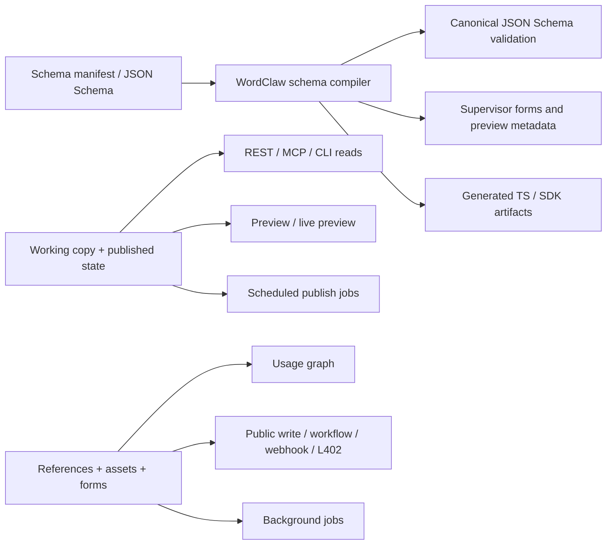

# RFC 0028: Content Modeling and Supervisor Ergonomics

**Author:** Codex  
**Status:** Implemented  
**Date:** 2026-03-29  

## 1. Summary

A review of mature structured-content runtime patterns shows a useful lesson: strong runtime fundamentals become much more valuable when they are paired with first-class modeling primitives and a higher-quality supervisor authoring experience. WordClaw already has many of the runtime pieces that advanced content platforms rely on, including version history, workflows, assets, API generation, and optional vector search. The main gaps are around **how models are expressed**, **how draft versus published state is handled**, and **how human supervisors operate safely without editing raw JSON everywhere**.

This RFC proposes an optional improvement lane for WordClaw that borrows the most relevant ideas from modern content-system design patterns while preserving WordClaw's product boundary as a governed runtime for AI agents and human supervisors. The proposal adds:

- singleton/global content types
- field-level localization with locale-aware reads
- working-copy versus published state with preview and live preview
- an editor-oriented field manifest that compiles to canonical JSON Schema
- reverse relationship and asset usage graphs
- generated typed client artifacts
- form definitions built on top of existing public-write, workflow, webhook, and L402 primitives
- a generalized jobs layer for scheduled and non-blocking work

This RFC explicitly rejects turning WordClaw into a generic page builder, a Next.js-coupled monolith, or a system where local/server-side calls bypass policy guarantees.

## 1.1 Implementation Status

This RFC is now in core as of 2026-03-29:

- singleton/global content types
- field-level localization with locale-aware reads
- working-copy versus published reads with derived `draft`, `published`, and `changed` state
- preview-token issuance and preview read paths
- initial supervisor preview actions
- schema manifests and the compiler pipeline
- reverse-reference usage graphs for content items and assets across REST, GraphQL, MCP, CLI, and the supervisor UI
- generated TypeScript/Zod/client artifact generation from live schemas plus capability metadata
- reusable form definitions across REST, GraphQL compatibility, MCP, CLI, and the supervisor UI
- generalized background jobs for scheduled status transitions and deferred webhook delivery

The earlier discussion of plugin-style extension registries and richer live-preview session mechanics is now best treated as follow-on work rather than part of this accepted and implemented RFC scope.

## 2. Motivation

### 2.1 What the Product Review Made Clear

The review is not useful because it points at one specific CMS. It is useful because it highlights a few product truths especially well:

- content modeling is stronger when schemas also drive the authoring UI
- singleton/global documents remove repeated "just create one row and remember not to create a second one" friction
- draft and published state should be first-class, not just conventions layered on top of generic versions
- preview is more useful when it is built into the authoring loop rather than left to custom glue code
- reverse relationship visibility is operationally important, not just convenient
- typed client artifacts reduce integration mistakes and make complex content models easier to consume
- generalized background jobs turn scheduling, previews, publishing, and side effects into product features instead of ad hoc scripts

These themes recur across mature content systems with first-class globals, drafts, preview, structured blocks, reverse relationships, generated client contracts, extension systems, job queues, and reusable form tooling.

### 2.2 Current WordClaw Strengths

WordClaw already has strong runtime foundations:

- multi-tenant content types and content items
- immutable item version history
- review workflows and approval tasks
- schema-aware assets and content references
- REST, MCP, CLI, and compatibility GraphQL surfaces
- audit logs, policy enforcement, and L402 monetization
- public write lanes for bounded external input

That means WordClaw does **not** need to copy any external product wholesale. It already has a differentiated runtime core.

### 2.3 Current Friction in WordClaw

The following reflected the pre-implementation state at proposal time.

The main friction is upstream of the runtime:

- `ui/src/routes/schema/+page.svelte` stores and edits schemas as raw JSON in a `Textarea`, which is powerful but high-friction for routine supervisor work.
- `src/services/content-schema.ts` supports a small but growing set of custom JSON Schema extensions (`asset`, `content-ref`, public write, lifecycle), but there is no higher-level modeling layer for reusable editor semantics.
- `src/db/schema.ts` models content types and content items generically, but has no first-class concept for singleton documents, locale-aware state, preview sessions, or reverse-reference projections.
- Draft status exists today, but WordClaw does not yet have a first-class working-copy versus published split, autosave, scheduled publishing, or a preview contract for site/app consumers.
- Relationship support is currently directional. WordClaw can point to content and assets, but it does not yet surface "used by" or impact views as a product primitive.
- Public write lanes are strong low-level primitives, but there is no supervisor-facing form definition workflow on top of them.

### 2.4 Design Patterns Worth Adapting

| Pattern | Why it matters | WordClaw action |
| --- | --- | --- |
| **Globals** | Single-document config is a real content primitive, not a workaround. | Add singleton/global content types and dedicated runtime surfaces. |
| **Drafts + changed state** | Editors need a clean split between published state and ongoing work. | Add working-copy semantics, preview, autosave, and scheduled publishing. |
| **Live Preview** | Preview must live inside the authoring loop. | Add preview tokens plus a supervisor preview contract. |
| **Blocks** | Heterogeneous structured sections make content modeling easier without free-form page-builder drift. | Add reusable block/section manifests compiled to JSON Schema. |
| **Join field** | Reverse references are important for safe edits and operational awareness. | Add usage graphs and reverse relationship projections. |
| **Generated TypeScript** | Runtime contracts are safer when client artifacts are generated from content models. | Add schema-driven type and SDK generation to the CLI. |
| **Jobs Queue** | Scheduling and slow side effects should be productized. | Generalize existing workers into a background jobs lane. |
| **Form Builder plugin** | Reusable form definitions unlock practical external intake workflows. | Build form kits on top of public write, workflow, webhook, and L402 support. |

## 3. Proposal

Introduce an optional **content-modeling and supervisor-ergonomics lane** for WordClaw, built around three pillars:

1. **Content-state primitives**
2. **Schema-to-authoring ergonomics**
3. **Operational extension primitives**



### 3.1 Content-State Primitives

Add first-class primitives for the most common authoring-state workflows:

- **Singleton/global content types**
- **Localized fields**
- **Working copy versus published state**
- **Preview and live preview**
- **Scheduled publish and unpublish**

These are not marketing-only features. They help every governed content workflow where the runtime needs:

- a single canonical settings object
- different locale variants of the same logical document
- safe unpublished changes
- human verification before publication

### 3.2 Schema-to-Authoring Ergonomics

Keep JSON Schema as WordClaw's canonical validation language, but add an optional, higher-level **field manifest** that compiles down to JSON Schema and supervisor UI metadata.

This manifest should support a constrained set of field primitives:

- text, textarea, number, checkbox, select
- rich text later, but not required for the first phase
- asset and asset-list
- content-ref and content-ref-list
- group and array
- block-set for heterogeneous structured sections
- localized fields
- singleton/global references

The important product rule is:

- agents and APIs continue to rely on canonical JSON Schema
- human supervisors get a better modeling and editing experience
- advanced users can still drop to raw JSON Schema when needed

### 3.3 Operational Extension Primitives

Build on existing WordClaw foundations by adding:

- reverse-reference projections for impact analysis
- generated typed client artifacts
- reusable form definitions
- a generalized jobs layer

This makes the current runtime easier to extend without requiring every deployment to reinvent the same surrounding infrastructure.

### 3.4 Product Boundaries

This RFC does **not** propose:

- turning WordClaw into a generic visual page builder
- coupling WordClaw to Next.js or any specific frontend stack
- replacing JSON Schema with TypeScript-only config
- bypassing policy, audit, or domain isolation in "local" execution paths
- recreating any external CMS admin surface wholesale

The goal is to selectively adopt the patterns that materially improve WordClaw's current product.

## 4. Technical Design (Architecture)

### 4.1 Singleton / Global Content Types

#### Problem

WordClaw currently models everything as a collection-like content type plus many content items. That works for repeatable entities, but it is awkward for:

- site settings
- brand settings
- default prompts
- pricing tables
- workflow defaults
- deployment-specific copy or policy banners

#### Proposal

Add a content-type kind:

- `collection`
- `singleton`

Implementation options:

- add a `kind` column to `content_types`, or
- introduce a small `singleton_content_types` side table if a cleaner migration path is preferred

Runtime behavior:

- singleton types allow one active document per `(domain_id, content_type_id)`
- they still produce versions, audit events, workflow submissions, and preview state
- REST gets dedicated endpoints such as `GET /api/globals/:slug` and `PUT /api/globals/:slug`
- MCP gets `get_global` and `update_global`
- CLI gets `wordclaw globals get` and `wordclaw globals update`

This captures the useful singleton/global pattern without forcing WordClaw to abandon its existing content-type model.

### 4.2 Localization

#### Problem

WordClaw currently has no first-class localization contract. Teams can encode locale maps manually, but the runtime does not:

- declare supported locales at the schema layer
- resolve locale plus fallback consistently across surfaces
- show locale-aware publication state

#### Proposal

Add localization as an optional schema-level capability:

- schema extension such as `x-wordclaw-localization`
- field manifest flag such as `localized: true`

Example:

```json
{
  "x-wordclaw-localization": {
    "supportedLocales": ["en", "nl"],
    "defaultLocale": "en"
  }
}
```

Runtime behavior:

- writes store canonical locale maps
- reads may request `locale` and `fallbackLocale`
- responses include locale resolution metadata
- draft/published state can later be localized per locale when required

REST, MCP, CLI, and UI should all share the same locale contract.

### 4.3 Working Copy, Published State, Preview, and Scheduling

#### Problem

WordClaw already has versions and draft status, but it does not yet provide a complete authoring-state model. Modern draft-oriented systems highlight the missing parts:

- a durable distinction between published data and newer draft changes
- a derived "changed" state for published items with newer working copies
- autosave
- scheduled publish / unpublish
- preview reads that intentionally return draft state

#### Proposal

Extend the existing versioned content model with explicit working-copy semantics:

- the currently published representation remains the default public read
- the newest draft/working copy is stored and queryable separately
- UI derives `draft`, `published`, and `changed`
- autosave remains opt-in per content type or singleton
- scheduled publish/unpublish is executed through the jobs layer

Expected API additions:

- read option: `draft=true`
- preview-token issuance endpoints
- preview-specific read helpers for site/app consumers
- schedule fields or dedicated schedule endpoints for future publication changes

Expected UI additions:

- Save draft
- Publish
- Schedule publish
- Revert to published
- Preview and live preview actions

This is a direct improvement to WordClaw's current workflow story and naturally complements the existing review-task system.

### 4.4 Supervisor Preview and Live Preview

#### Problem

Preview in WordClaw is currently a custom integration problem. Mature content systems demonstrate that preview becomes much more usable when it is built into the authoring loop.

#### Proposal

Add two related but distinct primitives:

1. **Preview tokens**
2. **Live preview sessions**

Preview tokens:

- short-lived
- domain-scoped
- read-only
- optionally limited to specific content types, items, locales, or singleton slugs

Live preview sessions:

- supervisor UI opens a preview pane or iframe for a configured frontend URL
- WordClaw emits preview update events when the working copy changes
- frontend can reload or patch itself using the latest preview payload

Important adaptation:

- WordClaw should not require a specific frontend framework
- preview should be exposed as a runtime contract, not an admin-only hack
- preview access must remain policy-checked and auditable

### 4.5 Schema Manifest Compiler and Blocks

#### Problem

Raw JSON Schema remains the correct canonical runtime format for WordClaw, but it is too low-level for many supervisor workflows. Structured field and block systems are useful because they connect schema definition to editing ergonomics.

#### Proposal

Add an optional `schema_manifest` or equivalent config on `content_types`. This manifest compiles to:

- canonical JSON Schema
- editor layout metadata
- queryable field metadata
- preview labels and summaries
- generated types

Example high-level capabilities:

- grouped fields
- repeatable arrays
- heterogeneous block sets
- reusable field presets
- conditional visibility rules in the supervisor UI

Block sets should be intentionally constrained:

- suitable for structured sections, intake steps, or modular content parts
- not a free-form drag-and-drop website builder

This improves human usability while preserving the agent-facing JSON contract.

### 4.6 Reverse References and Usage Graphs

#### Problem

WordClaw already stores forward references through content refs and asset refs, but operators still lack a first-class way to ask:

- where is this document used?
- which pages or prompts depend on this asset?
- what else will be affected if I archive or change this record?

#### Proposal

Introduce a reverse-reference projection:

- either materialized as a `reference_edges` table, or
- incrementally maintained via events and backfills

Expose:

- `GET /api/content-items/:id/used-by`
- `GET /api/assets/:id/used-by`
- matching MCP/CLI read tools

Use cases:

- safe archive/delete flows
- workflow review impact checks
- preview invalidation
- dependency-aware publishing

This adapts the most useful part of reverse-relationship modeling while staying aligned with WordClaw's asset/content-ref model.

### 4.7 Generated Types and SDK Artifacts

#### Problem

WordClaw's schemas are machine-readable, but consumers still need to hand-write a large amount of integration code. Generated client artifacts demonstrate how much friction this removes.

#### Proposal

Add CLI-driven artifact generation:

- TypeScript interfaces
- Zod validators
- lightweight REST/MCP client helpers
- singleton/global typings
- localized field helpers

Example command:

```bash
wordclaw schema generate --domain default --out ./generated/wordclaw
```

These artifacts should be generated from WordClaw's own schema and capability surfaces, not from a framework-specific config file.

### 4.8 Form Definitions on Top of Public Write

#### Problem

WordClaw already has public write, workflows, webhooks, and L402, but the product does not yet expose a reusable form-definition layer. Reusable form-definition tooling shows the value of turning this into a first-party pattern.

#### Proposal

Add a narrow form-definition feature that composes existing runtime pieces:

- form definition schema or singleton
- generated public-write endpoint or token
- submission storage as content items
- optional moderation or review workflow
- optional webhook/email follow-up
- optional L402 payment requirement

Important boundary:

- this is a structured intake/runtime feature
- not a generic no-code website builder

This proposal also aligns with the website-form reference direction already described in RFC 0027.

### 4.9 Generalized Jobs Layer

#### Problem

WordClaw already has background-worker patterns for agent runs, payouts, assets, embeddings, lifecycle cleanup, and webhook-style side effects. These are valuable, but fragmented.

A generalized jobs abstraction illustrates the advantage of a single productized layer for:

- deferred work
- scheduled work
- non-blocking side effects

#### Proposal

Introduce a generalized jobs subsystem used by:

- scheduled publish / unpublish
- asset derivative generation
- embedding generation and refresh
- webhook fan-out and retries
- preview invalidation
- form follow-up actions
- future plugin-managed tasks

This does not replace the existing agent-run system. It complements it with a smaller, generic background-task lane.

### 4.10 Relationship to RFC 0022 and Existing Runtime Contracts

This RFC should compose with, not replace:

- RFC 0022 plugin architecture
- RFC 0023 media assets
- RFC 0025 reactive MCP sessions
- RFC 0027 structured website support

Specifically:

- plugins should be able to register new field presets, blocks, jobs, preview providers, and form actions
- reactive MCP can power preview invalidation and publish notifications
- media assets remain the canonical asset primitive used inside blocks, forms, and usage graphs
- website support becomes more practical once globals, localization, and preview exist

## 5. Alternatives Considered

### 5.1 Keep the Current JSON-Only Authoring Model

Rejected because it preserves the current supervisor friction and continues to push every real deployment toward custom modeling glue.

### 5.2 Recreate a Generic CMS Product More or Less Directly

Rejected because WordClaw is not trying to become a general-purpose framework-native CMS. Copying a full external product surface would dilute the governance-runtime focus.

### 5.3 Replace JSON Schema with TypeScript-Only Collection Config

Rejected because WordClaw's current value depends on transport-neutral schemas that agents, REST, MCP, CLI tooling, and remote operators can all exchange. TypeScript should be generated from WordClaw models, not become the sole source of truth.

### 5.4 Build a Visual Page Builder

Rejected because RFC 0021 and RFC 0027 both point in a narrower direction. WordClaw should support structured websites and structured supervisor authoring, not a generic drag-and-drop marketing product.

### 5.5 Keep Forms as Documentation-Only Patterns

Partially rejected. Documentation is still valuable, but WordClaw has enough primitives now that a reusable form-definition product layer is justified.

## 6. Security & Privacy Implications

- **Preview access**: Preview tokens must be short-lived, domain-scoped, auditable, and denied by default outside the requested content scope.
- **Draft leakage**: Public reads must never return drafts unless explicitly authorized through preview or authenticated access policy.
- **Cross-domain isolation**: Reverse-reference graphs, generated artifacts, and jobs must remain domain-scoped.
- **Generated client artifacts**: Code generation must avoid embedding secrets, policy internals, or hidden fields.
- **Form submissions**: Public form definitions must preserve bounded create-only semantics unless stricter permissions are explicitly granted.
- **Scheduled jobs**: Publish and unpublish scheduling must remain idempotent and traceable through audit and job logs.
- **Policy parity**: Unlike local-only privileged execution patterns in some systems, WordClaw should preserve policy evaluation expectations across all supported surfaces. No private execution path should silently bypass governance guarantees unless the operator explicitly opts into an admin-only maintenance mode.
- **L402 compatibility**: Form kits and preview flows must not accidentally bypass entitlement or paid-read rules when a content type or asset is monetized.

## 7. Rollout Plan / Milestones

### Implemented Scope

- singleton/global content types
- localization contract and locale-aware reads
- working-copy versus published reads with preview tokens
- schema manifests and compiled supervisor metadata
- reverse-reference usage graphs
- generated TypeScript and Zod artifacts from the CLI
- reusable form definitions on top of public write, workflow, webhook, and L402
- generalized jobs plus scheduled content status changes
- parity coverage across REST, MCP, CLI, optional GraphQL compatibility, and the supervisor UI where applicable

### Follow-On Candidates

- richer live-preview session transport beyond the current scoped preview-token contract
- plugin extension registries for manifest presets, preview providers, jobs, and form actions
- any extra migration/backfill helpers required for deployments that skipped earlier rollout slices
