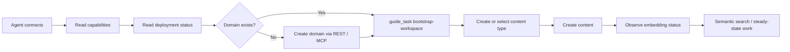

# RFC 0029: Agent Provisioning and Runtime Self-Description

**Author:** Codex  
**Status:** Implemented  
**Date:** 2026-03-29  
**Tracking Issue:** #175  

## 1. Summary

Real onboarding sessions with OpenClaw and Claude Code showed that WordClaw's runtime is already strong once an agent is connected, authenticated, and pointed at a valid domain, but the **first-contact provisioning path** was under-specified. Agents could discover capabilities after connection, yet they still hit avoidable friction around first-domain bootstrap, effective auth posture, vector RAG readiness, embedding completion, agent-oriented schema design, and framework-specific MCP setup.

This RFC proposes a **first-contact provisioning contract** across REST, MCP, CLI, and docs. The contract adds explicit bootstrap readiness to `GET /api/capabilities` and `GET /api/deployment-status`, introduces guided domain bootstrap and a new `guide_task("bootstrap-workspace")`, surfaces effective auth and RAG posture without relying on startup logs, makes embedding sync state queryable, and version-gates framework-specific integration guidance with a REST-first fallback.

The goal is not to hide runtime reality from agents. The goal is to make the runtime describe that reality clearly enough that an agent can bootstrap itself without guessing, sleeping blindly, or dropping to SQL.

## 1.1 Implemented

- capability and deployment discovery now surface effective auth posture, domain bootstrap state, and vector RAG readiness in-band
- first-domain bootstrap is now available over REST with `POST /api/domains`
- first-domain bootstrap is now also available over MCP with `create_domain`
- `guide_task("bootstrap-workspace")` now returns live actor-aware bootstrap guidance
- content writes fail with `NO_DOMAIN` on empty installs instead of surfacing a raw database foreign-key failure
- deployment status now exposes live embedding runtime health, and content reads now expose per-item `embeddingReadiness` for the latest published snapshot
- `guide_task("author-content")` and `content guide` now return schema-design guidance, starter schema-manifest patterns, and embedding/chunking notes when no content type is known yet
- capability discovery now includes a `toolEquivalence` map so agents can pivot between REST, MCP, GraphQL compatibility, and CLI during bootstrap
- deployment status now exposes supervisor UI readiness and startup hints through `checks.ui`
- the CLI now includes `wordclaw provision --agent <framework>` for OpenClaw, Codex, Claude Code, and Cursor snippets, with explicit `--write` support where safe
- local operator onboarding now has `npm run dev:all` for API plus supervisor startup
- integration docs now include framework-specific config-path guidance plus an explicit REST-first bootstrap fallback

## 2. Motivation

### 2.1 Observed Friction During Real Agent Onboarding

Recent provisioning sessions against a local WordClaw instance exposed the same class of issues more than once:

- a fresh database with no domain causes the first content-type write to fail deep in the data layer
- `AUTH_REQUIRED=false` is easy to misread as "no key needed", even though write paths still depend on actor and scope resolution unless insecure local admin is explicitly enabled
- semantic search availability is only obvious after a failing request or from startup logs that MCP and REST clients never see
- schema design for agent memory, checkpoints, and task logs is currently undocumented beyond the raw JSON Schema contract
- framework-specific MCP registry expectations vary, but the current docs assume more uniform support than agent frameworks actually provide
- the API/UI split and embedding completion state remain implicit operational knowledge rather than explicit runtime contract
- the bootstrap sequence exists conceptually, but not as one canonical first-time agent workflow

### 2.2 Why This Matters

WordClaw's product story depends on low-friction agent operation. If an agent cannot deterministically answer these questions, the rest of the runtime becomes harder to use than it should be:

- Can I act yet?
- Which domain am I supposed to use?
- What credential model is actually in force?
- Is vector RAG available in this deployment?
- Which bootstrap step is missing right now?
- When is embedding-backed search actually ready?

These are not edge-case ergonomics. They sit directly on the critical path for first-time agent setup and low-memory resume workflows.

### 2.3 Current Surfaces Are Good but Incomplete for Bootstrap

WordClaw already has several strong discovery surfaces:

- `GET /api/capabilities` and `system://capabilities`
- `GET /api/deployment-status` and `system://deployment-status`
- `GET /api/workspace-context` and `system://workspace-context`
- `guide_task("discover-deployment")`
- `guide_task("discover-workspace")`

The gap is that these surfaces start being useful **after** key bootstrap assumptions already hold. The runtime needs to describe the missing prerequisites themselves, not just the steady-state contract.

## 3. Proposal

Introduce a **first-contact provisioning contract** with six lanes:

1. explicit bootstrap precondition reporting
2. guided first-domain creation and bootstrap workflow
3. effective auth posture reporting
4. service readiness reporting for vector RAG, embeddings, and UI
5. agent-oriented content-model guidance
6. cross-framework portability guidance with REST fallback



### 3.1 Provisioning Contract Goals

The runtime should let an agent determine, in-band and without logs:

- whether any domains exist
- whether the current auth mode permits writes, and under what conditions
- whether semantic search is enabled and why or why not
- how to bootstrap a workspace from zero state
- whether asynchronous embedding work has completed
- which transport to use when MCP registry support is missing

### 3.2 Non-Goals

This RFC does not propose:

- anonymous remote tenant creation
- hiding auth requirements behind silent development-only magic
- turning WordClaw into a framework-specific integration product
- replacing current discovery resources with docs-only guidance
- building a full visual setup wizard before the machine-readable contract exists

## 4. Technical Design (Architecture)

### 4.1 Capability Manifest Additions

`buildCapabilityManifest()` should grow a provisioning-oriented section that describes bootstrap expectations and transport fallback, not just steady-state capability surfaces.

Proposed additions:

- `bootstrap`
- `auth`
- `toolEquivalence`

Illustrative shape:

```json
{
  "bootstrap": {
    "domainsPresent": false,
    "domainCount": 0,
    "firstDomainRequired": true,
    "restCreateDomainPath": "/api/domains",
    "mcpCreateDomainTool": "create_domain",
    "recommendedGuideTask": "bootstrap-workspace"
  },
  "auth": {
    "required": false,
    "writeRequiresCredential": true,
    "insecureLocalAdminEnabled": false,
    "acceptedHeaders": ["x-api-key", "Authorization: Bearer <key>"],
    "recommendedActorProfile": "api-key",
    "recommendedScopes": ["content:write"]
  },
  "toolEquivalence": [
    {
      "intent": "create-domain",
      "rest": "POST /api/domains",
      "mcp": "create_domain"
    },
    {
      "intent": "create-content-type",
      "rest": "POST /api/content-types",
      "mcp": "create_content_type"
    }
  ]
}
```

Design notes:

- `capabilities` stays safe for public discovery, so it must not expose configured key names, secrets, filesystem paths, or raw environment values
- `auth.recommendedScopes` should name scopes, not specific key labels such as `writer`
- `toolEquivalence` should initially cover bootstrap-critical operations rather than every tool in the product

### 4.2 Deployment Status Additions

`getDeploymentStatusSnapshot()` should report the live readiness of the bootstrap path itself.

Proposed additions:

- `bootstrap`
- `vectorRag`
- `embeddings`
- `ui`

Illustrative shape:

```json
{
  "bootstrap": {
    "status": "blocked",
    "domainCount": 0,
    "firstDomainRequired": true,
    "nextAction": "Create a domain before creating content types or content items."
  },
  "vectorRag": {
    "status": "disabled",
    "enabled": false,
    "reason": "OPENAI_API_KEY not set",
    "model": null,
    "provisioningHint": "Set OPENAI_API_KEY and restart the server."
  },
  "embeddings": {
    "status": "ready",
    "enabled": true,
    "queueDepth": 0,
    "dailyBudgetRemaining": 1976
  },
  "ui": {
    "status": "degraded",
    "servedFromApi": false,
    "routePrefix": "/ui/",
    "devHint": "Start the UI with `npm --prefix ui run dev`."
  }
}
```

Design notes:

- `vectorRag` must reflect what the runtime can do right now, not what startup logs said at boot
- `embeddings.queueDepth` can be advisory and process-local in the first phase because the current embedding work is in-process rather than a durable queue
- `ui.servedFromApi` should distinguish between a built static UI available at `/ui/` and a separate dev server that still needs to be started

### 4.3 Domain Bootstrap Surfaces

WordClaw already exposes `GET /api/domains`, but first-time bootstrap still lacks a mutation path.

Proposed additions:

- `POST /api/domains`
- MCP `create_domain`
- CLI `wordclaw domains create`
- explicit `NO_DOMAIN` write error for content-type and content-item creation

Proposed route behavior:

- normal multi-domain operation: require `admin` or `tenant:admin`
- bootstrap mode: permit creation when `domainCount === 0` and the caller is using an allowed bootstrap profile such as an env-backed admin key or insecure local admin in non-production
- when no domain exists, content mutations should fail early with:

```json
{
  "code": "NO_DOMAIN",
  "remediation": "Create a domain with POST /api/domains or MCP create_domain before creating content types."
}
```

This RFC prefers **explicit bootstrap mutation plus explicit erroring** over silent automatic domain creation.

### 4.4 Guided Bootstrap Workflow

Add `guide_task("bootstrap-workspace")` as the canonical first-time provisioning sequence.

Expected behavior:

- read deployment capabilities and status
- confirm auth posture
- create a domain if needed
- check or create the first target content type
- verify vector RAG readiness when semantic search is required
- create initial content
- wait for or verify embedding readiness before semantic search verification

`guide_task("discover-deployment")` should also be upgraded so that it explicitly reports blocked bootstrap conditions, even when the caller has not yet asked for the full bootstrap recipe.

### 4.5 Effective Auth Posture

The runtime currently communicates actor profiles, but not the effective write posture clearly enough when `AUTH_REQUIRED=false`.

Required behavior:

- distinguish `auth required for all requests` from `credentials still required for write-capable actor resolution`
- expose whether `ALLOW_INSECURE_LOCAL_ADMIN=true` is actually active
- provide deterministic hints for accepted credential formats and minimum scopes
- update `.env.example`, `getting-started.md`, and integration guides so the written explanation matches runtime behavior exactly

This keeps the actual auth system unchanged while removing ambiguity about how it behaves.

### 4.6 Embedding Readiness Tracking

Embedding sync is currently asynchronous and mostly invisible to agents. That makes semantic-search verification non-deterministic.

Proposed content-item metadata:

- `embeddingStatus`: `pending | synced | failed | disabled`
- `embeddingChunks`: integer
- `embeddingUpdatedAt`: timestamp
- `embeddingErrorCode`: nullable string

Implementation direction:

- persist embedding status metadata alongside `content_items`
- set `pending` when a publish or publish-like update schedules embedding work
- set `disabled` immediately when vector RAG is unavailable for this deployment
- set `synced` plus chunk count on success
- set `failed` plus a sanitized error code on failure

These fields should be returned from REST, GraphQL, and MCP item reads so agents do not need a transport-specific workaround.

### 4.7 Agent-Oriented Content Modeling Guidance

WordClaw already accepts flexible JSON Schema, but bootstrap guidance should cover common agent patterns instead of leaving every agent to rediscover them.

Required guidance additions:

- recommended schema patterns for `memory`, `task-log`, and `checkpoint`
- explicit note about which fields are skipped during embedding chunk generation
- guidance on stable identifiers, tags, lifecycle state, provenance fields, and concise searchable text
- `guide_task("author-content")` should offer schema design hints when no usable content types exist yet

This can start as docs plus task guidance. A dedicated machine-readable template resource can follow later if needed.

### 4.8 Framework Portability and Provisioning Helpers

The integration surface should stop assuming that all agent frameworks support the same MCP registry conventions.

Required changes:

- version-gate the OpenClaw guide where native MCP registry support is required
- add a REST-first fallback section to OpenClaw and general MCP integration docs
- document config-path differences for OpenClaw, Claude Code, Cursor, and similar clients without claiming schema parity that does not exist
- add `wordclaw provision --agent <framework>` as a helper that prints bootstrap-ready config snippets and, optionally, writes them with an explicit `--write` flag
- add `npm run dev:all` to start API and UI together for local operator onboarding

The helper command should be convenience tooling, not the only supported path.

## 5. Alternatives Considered

### 5.1 Docs-Only Cleanup

Improve the guides but leave runtime responses unchanged.

Rejected because the most expensive failures happen before agents know which guide applies, and because runtime-discoverable truth is more reliable than prompt or documentation memory.

### 5.2 Auto-Seed a Default Domain in Development

Create a default domain during migration whenever `NODE_ENV !== 'production'`.

Deferred as a convenience option, but rejected as the primary solution. Silent seeding hides the real bootstrap model, creates dev/prod drift, and does not help hosted or remotely attached agents understand what happened.

### 5.3 Framework-Specific Skill Fixes Only

Patch OpenClaw and Claude-specific skills or prompts without changing WordClaw itself.

Rejected because the provisioning problem is in the runtime contract, not in one agent client. Solving it in prompts duplicates logic and guarantees drift.

### 5.4 Keep Embedding Readiness Implicit

Continue using delay-based retries after publish.

Rejected because blind sleeps are token-expensive, flaky, and unnecessary when the runtime can expose state directly.

## 6. Security & Privacy Implications

This RFC mostly improves observability and bootstrap control, but several guardrails matter:

- public capability and status surfaces must expose posture, not secrets
- `POST /api/domains` must never permit anonymous remote creation
- bootstrap-mode domain creation must be tightly scoped to `domainCount === 0` or global admin profiles
- auth guidance must describe accepted credentials and scopes without leaking configured key names or raw environment values
- embedding failure details returned to agents should use sanitized error codes rather than raw vendor exceptions
- `wordclaw provision --agent --write` must remain an explicit local operator action and should not rewrite third-party config files implicitly

## 7. Rollout Plan / Milestones

### Phase 1: Discovery Contract and Error Clarity

- add `bootstrap`, `auth`, and `vectorRag` reporting to capability and status surfaces
- return `NO_DOMAIN` instead of surfacing raw foreign-key failures for first-write bootstrap mistakes
- update `discover-deployment` guidance and the main onboarding docs

### Phase 2: Bootstrap Mutations

- ship `POST /api/domains`, MCP `create_domain`, and CLI `wordclaw domains create`
- add `guide_task("bootstrap-workspace")`
- document the first-time agent setup recipe end-to-end

### Phase 3: Embedding Readiness

- persist embedding status metadata on content items
- expose embedding readiness across REST, GraphQL, and MCP
- surface advisory embedding queue and budget status in deployment readiness

### Phase 4: Framework Convenience and Operator Ergonomics

- version-gate OpenClaw integration instructions and add REST fallback tables
- add `wordclaw provision --agent <framework>`
- add `npm run dev:all`
- expose UI availability and startup hints in deployment status
