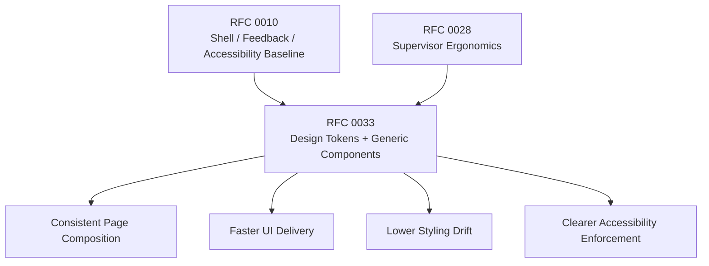

# RFC 0033: Supervisor UI Design System and Consistency

**Author:** Codex<br>
**Status:** Substantially Implemented<br>
**Date:** 2026-04-03<br>
**Updated:** 2026-04-05

## 0. Current Status

As of 2026-04-05, RFC 0033 is substantially implemented on `main`.

### What Has Been Delivered

#### Foundation Component Layer (Complete)

The `ui/src/lib/components/ui/` directory contains a stable set of foundational primitives used across all operational routes:

- `Button` — 6 variants (default, secondary, outline, ghost, destructive, success) × 4 sizes
- `Input` — consistent rounded-xl form control with focus-ring styling
- `Select` — system-styled dropdown with design-token compliance
- `Textarea` — auto-height text input with consistent border and focus behavior
- `Badge` — 8 semantic variants (default, muted, outline, success, warning, danger, paid, info)
- `Surface` — primary container primitive with 3 tones (default, muted, subtle)

#### Composite Components (Complete)

Shared behavior components in `ui/src/lib/components/`:

- `DataTable` — sortable, expandable, custom-cell-rendered data table used by content, assets, keys, jobs, payments, forms, and audit logs
- `ErrorBanner` — inline error display with error code, remediation, detail lists, and action buttons
- `Toast` — severity-based notification system managed by the reactive `FeedbackStore`
- `ConfirmDialog` — focus-trapping modal confirmation with danger/primary intents and async loading state
- `ContentPreviewModal` — structured content inspector with field-level inline revision via the approval queue; also used as a read-only viewer in the content browser
- `LoadingSpinner` — 4-size spinner used across all loading states
- `ActorIdentity` — actor type/source/ID renderer with icon discrimination
- `ActionBadge` — CRUD operation pill for audit-log entries
- `JsonCodeBlock` — syntax-highlighted JSON viewer
- `DomainDropdown` — multi-tenant domain selector

#### Sandbox Components (Agent Sandbox Feature)

`ui/src/lib/components/sandbox/`:

- `SandboxWorkspace` — full interactive agent sandbox UI
- `StepTimeline` — vertical step timeline for agent run visualization
- `NarrationBlock` — agent narration/reflection renderer
- `StatusBadge` — status indicator for sandbox state

#### Design System Documentation (Complete)

A comprehensive design-system reference document exists at `doc/reference/design-system.md` covering:

- Color system (core palette, semantic colors, action badges, backgrounds)
- Typography scale and rendering rules
- Spacing and layout tokens (grid, padding, radius, shadows)
- Full component API documentation per component
- Navigation system architecture (sidebar, breadcrumb, collapsed mode)
- Iconography assignments (svelte-hero-icons)
- Motion and transition inventory
- Overlay and z-index stack
- CSS architecture (Tailwind v4, cn() utility, theme switching)
- Content intelligence / label resolution
- UI feedback system
- Conventions and guidelines

#### Shared Utility Layer (Complete)

- `content-label.ts` — unified content label, subtitle, summary, slug, and attribution resolution
- `actors.ts` — actor type inference and display formatting
- `theme.ts` — theme initialization, application, and toggle with localStorage persistence
- `ui-feedback.svelte.ts` — reactive Svelte 5 store for toasts and confirmations
- `api.ts` — fetchApi with structured error handling (ApiError with code + remediation)
- `utils.ts` — deepParseJson and formatJson utilities
- `cn.ts` — class merging via clsx + tailwind-merge
- `deferred-tab.ts` — deferred browser tab management

#### Route Coverage (Complete)

All supervisor routes use the shared design-system primitives:

| Route | Button | Surface | Badge | DataTable | ErrorBanner | Toast/Confirm |
|-------|--------|---------|-------|-----------|-------------|---------------|
| Dashboard | — | ✓ | ✓ | — | ✓ | — |
| Audit Logs | ✓ | — | ✓ | ✓ | ✓ | — |
| Content Browser | ✓ | ✓ | ✓ | ✓ | ✓ | ✓ |
| Assets | ✓ | ✓ | ✓ | ✓ | ✓ | ✓ |
| Schema Manager | ✓ | ✓ | ✓ | — | ✓ | ✓ |
| Forms | ✓ | ✓ | ✓ | ✓ | ✓ | ✓ |
| Agents | ✓ | ✓ | ✓ | — | ✓ | ✓ |
| API Keys | ✓ | ✓ | ✓ | ✓ | ✓ | ✓ |
| Approval Queue | ✓ | ✓ | ✓ | — | ✓ | ✓ |
| Jobs | ✓ | ✓ | ✓ | ✓ | ✓ | ✓ |
| Payments | — | — | ✓ | ✓ | ✓ | — |
| L402 Readiness | ✓ | ✓ | ✓ | — | ✓ | ✓ |

#### Test Coverage (Complete — All Thresholds Met)

21 test files with 169 tests passing. Coverage exceeds all thresholds:

| Metric | Coverage | Threshold | Status |
|--------|----------|-----------|--------|
| Statements | 70.77% | 65% | ✓ |
| Branches | 51.92% | 45% | ✓ |
| Functions | 71.07% | 65% | ✓ |
| Lines | 70.10% | 70% | ✓ |

Component-level tests:

- `ErrorBanner.test.ts` — 8 tests (render paths, codes, remediations, actions)
- `DataTable.test.ts` — 7 tests (columns, row clicks, sorting)
- `ConfirmDialog.test.ts` — 4 tests (render, confirm, cancel flows)
- `Toast.test.ts` — 5 tests (severity variants, codes, remediation)

Utility-level tests:

- `content-label.test.ts` — 27 tests
- `actors.test.ts` — 24 tests
- `utils.test.ts` — 11 tests
- `theme.test.ts` — 9 tests
- `formHelpers.test.ts` — 19 tests

Route-level tests:

- `layout.test.ts` — responsive shell and navigation
- `login.test.ts` — authentication flow
- `invite.test.ts` — invite acceptance flow
- `approvals.test.ts` — approval queue interactions
- `agents.test.ts` — agent provisioning
- `forms.test.ts` — form creation/editing
- `keys.test.ts` — API key management

### What Remains Pending

The following items from the original proposal have not yet been implemented as standalone shared components. The patterns they describe are present in the codebase, but they remain route-local implementations rather than reusable abstractions.

#### Mid-Level Pattern Components (Not Yet Extracted)

| Proposed Component | Current State |
|--------------------|---------------|
| `PageHeader` | Each route builds its own header with h2 + description + actions. The pattern is consistent in style but not extracted to a shared component. |
| `StatCard` / `StatGrid` | The dashboard uses inline Surface-based stat strips. Other routes (keys, L402 readiness, content) use similar patterns ad hoc. |
| `FilterBar` / `FilterChips` | Content browser, assets, jobs, and audit logs each implement their own search/filter toolbar. The pattern is consistent but not shared. |
| `InspectorPanel` / `SplitView` | Content browser, assets, and jobs each implement right-side drawer inspectors. Approval queue uses a master-detail split. These are route-local. |
| `MetadataList` | Inspector panels repeat label/value detail lists with identical styling. Not yet a shared component. |
| `Dialog` / `Sheet` | Modals and drawers in content, keys, agents, and assets are each page-local. `ConfirmDialog` and `ContentPreviewModal` are shared, but the generic dialog/sheet shell is not. |
| `Field` / `Checkbox` / `RadioCard` | Form labels, hints, and validation wrappers are hand-built per route. The form editor uses its own label/hint patterns. |
| `AuthShell` | Login and invite pages use legacy gray-based color palette and do not use shared primitives (`Button`, `Input`, `ErrorBanner`). They are the only routes that bypass the design system. |
| `EmptyState` | Each route implements its own empty state. The DataTable has a built-in empty state, but standalone empty states are route-local. |
| `LoadingState` | All routes use LoadingSpinner directly. No shared loading-state wrapper exists. |
| `SelectableCard` | Schema picker in the content browser uses a card selection pattern that is not extracted. |

#### Auth Page Modernization (Not Started)

The `login` and `invite` pages are the only routes that still bypass the shared design system:

- Use `bg-gray-*` / `dark:bg-gray-*` instead of the standardized slate palette
- Use raw `<input>` and `<button>` elements instead of `Input`, `Button`, and `ErrorBanner`
- Do not have a shared `AuthShell` wrapper for the centered card layout
- Visually inconsistent with the rest of the supervisor UI

## 1. Summary

This RFC proposes a Supervisor UI design-system layer for WordClaw.

The goal is not a visual rebrand and not a frontend rewrite. The goal is to make the current visual language composable and enforceable through reusable generic components, semantic design tokens, and a small set of page composition contracts.

Primary objectives:

- improve operator-facing consistency across all supervisor routes
- reduce duplicate UI code by replacing route-local layout and interaction shells with shared generic components
- increase UI test coverage so the new design-system contracts are verified rather than relying only on manual review

The proposed system keeps the current Svelte + Tailwind stack and extends the existing primitive layer with standardized components for:

- page chrome
- cards and metric presentation
- dialogs and drawers
- forms and field wrappers
- loading, empty, and error states
- filters and active filter chips
- split-view inspector layouts
- metadata and structured detail presentation
- public auth pages

## 2. Dependencies & Graph

- **Builds on:** RFC 0010 (Supervisor UI Usability and Accessibility Hardening) for the responsive shell, shared feedback direction, and accessibility baseline.
- **Builds on:** RFC 0028 (Content Modeling and Supervisor Ergonomics) because structured browsing and editing flows need consistent operator-facing presentation.
- **Supports:** current and future supervisor pages, including approval workflows, asset inspection, content modeling, provider/workforce provisioning, and public supervisor-account flows.



## 3. Motivation

### 3.1 Operator Consistency Is Still Too Manual

The current UI foundation is strong enough to build pages, but not strong enough to keep them consistent without repeated manual effort.

Examples of repeated patterns now present in the codebase:

- page headers with eyebrow, title, description, and actions
- bordered metric tiles with nearly identical typography
- ad hoc modal shells for keys, agents, assets, and content
- repeated filter toolbars with search, selects, buttons, and filter chips
- duplicated empty and loading shells
- repeated inspector and master-detail layouts for assets, jobs, and content

### 3.2 Duplication Raises Product and Maintenance Cost

This duplication has direct consequences:

- new UI work is slower because authors restyle solved problems
- dark-mode and spacing parity regress page by page
- accessibility fixes have to be applied repeatedly
- interaction differences make the product harder to learn
- the codebase becomes harder to refactor because the visual system is expressed as copied utility strings instead of shared contracts

### 3.3 WordClaw Needs a Stable Mid-Level UI Layer

The current primitive layer is too atomic for the actual product.

WordClaw does not only need buttons and inputs. It also needs reusable product patterns:

- page headers
- stat cards
- dialogs
- field groups
- empty states
- inspector panels
- filter bars

Without those mid-level components, the design system exists only implicitly.

## 4. Proposal

Introduce a formal Supervisor UI design-system layer with three levels:

1. **Semantic Tokens**
   - colors, surfaces, borders, text roles, spacing, radii, shadows, and focus rings
2. **Reusable Generic Components**
   - page, form, feedback, data-display, and overlay components
3. **Page Composition Rules**
   - standard ways to assemble operational routes from those components

This RFC intentionally does not propose:

- a separate npm package
- a migration away from Tailwind or Svelte
- a new brand identity
- a full-page rewrite in one release
- a dependency on a large third-party UI kit

The design direction remains conservative: codify the current working visual language, reduce drift, and improve consistency through composition rather than reinvention.

Duplicate-code reduction is an explicit objective of this RFC. New abstractions should replace repeated route-local implementations, not sit alongside them as an optional parallel layer.

## 5. Technical Design (Architecture)

### 5.1 Design Token Layer

Add semantic tokens for the Supervisor UI so shared components stop hardcoding the same values independently.

Scope:

- background layers
- surface layers
- muted surface layers
- border tones
- primary text, secondary text, tertiary text
- accent, success, warning, danger, and info roles
- focus ring color and offset behavior
- radii and shadow levels
- spacing scale used by headers, cards, forms, and dialogs

Implementation direction:

- keep token definitions in the existing UI styling entrypoint or a dedicated imported token file
- prefer semantic naming over palette naming
- support light and dark mode together
- update primitives to consume the same token vocabulary

This is not a mandate to remove every utility class. It is a mandate to stop making every component decide its own spacing and semantic colors independently.

**Status (2026-04-05):** The design-system reference document (`doc/reference/design-system.md`) fully documents the token vocabulary: core palette, semantic colors, action badges, surfaces, borders, text roles, spacing/radius/shadow scales, and background treatments for both light and dark modes. The tokens are applied consistently through shared components. No separate CSS custom-property token file has been created; tokens are expressed through Tailwind utility classes documented in the design-system reference.

### 5.2 Component Taxonomy

The design system should have two reusable layers above the primitives already present.

#### Foundation Components

Keep and evolve the existing base components:

- `Button` ✓
- `Input` ✓
- `Select` ✓
- `Textarea` ✓
- `Badge` ✓
- `Surface` ✓
- `DataTable` ✓

Extend this layer with:

- `Alert` — not yet extracted (ErrorBanner covers most cases)
- `Card` — not yet extracted (Surface with custom content fills this role)
- `Dialog` — not yet extracted (ConfirmDialog and ContentPreviewModal are the shared modals)
- `Sheet` — not yet extracted (route-local inspector drawers exist)
- `Field` — not yet extracted
- `Checkbox` — not yet extracted
- `RadioCard` — not yet extracted
- `LoadingState` — not yet extracted (LoadingSpinner is used directly)
- `EmptyState` — not yet extracted (DataTable has a built-in empty state)

#### Pattern Components

Add a more opinionated product-pattern layer:

- `PageHeader` — not yet extracted
- `StatCard` — not yet extracted
- `StatGrid` — not yet extracted
- `FilterBar` — not yet extracted
- `FilterChips` — not yet extracted
- `MetadataList` — not yet extracted
- `InspectorPanel` — not yet extracted
- `SplitView` — not yet extracted
- `SelectableCard` — not yet extracted
- `AuthShell` — not yet extracted

### 5.3 Proposed Generic Components

The following components are the minimum useful set.

| Component | Purpose | Primary Adoption Targets | Status |
| --- | --- | --- | --- |
| `PageHeader` | Standard route header with eyebrow, title, description, badges, and actions | forms, jobs, keys, agents, content, dashboard | Pending |
| `Card` family | Shared content container with header/content/footer and stat variants | dashboard, jobs, keys, assets, content | Surface fills this role; no separate Card component |
| `Alert` | Severity-based inline feedback replacing page-local error boxes | all routes, replaces `ErrorBanner` over time | ErrorBanner is the current solution |
| `Dialog` | Standard modal shell with title, body, footer actions, overlay, and focus behavior | keys, agents, assets, content | Pending |
| `Sheet` | Right-side inspector/drawer pattern | content item inspector, future approval/job detail flows | Pending |
| `Field` family | Label, hint, validation, and consistent control spacing | all forms, login, invite, provisioning dialogs | Pending |
| `CheckboxCard` / `RadioCard` / `SelectableCard` | Structured option selection with stronger visual affordance | schema picker, permissions, readiness checklist | Pending |
| `LoadingState` | Standard blocking/non-blocking loading presentation | forms, keys, jobs, content, assets | LoadingSpinner used directly |
| `EmptyState` | Standard empty-result or empty-product state | tables, lists, first-run routes | DataTable has built-in; others ad hoc |
| `FilterBar` | Search, filter controls, actions, and active-filter affordances | content, jobs, assets, audit logs | Pending |
| `StatGrid` / `StatCard` | KPI and summary presentation | dashboard, keys, jobs, L402 readiness | Pending |
| `MetadataList` | Standard label/value detail display | inspectors, endpoints, timestamps, delivery metadata | Pending |
| `SplitView` / `InspectorPanel` | Master-detail page structure | content, assets, jobs | Pending |
| `AuthShell` | Shared public-route wrapper and auth card layout | login, invite | Pending |

### 5.4 File Organization

Recommended structure:

```text
ui/src/lib/components/ui/
  Alert.svelte
  Badge.svelte          ✓ exists
  Button.svelte         ✓ exists
  Card.svelte
  Checkbox.svelte
  Dialog.svelte
  EmptyState.svelte
  Field.svelte
  Input.svelte          ✓ exists
  LoadingState.svelte
  PageHeader.svelte
  RadioCard.svelte
  Select.svelte         ✓ exists
  Sheet.svelte
  Surface.svelte        ✓ exists
  Textarea.svelte       ✓ exists

ui/src/lib/components/patterns/
  AuthShell.svelte
  FilterBar.svelte
  FilterChips.svelte
  InspectorPanel.svelte
  MetadataList.svelte
  SplitView.svelte
  StatCard.svelte
  StatGrid.svelte
  SelectableCard.svelte
```

This keeps the current repository shape understandable:

- primitives stay close to the existing `ui` layer
- opinionated page patterns are grouped separately
- routes become consumers of shared product patterns instead of owners of layout decisions

**Status (2026-04-05):** The `ui/` subdirectory contains the 6 foundational primitives. The `patterns/` subdirectory does not yet exist. Composite components (`DataTable`, `ErrorBanner`, `Toast`, `ConfirmDialog`, `ContentPreviewModal`, etc.) live directly in `ui/src/lib/components/`.

### 5.5 Interaction Contracts

The design system should define behavior, not only styling.

#### Dialog Contract

All dialogs should share:

- overlay styling
- title and description placement
- close affordance
- footer action alignment
- escape handling
- focus management
- async action loading states

`ConfirmDialog` should become a specialization of the same dialog shell rather than a parallel implementation.

**Status (2026-04-05):** `ConfirmDialog` and `ContentPreviewModal` both implement the full dialog contract independently (overlay, escape, focus trap, loading state, footer actions). They are not yet derived from a shared `Dialog` base.

#### Field Contract

All editable inputs should share:

- label position
- hint text styling
- validation/error presentation
- disabled state
- consistent vertical rhythm

Page authors should not hand-build label and spacing wrappers unless there is a documented exception.

**Status (2026-04-05):** No shared `Field` wrapper exists. Routes and the form editor hand-build their own label/hint/error wrappers.

#### State Contract

All route-level and panel-level states should prefer:

- `LoadingState`
- `EmptyState`
- `Alert`

instead of route-local one-off implementations.

**Status (2026-04-05):** All routes use `LoadingSpinner` and `ErrorBanner` as the de facto standard, but no `LoadingState` or `EmptyState` wrapper component has been extracted.

#### Layout Contract

Operational routes should prefer:

- `PageHeader` for route chrome
- `Card` or `Surface`-based content sections
- `StatGrid` for compact metrics
- `SplitView` for master-detail flows
- `FilterBar` for searchable/filterable collections

**Status (2026-04-05):** All operational routes use `Surface` for content sections. Page headers, stat grids, split views, and filter bars are route-local. The patterns are visually consistent but not shared.

### 5.6 Adoption Targets by Area

#### Immediate High-Value Targets

- `login` and `invite` — **Not started.** Still use legacy gray palette and raw HTML elements.
- `keys` — **Done.** Uses Button, Surface, Badge, DataTable, ErrorBanner, ConfirmDialog.
- `agents` — **Done.** Uses Button, Surface, Badge, ErrorBanner, Toast, ConfirmDialog.
- `assets` — **Done.** Uses Button, Surface, Badge, DataTable, ErrorBanner, Toast, ConfirmDialog.
- `jobs` — **Done.** Uses Button, Surface, Badge, DataTable, ErrorBanner, Toast, ConfirmDialog.
- `content` — **Done.** Uses Button, Surface, Badge, DataTable, Input, Select, ErrorBanner, Toast, ConfirmDialog, ContentPreviewModal.

#### Medium-Term Targets

- dashboard summary surfaces — **Done.** Uses Surface, Badge, ErrorBanner, LoadingSpinner, ActionBadge, ActorIdentity.
- audit logs filtering/pagination shell — **Done.** Uses DataTable, Badge, ErrorBanner.
- L402 readiness checklist and status cards — **Done.** Uses Button, Surface, Badge, ErrorBanner.
- approvals page consistency pass — **Done.** Uses Button, Surface, Badge, Textarea, ErrorBanner, Toast, ConfirmDialog, ContentPreviewModal.

### 5.7 Documentation and Verification

This RFC does not require Storybook as a prerequisite.

Instead, the initial documentation and verification path should be:

- component usage docs in the repo
- route migrations that demonstrate intended composition
- targeted component tests where behavior matters
- route-level UI tests for critical migrated flows such as auth, dialogs, filters, and inspector interactions
- visual/manual review against light and dark themes

If the component surface grows enough to justify it later, a dedicated preview/catalog can be introduced as a follow-on step.

UI test coverage is a required outcome of the rollout, not a nice-to-have. Shared components should gain tests when they define meaningful behavior, and high-value migrated routes should gain or retain tests that prove the design-system layer works in realistic operator flows.

**Status (2026-04-05):** All documentation and verification targets are met:

- Design-system reference document exists at `doc/reference/design-system.md`.
- All operational routes use shared primitives (Button, Surface, Badge, DataTable, ErrorBanner, Toast, ConfirmDialog).
- 21 test files with 169 tests, all passing. Coverage exceeds all thresholds (statements 70.77%, branches 51.92%, functions 71.07%, lines 70.10%).
- Component tests exist for ErrorBanner, DataTable, ConfirmDialog, and Toast.
- Route tests exist for login, invite, layout, approvals, agents, forms, and keys.
- Web Animations API polyfill added to `vitest-setup.ts` for Svelte transition compatibility in jsdom.

### 5.8 Additional UI Improvements Enabled by This RFC

Beyond consistency and code reduction, this design-system layer should make a set of extra UI improvements much easier to ship safely.

These improvements are secondary to the core standardization work, but they are desirable follow-on outcomes:

- keyboard shortcuts and faster operator workflows for high-frequency pages — **Implemented** in the approval queue (j/k navigation, a/r for approve/reject).
- density options for data-heavy views such as content, assets, jobs, and audit logs — Not yet implemented.
- saved filters or saved views for repeated operational tasks — Not yet implemented.
- stronger mobile and narrow-screen adaptations for tables, filters, and inspectors — **Implemented** for the approval queue with responsive sticky action bar and collapsible metadata; content browser has mobile card view.
- clearer empty states and first-run guidance for under-configured domains — Partially present; DataTable has built-in empty states but no first-run guidance.
- more consistent inline help, hints, and explanatory copy in provisioning and schema-driven flows — Partially present; agents page has descriptive provider labels and status badges.
- standardized action bars for bulk actions, refresh actions, and contextual row actions — **Implemented** in the content browser (Eye/View action on each row) and approval queue.
- improved visual hierarchy for destructive actions, warnings, and system status — **Implemented** through ConfirmDialog with danger/primary intents and error severity in toasts.

These should be treated as benefits unlocked by the shared component layer, not as reasons to delay the initial design-system rollout.

## 6. Alternatives Considered

### 6.1 Continue with Ad Hoc Per-Page Refactors

Rejected because it preserves drift. It solves individual pages but never creates a reusable product language.

### 6.2 Adopt a Large Third-Party Component Library as the Product Standard

Rejected because WordClaw already has a usable visual direction and shared primitives. A heavy external layer would increase adaptation cost, create style mismatch, and reduce control over operator-specific patterns such as inspectors and schema-oriented filters.

### 6.3 Full Frontend Rewrite Around a New Design System

Rejected because it is too expensive relative to the problem. The current issue is not that the UI stack is wrong. The issue is that the reusable layer between primitives and pages is incomplete.

### 6.4 Keep Only Atomic Primitives

Rejected because it leaves too many product decisions at route level. Atomic primitives are necessary but insufficient for consistency at WordClaw's current page complexity.

## 7. Security & Privacy Implications

This RFC is primarily a UI architecture change and does not require new backend trust boundaries.

Security and privacy requirements still apply:

- destructive flows must continue to require explicit confirmation
- shared feedback surfaces must not expose secrets, raw credentials, or unsafe payload fragments
- shared metadata/detail components should support redaction-friendly rendering
- auth pages must not regress on password handling or browser autofill semantics
- any future UI telemetry added to evaluate adoption should remain aggregate and avoid PII

A consistent design system improves safety indirectly by reducing accidental action patterns and making destructive states easier to recognize.

## 8. Rollout Plan / Milestones

1. **Phase 1: Token and Shell Alignment** ✓ Complete
   - ~~add semantic tokens~~ ✓ Design tokens documented in `doc/reference/design-system.md`
   - ~~introduce `PageHeader`, `Card`, `Alert`, `LoadingState`, and `EmptyState`~~ Partially — `Surface` fills the Card role; `ErrorBanner` fills the Alert role; `LoadingSpinner` fills the LoadingState role. `PageHeader` and `EmptyState` not yet extracted.
   - ~~migrate dashboard, forms, and jobs headers and state shells~~ ✓ All use shared primitives

2. **Phase 2: Form and Auth Consistency** — Partially Complete
   - ~~introduce `Field`, `Checkbox`, `RadioCard`, and `AuthShell`~~ Not yet extracted
   - ~~migrate `login`, `invite`~~ **Not started.** Login and invite still use legacy gray palette and raw HTML inputs/buttons.
   - ~~provisioning dialogs~~ ✓ Agent provisioning uses Button, Surface, Badge
   - ~~L402 checklist controls~~ ✓ Uses Button, Surface, Badge

3. **Phase 3: Overlay Standardization** — Partially Complete
   - ~~introduce `Dialog` and `Sheet`~~ Not yet extracted as generic components
   - ~~migrate keys, agents, assets, and content modals/drawers~~ Route-local modal implementations remain
   - ~~rebase `ConfirmDialog` on the shared dialog shell~~ ConfirmDialog remains standalone
   - `ContentPreviewModal` added as a shared content inspector (used by both approval queue and content browser)

4. **Phase 4: Data-Heavy Route Patterns** — Partially Complete
   - ~~introduce `FilterBar`, `FilterChips`, `StatGrid`, and `MetadataList`~~ Not yet extracted
   - ~~migrate content, assets, jobs, audit logs, and dashboard stat treatments~~ ✓ All use shared primitives but filter/stat patterns are route-local

5. **Phase 5: Split-View Standardization** — Not Started
   - ~~introduce `SplitView` and `InspectorPanel`~~ Not yet extracted
   - ~~migrate content, assets, and jobs detail layouts~~ Route-local implementations

6. **Phase 6: Documentation and Guardrails** ✓ Complete
   - ~~document usage rules~~ ✓ Full design-system reference at `doc/reference/design-system.md`
   - ~~add component-level tests for interactive patterns~~ ✓ Tests for ErrorBanner, DataTable, ConfirmDialog, Toast
   - ~~add route-level UI coverage for representative migrated pages and auth flows~~ ✓ Tests for login, invite, layout, approvals, agents, forms, keys
   - ~~add lightweight review guidance so new pages use shared patterns by default~~ ✓ Documented in design-system reference (section 14: Conventions & Guidelines)

## 9. Success Criteria

| Criterion | Status |
|-----------|--------|
| New supervisor routes are assembled from shared generic components rather than hand-built layout shells | ✓ Met — all operational routes use Button, Surface, Badge, DataTable, ErrorBanner, Toast, ConfirmDialog |
| Duplicate route-local UI shells are removed from the initial target pages instead of being preserved beside new abstractions | Partially met — primitives are shared but page headers, filter bars, and inspectors remain route-local |
| No new route-local modal shell is introduced when `Dialog` or `Sheet` is applicable | Partially met — `ConfirmDialog` and `ContentPreviewModal` cover the most common modal patterns; no generic Dialog/Sheet exists |
| Public auth routes use shared design-system components rather than isolated markup | ✗ Not met — login and invite still use legacy gray palette and raw HTML |
| Route-level loading, empty, and inline-error states converge on shared components | ✓ Met — all routes use LoadingSpinner and ErrorBanner consistently |
| Spacing, hierarchy, and dark-mode behavior become materially more consistent across keys, agents, assets, jobs, content, and public auth flows | ✓ Met for operational routes; ✗ Not met for auth pages |
| The cost of adding a new operational route drops because page authors choose from existing patterns instead of inventing them | ✓ Met — the agent sandbox and schema manager were built using shared primitives |
| Shared interactive components and representative migrated routes have UI test coverage for core behaviors | ✓ Met — 169 tests, all passing, coverage exceeds all thresholds |

## Appendix A: Code Duplication Audit (2026-04-05)

This appendix documents the concrete duplicated patterns found across all supervisor routes. Each section identifies the pattern, which routes duplicate it, and a proposed extraction target.

### A.1 Duplicated Utility Functions

The following functions are copy-pasted across multiple route files with near-identical implementations.

#### `formatDate(value)`

Converts an ISO timestamp to a locale-formatted date string.

| Route | Location |
|-------|----------|
| `+page.svelte` (dashboard) | line 121 |
| `assets/+page.svelte` | line 199 |
| `jobs/+page.svelte` | line 154 |
| `keys/+page.svelte` | line 592 |
| `agents/+page.svelte` | line 373 |
| `content/+page.svelte` | line 446 |
| `forms/formHelpers.ts` | shared (already extracted) |

**6 duplicate implementations.** Only `forms/formHelpers.ts` has it as a shared export.

#### `formatRelativeDate(value)`

Converts an ISO timestamp to a relative label like "2h ago" or "3d ago".

| Route | Location |
|-------|----------|
| `assets/+page.svelte` | line 206 |
| `jobs/+page.svelte` | line 161 |
| `approvals/+page.svelte` | line 449 |
| `content/+page.svelte` | line 486 |
| `forms/formHelpers.ts` | shared (already extracted) |

**4 duplicate implementations** plus one shared export.

#### `formatStatusLabel(status)`

Title-cases a status slug (e.g., `in_review` → `In Review`).

| Route | Location |
|-------|----------|
| `assets/+page.svelte` | line 240 |
| `approvals/+page.svelte` | line 433 |
| `content/+page.svelte` | line 454 |

**3 duplicate implementations.**

#### `resolveStatusBadgeVariant(status)`

Maps a content lifecycle status to a `Badge` variant (e.g., `published` → `success`).

| Route | Location |
|-------|----------|
| `approvals/+page.svelte` | line 440 |
| `content/+page.svelte` | line 461 |

**2 duplicate implementations.**

#### `humanizeFieldName(value)`

Converts `camelCase` or `snake_case` to a title-cased label.

| Route | Location |
|-------|----------|
| `schema/+page.svelte` | line 335 |
| `content/+page.svelte` | line 677 |

**2 duplicate implementations.**

#### `formatDateTime(value)`

Similar to `formatDate` but includes time.

| Route | Location |
|-------|----------|
| `content/+page.svelte` | line 450 |

Currently only in content, but functionally overlaps with `formatDate` in other routes.

**Proposed extraction:** Create a shared `ui/src/lib/format.ts` module exporting `formatDate`, `formatDateTime`, `formatRelativeDate`, `formatStatusLabel`, `resolveStatusBadgeVariant`, and `humanizeFieldName`. Replace all route-local implementations with imports from this module. This eliminates **~17 duplicated functions** across 7 routes.

---

### A.2 Page Header Pattern

Every operational route starts with a visually consistent but hand-coded header block containing:
- An optional eyebrow label (uppercase, small, tracked text)
- A page title (h1/h2, `text-xl` or `text-2xl`)
- A description paragraph
- Optional summary badges
- An action button group (Refresh, Create/Upload)

**Occurrences found:**

| Route | Title Style | Has Eyebrow | Has Badges | Has Actions |
|-------|-------------|-------------|------------|-------------|
| Dashboard | `text-xl font-semibold tracking-tight text-gray-900` | ✗ | ✗ | ✗ |
| Assets | `text-2xl font-semibold tracking-tight text-slate-900` | ✗ | ✓ summary badges | ✓ Refresh + Upload |
| Jobs | `text-3xl font-semibold tracking-tight text-slate-900` | ✓ `text-sm` | ✗ | ✓ Refresh |
| Content Browser | `text-xl font-semibold tracking-tight text-slate-900` | ✗ | ✗ | ✓ Refresh + Back |
| Schema Manager | `text-xl font-semibold tracking-tight text-gray-900` | ✗ | ✗ | ✗ |
| Form Editor | `text-xl font-semibold tracking-tight text-slate-900` | ✗ | ✗ | ✓ Save |

**Notes:** The title sizing (`text-xl` vs `text-2xl` vs `text-3xl`) and color (`text-gray-900` vs `text-slate-900`) are inconsistent across routes. This is exactly the kind of drift a `PageHeader` component would prevent.

**Proposed component:** `PageHeader` with props: `eyebrow?`, `title`, `description?`, `{#snippet badges}`, `{#snippet actions}`.

---

### A.3 Section Header Pattern (Surface Header Bar)

Inside `Surface` containers, a consistent section header pattern repeats:

```svelte
<div class="border-b border-slate-200/80 bg-slate-50/80 px-4 py-3 dark:border-slate-700 dark:bg-slate-900/30">
    <p class="text-[0.72rem] font-semibold uppercase tracking-[0.18em] text-slate-500 dark:text-slate-400">
        Section Label
    </p>
    <h3 class="mt-2 text-lg font-semibold text-slate-900 dark:text-white">
        Section Title
    </h3>
</div>
```

**Occurrences:** 20+ instances across `content`, `assets`, `approvals`, `schema`, `agents`, `keys`, and `dashboard`. Each one hand-codes the same border, background, padding, and typography classes.

**Proposed component:** `SectionHeader` with props: `eyebrow?`, `title`, `description?`, `{#snippet trailing}`. This would eliminate ~20 repeated class strings.

---

### A.4 Stat Tile Pattern

Small bordered cards with an uppercase label and a bold metric value:

```svelte
<div class="rounded-2xl border border-slate-200 px-4 py-4 dark:border-slate-700">
    <p class="text-xs uppercase tracking-[0.16em] text-slate-500 dark:text-slate-400">
        Label
    </p>
    <p class="mt-2 text-2xl font-semibold text-slate-900 dark:text-white">
        {value}
    </p>
</div>
```

**Occurrences:**

| Route | Count | Used For |
|-------|-------|----------|
| Jobs | 4 tiles | Worker stats: Started, Sweeps, Jobs processed, Last sweep |
| Jobs | 2 tiles | Selected job: Run at, Completed |
| Dashboard | 5 tiles | Health strip + activity stats strip |
| Dashboard | 2 tiles | L402 payment cards (Settled, Pending) |
| Dashboard | 3 tiles | Worker/queue/outcome cards |
| Assets | 2 tiles | Inspector: Storage, Lifecycle |

**~18 total instances** of the stat tile pattern with minor variations (some have Badge content instead of plain text, some have icon accents).

**Proposed component:** `StatTile` with props: `label`, `{#snippet value}`, `class?`. An optional `StatGrid` wrapper for the `grid gap-4 md:grid-cols-2 xl:grid-cols-4` container.

---

### A.5 Metadata Detail Block Pattern

In inspector panels, a repeated pattern renders label/value pairs with consistent styling:

```svelte
<div class="rounded-2xl border border-slate-200 bg-slate-50/80 p-4 dark:border-slate-700 dark:bg-slate-900/30">
    <p class="text-[0.72rem] font-semibold uppercase tracking-[0.18em] text-slate-500 dark:text-slate-400">
        Label
    </p>
    <p class="mt-3 text-lg font-semibold text-slate-900 dark:text-white">
        Value
    </p>
    <p class="mt-1 text-sm text-slate-500 dark:text-slate-400">
        Secondary info
    </p>
</div>
```

**Occurrences:** 30+ instances in `assets` (inspector: Storage, Lifecycle, Source asset, Variant key, Transform metadata, Delivery, Access grants) and many similar blocks in `content` and `schema`.

**Proposed component:** `DetailCard` with props: `label`, `value`, `subtitle?`, or a `MetadataList` that accepts an array of `{ label, value }` entries and renders them consistently.

---

### A.6 Pagination Footer Pattern

A standardized pagination bar appears at the bottom of paginated lists:

```svelte
<div class="flex items-center justify-between gap-3 border-t border-slate-200 px-5 py-4 dark:border-slate-800">
    <p class="text-sm text-slate-500 dark:text-slate-400">
        Showing {start}-{end} of {total}
    </p>
    <div class="flex items-center gap-3">
        <Button variant="outline" disabled={!hasPrev} onclick={prev}>Previous</Button>
        <Button variant="outline" disabled={!hasNext} onclick={next}>Next</Button>
    </div>
</div>
```

**Occurrences:**

| Route | Location |
|-------|----------|
| `content/+page.svelte` | lines ~3310 (items), ~3015 (schemas) |
| `assets/+page.svelte` | line ~1155 |

**Proposed component:** `PaginationFooter` with props: `start`, `end`, `total`, `hasPrev`, `hasNext`, `onPrev`, `onNext`.

---

### A.7 Empty State Pattern

A dashed-border container with centered text indicating no data:

```svelte
<div class="rounded-2xl border border-dashed border-slate-300 px-4 py-6 text-center text-sm text-slate-500 dark:border-slate-700 dark:text-slate-400">
    Message text
</div>
```

**Occurrences:**

| Route | Count | Used For |
|-------|-------|----------|
| `content/+page.svelte` | 3 | No schemas, no items, no filter matches |
| `jobs/+page.svelte` | 1 | No selected job |

The `DataTable` component also has a built-in empty state slot, but standalone empty states (outside tables) are hand-coded.

**Proposed component:** `EmptyState` with props: `message`, `{#snippet action}` (optional CTA button).

---

### A.8 Full-Page Loading State Pattern

A centered spinner with optional loading message:

```svelte
<div class="flex min-h-[18rem] items-center justify-center rounded-3xl border border-dashed border-slate-300 bg-white/70 dark:border-slate-700 dark:bg-slate-900/30">
    <LoadingSpinner size="lg" />
</div>
```

or within a Surface:

```svelte
<Surface class="flex min-h-[20rem] items-center justify-center">
    <div class="flex flex-col items-center gap-3 text-center">
        <LoadingSpinner size="xl" />
        <p class="text-sm text-slate-500 dark:text-slate-400">Loading…</p>
    </div>
</Surface>
```

**Occurrences:** All paginated/async routes (dashboard, assets, jobs, content, keys, agents, forms, approvals, audit-logs, schema, L402 readiness). Each one has a slightly different height, container, and message.

**Proposed component:** `LoadingState` with props: `message?`, `size?`, `minHeight?`.

---

### A.9 Modal Dialog Shell Pattern

Route-local modals share a consistent structure:

```svelte
<div class="fixed inset-0 z-50 flex items-center justify-center bg-slate-950/75 p-4">
    <div class="w-full max-w-2xl rounded-3xl border border-slate-200 bg-white shadow-2xl dark:border-slate-700 dark:bg-slate-950">
        <!-- Header with eyebrow + title + close button -->
        <div class="flex items-start justify-between gap-4 border-b border-slate-200 px-6 py-5 dark:border-slate-700">
            ...
        </div>
        <!-- Body -->
        <div class="space-y-5 px-6 py-5">
            ...
        </div>
        <!-- Footer actions -->
        <div class="flex flex-wrap items-center justify-end gap-3 border-t border-slate-200 px-6 py-4 dark:border-slate-800">
            <Button variant="outline">Cancel</Button>
            <Button>Confirm</Button>
        </div>
    </div>
</div>
```

**Occurrences:**

| Route | Modals |
|-------|--------|
| `assets/+page.svelte` | Upload modal, Derivative modal |
| `content/+page.svelte` | Schema info modal, Schema filter modal |
| `keys/+page.svelte` | Create key modal, Edit key modal, Rotate secret modal, Key detail modal |
| `agents/+page.svelte` | Provision agent modal, Agent config modal |

**~10 route-local modal implementations** with identical backdrop, border, border-radius, padding, header/body/footer layout, and close button styling.

**Proposed component:** `Dialog` with props: `open`, `eyebrow?`, `title`, `description?`, `maxWidth?`, `onclose`, `{#snippet body}`, `{#snippet footer}`.

---

### A.10 Field / Label + Control Pattern

A repeated form field wrapper with label and optional hint:

```svelte
<div class="space-y-2">
    <label for="..." class="text-sm font-medium text-slate-700 dark:text-slate-300">
        Label
    </label>
    <Input id="..." bind:value={...} placeholder="..." />
</div>
```

**Occurrences:** 40+ instances across `assets` (upload modal: 7 fields), `jobs` (create job: 6 fields, schedule: 4 fields), `keys` (create/edit modals: 5+ fields), `agents` (provision and config: 6+ fields), `content` (search/filter bars), `forms/FormEditor`, `schema`, `L402 readiness`.

The label styling varies slightly:
- `text-sm font-medium text-slate-700 dark:text-slate-300` (most routes)
- `text-[0.72rem] font-semibold uppercase tracking-[0.18em] text-slate-500 dark:text-slate-400` (filter bars)

**Proposed component:** `Field` with props: `label`, `for`, `hint?`, `error?`, `variant?: "default" | "filter"`, `{#snippet children}`.

---

### A.11 Auth Page Shell Pattern

Login and invite pages share an identical wrapper:

```svelte
<div class="min-h-screen flex items-center justify-center bg-gray-50 dark:bg-gray-900 py-12 px-4 sm:px-6 lg:px-8">
    <div class="max-w-md w-full space-y-8 bg-white dark:bg-gray-800 p-8 rounded-xl shadow-lg border border-gray-100 dark:border-gray-700">
        <!-- Logo + title + description -->
        <!-- Form body -->
    </div>
</div>
```

Both use `bg-gray-*` (legacy) instead of `bg-slate-*`. Both use raw HTML `<input>` and `<button>` instead of `Input` and `Button`.

**Proposed component:** `AuthShell` with props: `title`, `description`, `{#snippet body}`. Would also migrate colors from gray to slate.

---

### A.12 Inspector / Drawer Panel Pattern

A right-side fixed drawer for item inspection:

```svelte
<!-- Backdrop -->
<button class="fixed inset-0 z-30 bg-slate-950/55" onclick={close}></button>
<!-- Panel -->
<section class="fixed inset-y-0 right-0 z-40 flex w-full max-w-[36rem] flex-col overflow-hidden bg-white shadow-2xl dark:bg-slate-900">
    <!-- Header -->
    <!-- Scrollable content -->
    <!-- Optional footer actions -->
</section>
```

Currently only `content/+page.svelte` uses this exact pattern (the item inspector), but `assets` uses a similar side-panel layout via `xl:grid-cols` and the approval queue uses a master-detail split.

**Proposed component:** `Sheet` with props: `open`, `title`, `onclose`, `{#snippet body}`, `maxWidth?`.

---

### A.13 Extraction Priority

Based on duplication count and impact, the recommended extraction priority is:

| Priority | Component | Duplication Count | Route Impact | Complexity |
|----------|-----------|-------------------|--------------|------------|
| **P0** | `format.ts` (shared utilities) | 17 functions across 7 routes | All routes | Low — pure function extraction |
| **P0** | `Field` | 40+ instances | All form-bearing routes | Low — wrapper component |
| **P1** | `Dialog` | 10 modal implementations | keys, agents, assets, content | Medium — needs snippet slots |
| **P1** | `PageHeader` | 6+ headers | All routes | Low — simple wrapper |
| **P1** | `SectionHeader` | 20+ instances | content, assets, approvals, keys, agents | Low — simple wrapper |
| **P2** | `StatTile` / `StatGrid` | 18 tiles | dashboard, jobs, assets | Low — simple wrapper |
| **P2** | `PaginationFooter` | 3 instances | content, assets | Low — simple wrapper |
| **P2** | `EmptyState` | 4+ instances | content, jobs | Low — simple wrapper |
| **P2** | `LoadingState` | 10+ instances | All routes | Low — simple wrapper |
| **P2** | `DetailCard` / `MetadataList` | 30+ instances | assets, content, schema | Low — data-driven rendering |
| **P3** | `AuthShell` | 2 pages | login, invite | Low — wrapper + color migration |
| **P3** | `Sheet` | 1 instance + future use | content (inspector) | Medium — transition handling |

**Estimated reduction:** Extracting P0–P2 components would eliminate approximately **130+ duplicated pattern instances** across the codebase, with the largest wins from `Field` (40+), `DetailCard`/metadata blocks (30+), `SectionHeader` (20+), and `StatTile` (18).
