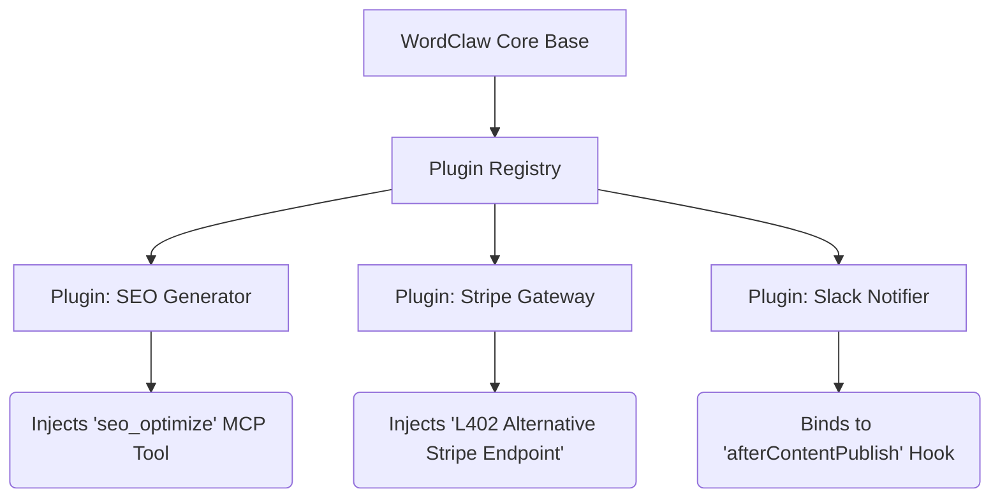

# RFC 0022: Plugin Architecture for WordClaw

**Author:** WordClaw Core Team  
**Status:** Proposed  
**Date:** 2026-03-12  

## 1. Summary
This RFC proposes a robust, Strapi-inspired Plugin Architecture for the WordClaw platform. It aims to provide developers with a structured methodology to extend the core Headless CMS and Model Context Protocol (MCP) Agent runtimes without modifying core repository code. Plugins will be able to inject custom schemas, REST/GraphQL endpoints, lifecycle hooks, admin UI components, and native LLM tools into the workspace context.

## 2. Motivation
As WordClaw grows as an L402-native, multi-tenant CMS and AI Sandbox, diverse deployment environments require highly specific integrations. Currently, adding a new AI payment gateway, a custom content syndication step, or altering the execution of the agent MCP tools requires modifying the core platform directly.

A plugin architecture inspired by modern headless systems (like Strapi) solves this by:
*   **Decoupling:** Allowing the community to build and share plugins independently of the WordClaw release cycle.
*   **Safety:** Isolating custom logic from the core engine to prevent regressions.
*   **Agent Extensibility:** Giving AI agents dynamic new tools (via MCP) purely by installing a plugin.

## 3. Proposal
Plugins in WordClaw will be self-contained NPM packages or local directories (e.g., `src/plugins/my-plugin`). During the WordClaw boot sequence, a `PluginRegistry` will scan, load, and mount these plugins.

A WordClaw plugin can encompass:
*   **Server Logic:** Custom routes, controllers, and services.
*   **Database:** Extension of Drizzle ORM schemas or injection of custom seed data.
*   **Lifecycle Hooks:** Pre/post execution hooks for content events (e.g., `beforeContentPublish`, `afterTaskApprove`).
*   **MCP Tools & Prompts:** Exposing native tools to the WordClaw MCP server, instantly expanding the capabilities of connected Agents.
*   **Admin UI:** Injecting custom React components or new pages into the Supervisor UI/Sandbox.



## 4. Technical Design (Architecture)

### 4.1. Plugin Structure
A standard plugin will follow a strict directory convention:
```
my-plugin/
├── package.json
├── dist/
├── src/
│   ├── server/             # Backend logic
│   │   ├── controllers/    # Express/Fastify route handlers
│   │   ├── services/       # Core plugin business logic
│   │   ├── routes.ts       # Route declarations
│   │   ├── hooks.ts        # Content lifecycle event bindings
│   │   └── mcp.ts          # MCP Tools and Prompts declarations
│   └── admin/              # Frontend extensions
│       ├── components/ 
│       └── pages/
└── wordclaw-plugin.json    # Plugin manifest (version, dependencies, scopes)
```

### 4.2. Component Registration APIs
Plugins will expose a standardized entry point `register(ctx: WordClawContext)` which the core system invokes at boot.

```typescript
export default function register(ctx: WordClawContext) {
  // 1. Register a new REST Route
  ctx.server.router.post('/my-plugin/action', myController.action);
  
  // 2. Register an MCP Tool for Agents
  ctx.mcp.registerTool({
    name: 'generate_social_copy',
    description: 'Generates social media copy for a content item',
    schema: { ... },
    handler: async (args) => { ... }
  });
  
  // 3. Bind to Core Lifecycle Hooks
  ctx.hooks.on('beforeItemPublish', async (item, supervisor) => {
    // Inject logic before an item goes live
  });
}
```

### 4.3. Multi-Tenant Safeties
Plugins must respect WordClaw's multi-tenant domains. The `WordClawContext` passed to plugin handlers will always enforce domain scoping, ensuring a plugin executing on behalf of `Tenant A` cannot accidentally access `Tenant B`'s data unless explicitly granted elevated supervisor privileges.

## 5. Alternatives Considered
*   **Webhooks Only:** Relying entirely on HTTP Webhooks for extensibility. *Discarded* because it forces developers to run separate infrastructure and increases network latency, particularly for tight Agent MCP loops that need synchronous resolution.
*   **Forking Core:** Recommending enterprise users fork the repository. *Discarded* as it makes receiving core security updates and L402 protocol patches difficult.

## 6. Security & Privacy Implications
*   **Malicious Plugins:** Since plugins run in the Node.js root context, a malicious plugin can read environment variables or access the database. Plugins must be vetted by operators before installation. 
*   **Sandboxing:** Future iterations may explore running MCP tool plugins in isolated V8 Isolates or WebAssembly containers to prevent host access.
*   **Permissions Matrix:** The plugin manifest (`wordclaw-plugin.json`) must statically declare what scopes and intents the plugin requests (e.g., `["content:read", "database:write"]`).

## 7. Rollout Plan / Milestones
*   **Phase 1:** Implement the `PluginRegistry` and server-side lifecycle hooks (Routes, Services, Hooks).
*   **Phase 2:** Implement MCP dynamic registration (allowing plugins to hot-load new agent tools).
*   **Phase 3:** Introduce Admin UI extensions for injecting React components into the Supervisor interface.
*   **Phase 4:** Launch the official WordClaw Plugin Marketplace.
