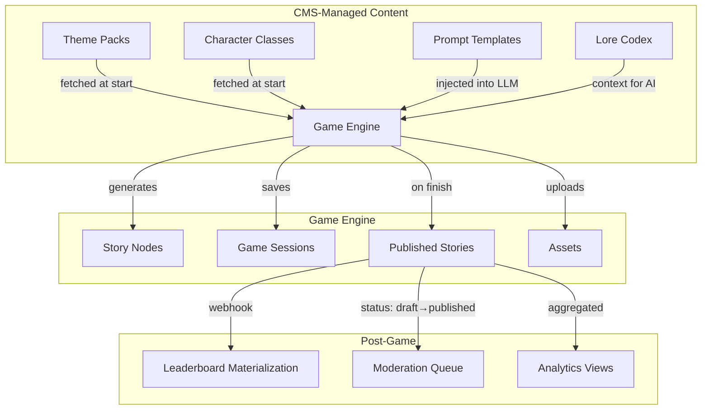
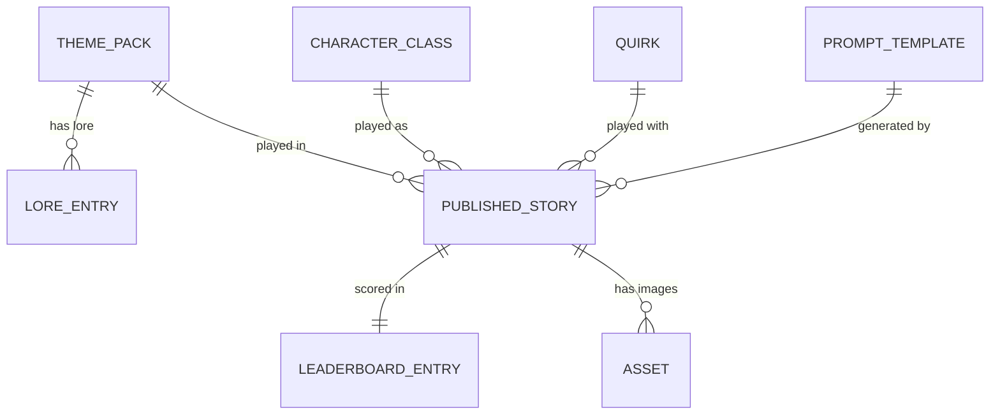

# RFC 0026: Adventure Game CMS Integration for Enhanced Playability

**Author:** DLIGTHART  
**Status:** Proposed  
**Date:** 2026-03-16  

## 1. Summary

The WordClaw Adventure Game currently relies on hardcoded configuration, in-memory sessions, AI-generated throwaway themes, and minimal CMS integration. This RFC proposes leveraging WordClaw's existing CMS capabilities — content types, content items, assets, webhooks, and the admin UI — to make the game more configurable, persistent, and engaging without changing the platform itself.

This direction is strong, but the full concept is not entirely "free" on top of today's core runtime. WordClaw already supports the content, workflow, asset, webhook, and supervisor building blocks needed for a first playable slice. However, some of the richer game concepts described below still expose gaps in the core CMS contract and should be called out explicitly rather than hidden behind demo-specific glue code.

## 2. Motivation

| Problem | Impact on Playability |
|---------|----------------------|
| **Themes regenerated every page load** | Players can't replay a favourite world; no curated quality control |
| **Classes/quirks are hardcoded arrays** | Adding new classes requires a code deploy |
| **Sessions are in-memory** | Server restart loses all active games |
| **Leaderboard is just a flat story list** | No competitive scoring, no rankings, no replayability incentive |
| **System prompts are hardcoded** | Fine-tuning narrative quality requires re-deploying the server |
| **No content moderation** | Published stories go live without review |
| **No player identity** | Anonymous players can't track their history across sessions |
| **No analytics** | No visibility into which themes/classes are popular or where players drop off |

## 3. Proposal

Introduce **six new WordClaw content types** and leverage existing platform features (assets, webhooks, content item status workflow) to make the game fully CMS-driven.



## 4. Technical Design (Architecture)

### 4.1 CMS-Managed Theme Packs

**New Content Type:** `adventure-theme-pack`

```json
{
  "title": "Haunted Steampunk Bayou",
  "description": "Mist-choked swamps where clockwork gators lurk...",
  "genre_tags": ["steampunk", "horror", "swamp"],
  "difficulty_modifier": 1.2,
  "lore_context": "Long-form world-building text for AI prompt injection...",
  "cover_image": { "assetId": 42 },
  "enabled": true
}
```

**Impact:** Themes are authored/curated in the WordClaw admin panel instead of AI-generated randomly. Enables quality control, seasonal events ("Halloween Horror Pack"), and community-submitted worlds.

**Game change:** Replace `/api/themes` (GPT call) → fetch `content-items?contentTypeId=X&status=published`.

**Review comment:** RFC 0023 already introduced schema-aware asset fields, so examples in this RFC should prefer asset references (`{ "assetId": 42 }`) instead of raw `*_asset_id` integers or hardcoded asset URLs.

---

### 4.2 CMS-Managed Character Classes & Quirks

**New Content Type:** `adventure-character-class`

```json
{
  "name": "Chronomancer",
  "description": "Bends time to their will",
  "icon_emoji": "⏳",
  "ability_description": "Can slow or reverse time in critical moments",
  "dc_bonus_categories": ["magic", "knowledge", "temporal"],
  "visual_archetype": "Robed figure with glowing clockwork gauntlets",
  "enabled": true
}
```

**New Content Type:** `adventure-quirk`

```json
{
  "name": "Pyromaniac",
  "description": "Can't resist setting things on fire",
  "gameplay_effect": "Fire-related choices always appear, +5 DC on stealth",
  "enabled": true
}
```

**Impact:** Add new playable classes and quirks from the admin UI. The `visual_archetype` field feeds directly into character portrait generation for better image consistency.

---

### 4.3 Prompt Template Management

**New Content Type:** `adventure-prompt-template`

```json
{
  "slug": "branch-generation-system-v4",
  "purpose": "system_prompt",
  "template": "You are an interactive fiction engine...\n{{CHARACTER_CLASS}}\n{{INVENTORY}}...",
  "model": "gpt-4o-mini",
  "temperature": 0.8,
  "version_notes": "Added better inventory item frequency",
  "active": true
}
```

**Impact:** Edit, A/B test, and version system prompts without code deployments. Supports multiple prompt variants for experimentation (e.g., "funny mode" vs "grimdark mode").

**Game change:** Fetch active prompt template on game start instead of using the hardcoded string in `generateBranches()`.

---

### 4.4 Persistent Leaderboard

**New Content Type:** `adventure-leaderboard-entry`

```json
{
  "player_name": "The Bender",
  "score": 200,
  "character_class": "Clumsy Scoundrel",
  "theme": "Whimsical Time-Bending",
  "survived": true,
  "chapters_completed": 6,
  "achievements": ["Timebender Extraordinaire", "Shadow Duelist"],
  "published_story_id": 15,
  "hero_image": { "assetId": 23 },
  "played_at": "2026-03-15T20:30:00Z"
}
```

**Impact:** Enables a sortable, filterable leaderboard page: "Top 10 by Score", "Hall of the Fallen", "Most Chapters Survived", "By Class". Drives replayability and competition.

**Game change:** On publish, also create a leaderboard entry. New `/api/leaderboard` endpoint reads from WordClaw sorted by score.

---

### 4.5 Lore Codex (World-Building Database)

**New Content Type:** `adventure-lore-entry`

```json
{
  "title": "The Clockwork Bayou",
  "category": "location",
  "theme_pack_ref": 5,
  "lore_text": "Deep in the mist-choked marshlands...",
  "ai_context_injection": "When the player is in swamp areas, mention: ...",
  "unlocked_by_achievement": "Swamp Survivor"
}
```

**Impact:** Creates a collectible codex that players unlock through achievements. Lore entries are injected into AI context for richer, more consistent worldbuilding across runs.

---

### 4.6 Content Moderation via Status Workflow

**No new content type needed** — uses WordClaw's existing `status` field on published stories.

**Current flow:** Story publishes immediately (status: `published`)  
**Proposed flow:** Story publishes as `draft` → admin reviews in WordClaw UI → sets to `published`

**Game change:** Archive page fetches only `status=published` stories. New stories get `status=draft` until reviewed.

---

### 4.7 Entity Relationships Summary



**Review comment:** This relationship diagram is conceptually correct, but WordClaw currently only has first-class schema-aware references for assets. Relationships such as `theme_pack_ref`, `published_story_id`, `character_class`, `quirk`, and `prompt_template` are still modeled as plain content fields today. A follow-up core primitive for content-item references would make this RFC materially stronger.

### 4.8 Review Comments: Core CMS Gaps Exposed by This RFC

This RFC is valuable because it pressure-tests WordClaw against a richer, more stateful application than a blog. It also reveals the places where the core CMS still needs stronger primitives to support concepts like these cleanly.

#### Already Supported Today

- content types and content items for game-configurable data
- schema validation and version history for prompt templates and story records
- schema-aware asset references for theme images and story art
- workflow + approval gates for moderating published stories
- supervisor UI for schema, content, approval, audit, and asset oversight
- webhooks and reactive MCP subscriptions for app-side follow-up automation

#### Remaining Core Gaps

| Gap | Why RFC 0026 needs it | Current workaround | Recommended core follow-up |
|-----|------------------------|--------------------|-----------------------------|
| **Field-aware filtering and sorting on content data** | The game needs to query `enabled=true`, pick an active prompt by `purpose`, and build a leaderboard sorted by `score` or filtered by class/theme. Current content listing only supports coarse filters plus sorting by `updatedAt`, `createdAt`, or `version`. | Fetch a larger set and filter/sort in the game server. | Add schema-aware field filters, schema-aware sort keys, or a dedicated read-model/query surface for content. |
| **First-class content-item references** | Theme packs, lore entries, published stories, leaderboard entries, and prompt templates all relate to one another. Today only asset references are validated as first-class schema extensions. | Store raw integer ids or denormalized strings in content data. | Introduce `x-wordclaw-field-kind: "content-ref"` and `"content-ref-list"` with same-domain validation and optional dereference helpers. |
| **Projection / materialization support** | A real leaderboard and analytics surface are read models, not just raw content items. This RFC assumes `POST publish -> create leaderboard entry -> query top scores`, but core CMS still leaves those derived views to application code. | Use game-side webhook handlers or ad hoc content-item duplication. | Add a projection/materialization framework or a lightweight derived-read-model module for sortable public views. |
| **Public player/session write lane** | The game wants persistent sessions and repeat players, but the core runtime is built around API keys, supervisor sessions, and MCP-attached actors. There is no first-class anonymous or browser-player mutation lane with bounded permissions. | Keep a game server in front of WordClaw and let it hold the API key/session mapping. | Add a constrained public actor profile, signed client mutation tokens, or a browser-safe session capability for app-owned public gameplay. |
| **Ephemeral state lifecycle / TTL semantics** | `game-session` content can work as a demo persistence mechanism, but game state is operationally different from durable editorial content. Long-lived abandoned sessions need expiry, archival, or cleanup behavior. | Store sessions as normal content items and clean them up in app code. | Add optional TTL, archival policy, or expirable-record semantics for ephemeral runtime content. |

#### Additional Review Notes

1. **The leaderboard should not be treated as a plain `content-items` list problem.**
   The current core list contract is not enough for "Top 10 by score" or "Hall of the Fallen" without app-side materialization.

2. **The prompt-template part of the RFC also depends on field-aware query.**
   "Fetch the active prompt for purpose `system_prompt`" is conceptually simple, but the core runtime still lacks a clean schema-aware query contract for that.

3. **The moderation flow is the best-aligned part of this RFC.**
   Draft-first publication through workflow and the supervisor approval queue fits the existing product very well and should be prioritized ahead of analytics or public-player identity.

4. **Asset usage should stay on asset references, not raw URLs.**
   The current asset runtime already supports `public`, `signed`, and `entitled` delivery modes with restore/purge lifecycle controls. The game should consume those records directly instead of introducing parallel asset-url conventions.

## 5. Alternatives Considered

| Alternative | Why Discarded |
|------------|---------------|
| **Database-backed sessions (e.g., SQLite)** | Adds infrastructure the game doesn't need; WordClaw's content items already provide persistence |
| **Hardcoded leaderboard JSON file** | Not queryable, no admin UI, no pagination |
| **External CMS (e.g., Contentful, Strapi)** | Unnecessary — WordClaw IS the CMS; using it dogfoods the platform |
| **User accounts with auth** | Out of scope for a demo game; player name at publish is sufficient |

## 6. Security & Privacy Implications

- **Content moderation** (§4.6) specifically addresses the risk of inappropriate AI-generated content reaching the archive
- Theme packs and prompt templates are admin-only content — no player can modify them
- Leaderboard entries are derived from published stories, not user-submitted, so injection risk is minimal
- No PII is collected; player names are optional at publish time

## 7. Rollout Plan / Milestones

| Phase | Scope | Effort |
|-------|-------|--------|
| **Phase 1: CMS Themes + Classes** | Replace hardcoded themes/classes with content items. Admin authors theme packs and classes. | ~1 day |
| **Phase 2: Prompt Templates** | Move system prompts to CMS. Game fetches active prompt at start. | ~0.5 day |
| **Phase 3: Leaderboard** | New content type + leaderboard page. Top scores, filters by class/theme. | ~1 day |
| **Phase 4: Content Moderation** | Change publish flow to draft-first. Archive filters by status=published. | ~0.5 day |
| **Phase 5: Lore Codex** | Optional enrichment. Lore entries for theme packs, unlockable via achievements. | ~1-2 days |
