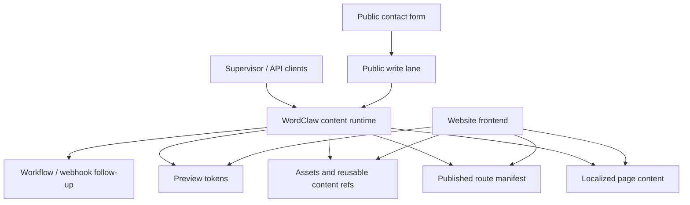

# RFC 0027: Structured Marketing Website Support Without Page Builder Drift

**Author:** Codex
**Status:** Partially Implemented
**Date:** 2026-03-19
**Updated:** 2026-03-31

## 0. Current Status

As of 2026-03-31, RFC 0027 is partially implemented.

Implemented so far:

- schema-level localization plus locale-aware reads
- short-lived preview tokens for content items and globals
- singleton/global content, working-copy versus published reads, and reverse-reference inspection
- reusable forms, bounded public write lanes, workflow transitions, and webhook follow-up primitives

Still pending:

- a lightweight published route manifest for site-generation and sitemap consumers
- a canonical website reference implementation built on the current runtime
- a clearer decision about how structured websites relate to the future public front door in RFC 0031

## 1. Summary

The `demos/demo-lightheart-site` exercise still shows that a site like `lightheart.tech` is feasible on top of WordClaw's runtime, but the work remaining is now much narrower than when this RFC was first drafted. The core content-runtime primitives already cover most of the model: typed page records, reusable section content, asset references, localized fields, preview tokens, content references, field-aware slug queries, approval-aware publishing, and bounded public write lanes.

The remaining gaps are now mostly about **website ergonomics and packaging**, not missing core storage contracts. The main open items are a lightweight route manifest, a clearer docs/demo path for structured sites, and the public-front-door decision described in RFC 0031. This RFC still proposes a narrow support lane for structured marketing websites while explicitly rejecting drift into generic WYSIWYG or page-builder scope.

## 2. Motivation

WordClaw's accepted product focus is a safe content runtime for AI agents and human supervisors, not a human-first page builder. That boundary should stay intact. At the same time, the Lightheart demo revealed a practical adjacent use case:

- teams want to model structured marketing pages in the same governed runtime as other content
- a website frontend can already consume typed content records, assets, and workflows
- the missing pieces are concentrated in a small set of repeated integration problems

### 2.1 What Already Works Today

| Existing capability | Why it matters for a Lightheart-style site |
| --- | --- |
| **Content types and content items** | Marketing pages, services, FAQs, case studies, and settings can be represented as typed records instead of free-form blobs. |
| **Schema-aware asset references** | Hero art, logos, and supporting imagery already fit the current asset model. |
| **First-class content references** | Page composition can reference reusable service cards, case studies, or shared CTA blocks without denormalizing everything into one page payload. |
| **Field-aware filtering and sorting** | Frontends can already resolve pages by slug or path and list content in predictable order. |
| **Workflow and approvals** | Draft, review, and publish flows are a strong fit for marketing copy governance. |
| **Public write lanes + webhooks** | Basic public submissions are possible today for bounded form capture and downstream follow-up. |

### 2.2 Gaps Exposed by the Demo

| Gap | Why it blocked a cleaner WordClaw-backed version |
| --- | --- |
| **Localized field semantics** | This gap is now closed in the runtime. The remaining work is mostly example coverage and packaging for site builders. |
| **Draft website preview** | This gap is now closed through scoped preview tokens for content items and globals. The remaining work is frontend reference usage, not backend contract design. |
| **Route manifest / sitemap ergonomics** | Site frontends need a clean way to enumerate published routes, locale variants, and SEO metadata for static generation or sitemap production. |
| **Reference implementation for website forms** | Forms, public write lanes, workflow hooks, and webhook follow-up now exist, but the repo still lacks a polished website-oriented starter pattern that packages them together. |

### 2.3 Important Boundary

This RFC does **not** propose:

- a visual page builder
- a WYSIWYG marketing editor
- a theme engine
- frontend hosting inside WordClaw
- WordClaw becoming a general website platform

The goal is narrower: make WordClaw a cleaner **structured website content runtime** for teams that already plan to bring their own frontend.

## 3. Proposal

Introduce an **optional structured marketing-website support lane** composed of four parts:

1. **Localized field semantics**
2. **Browser-safe site preview tokens**
3. **A published route manifest for website consumers**
4. **A reference pattern for website contact forms using existing public-write and workflow primitives**

This keeps the product inside its current boundary:

- WordClaw remains the governed content runtime
- the website remains a custom frontend
- the runtime adds only the missing contracts that repeatedly force bespoke glue code



### 3.1 Product Positioning Rule

Any implementation of this RFC must preserve the product direction from RFC 0021:

- support structured websites as a **secondary runtime use case**
- do not market WordClaw as a visual builder
- prefer schema contracts and read/write ergonomics over human-authoring chrome

## 4. Technical Design (Architecture)

### 4.1 Localized Field Semantics

#### Problem

The current runtime can validate arbitrary JSON, but localized content still needs one-off conventions:

- duplicate one content item per locale
- or store locale maps in plain objects and resolve them manually in the frontend

That is workable, but it creates repeated integration decisions and no standard fallback contract.

#### Proposal

Add a schema-level localization contract plus field-level localization semantics.

Example:

```json
{
  "type": "object",
  "x-wordclaw-localization": {
    "supportedLocales": ["en", "nl"],
    "defaultLocale": "en"
  },
  "properties": {
    "slug": { "type": "string" },
    "title": {
      "type": "object",
      "x-wordclaw-localized": true
    },
    "summary": {
      "type": "object",
      "x-wordclaw-localized": true
    }
  },
  "required": ["slug", "title"]
}
```

Target behavior:

- writes still store the canonical locale map
- reads can request `locale=nl&fallbackLocale=en`
- responses include locale resolution metadata when fallback occurred

Example response addition:

```json
{
  "data": {
    "title": "Sneller opleveren zonder concessies aan kwaliteit."
  },
  "meta": {
    "locale": "nl",
    "fallbackLocale": "en",
    "resolvedWithFallback": false
  }
}
```

This is intentionally not a translation-management suite. It is only a consistent runtime contract for localized fields.

### 4.2 Browser-Safe Draft Preview Tokens

#### Problem

The current runtime is built around API keys, admin sessions, and MCP-attached actors. A website preview flow needs something else:

- short-lived
- browser-safe
- scoped to one domain and a small set of reads
- able to expose draft content without giving away a full API key

#### Proposal

Add a preview-token issuance endpoint for authenticated operators:

```text
POST /api/site-preview-tokens
```

Token properties:

- domain-scoped
- read-only
- short TTL
- limited to content items or content types
- optional locale restrictions
- optional route restrictions

Website frontends can present the token when resolving draft content for preview mode. Published traffic keeps using the normal public delivery path and never depends on preview tokens.

### 4.3 Published Route Manifest

#### Problem

Site frontends frequently need a single published view over:

- route path or slug
- locale variants
- SEO metadata
- last updated timestamp
- canonical content item id

The data can already be assembled with existing APIs, but every site has to reinvent that fan-out.

#### Proposal

Add an optional site-route schema hint and a manifest read surface.

Example schema extension:

```json
{
  "x-wordclaw-site-route": {
    "slugField": "slug",
    "localeField": "locale",
    "seoField": "seo",
    "includeInSitemap": true
  }
}
```

Example read surface:

```text
GET /api/site-manifest?contentTypeId=42
```

Example response shape:

```json
{
  "data": [
    {
      "contentItemId": 88,
      "path": "/services",
      "locale": "en",
      "updatedAt": "2026-03-19T09:00:00Z",
      "seo": {
        "title": "Services | Lightheart Tech"
      }
    }
  ]
}
```

This surface should stay thin. It is a convenience read model for site frontends, not a website runtime of its own.

### 4.4 Website Form Reference Pattern

#### Problem

The current runtime already has public write lanes, workflows, and webhooks. That means the raw building blocks for contact forms exist. What is missing is a first-party pattern showing operators how to combine them for a website flow.

#### Proposal

Ship a reference pattern instead of a major new primitive:

- `contact_request` content type
- public write policy for bounded create-only submission
- default `draft` or `pending_review` status
- webhook follow-up to email or CRM
- operator moderation in the supervisor UI

This should be documented as a guide and reference demo before new backend primitives are added.

### 4.5 Suggested Content Model for a Lightheart-Class Site

The demo suggests the following runtime shape:

- `site_settings`
  - navigation, footer, supported locales, brand metadata
- `marketing_page`
  - route data, SEO fields, localized hero copy, section references
- `service_offer`
  - reusable service cards
- `case_study`
  - structured proof content
- `contact_request`
  - inbound website form submissions

This model already fits the current content runtime well. The RFC is mainly about removing the repetitive glue around it.

## 5. Alternatives Considered

### 5.1 Do Nothing and Leave It to Custom Integrators

Rejected as the only answer because the same missing pieces will recur across every website integration:

- locale handling
- preview auth
- route enumeration

The cost is not impossibility. It is repeated bespoke glue code.

### 5.2 Build a Full Visual Page Builder

Rejected because it conflicts directly with RFC 0021 and WordClaw's PMF. The product should remain a safe content runtime, not a human-first website builder.

### 5.3 Keep Duplicate Content Items Per Locale as the Long-Term Pattern

Rejected as the preferred product path because it pushes locale concerns into every integration and weakens content coherence for multi-language records.

### 5.4 Add Full Static Hosting / CDN Delivery to WordClaw

Rejected because the frontend should remain external. The right boundary is content/runtime support, not deployment platform ownership.

## 6. Security & Privacy Implications

- **Preview tokens** must be short-lived, domain-scoped, read-only, and auditable.
- **Published route manifests** should expose published content only, unless a preview token is present.
- **Localized fields** do not materially change the threat model, but they do increase data-shape complexity and should remain schema-validated.
- **Contact-form reference flows** should default to bounded public writes, workflow review, request tracing, and webhook signing where outbound delivery is configured.

The proposal keeps WordClaw's existing safety model intact:

- fail-closed auth
- domain isolation
- workflow moderation
- audit logs
- bounded public mutation lanes instead of anonymous broad write access

## 7. Rollout Plan / Milestones

| Phase | Scope | Outcome |
| --- | --- | --- |
| **Phase 1: Docs-first site guide** | Document the current best-practice model for `site_settings`, `marketing_page`, `case_study`, and `contact_request`; wire the Lightheart demo to a real seed path if practical. | Operators can build a WordClaw-backed website today with known tradeoffs. |
| **Phase 2 [Implemented]: Localized field contract** | Add schema semantics and locale-resolved reads. | Bilingual and multilingual sites no longer need ad hoc locale conventions. |
| **Phase 3 [Implemented]: Preview tokens** | Add browser-safe draft preview issuance and validation. | Marketing sites get a clean preview workflow without exposing API keys. |
| **Phase 4: Route manifest** | Add published route enumeration for sitemap/static-generation consumers. | Website frontends can hydrate route inventories and SEO metadata with less fan-out code. |
| **Phase 5: Form reference implementation** | Publish a guide/demo for website submissions using existing public-write, workflow, and webhook surfaces. | Contact forms become a documented recipe instead of custom guesswork. |

## 8. Recommendation

Adopt this RFC as an **optional runtime-support enhancement**, not as a product repositioning.

The Lightheart demo confirms the underlying answer is already "yes": WordClaw can support a site like `lightheart.tech`. The next step is to close the small set of remaining integration gaps without drifting into a generic page-builder roadmap.
