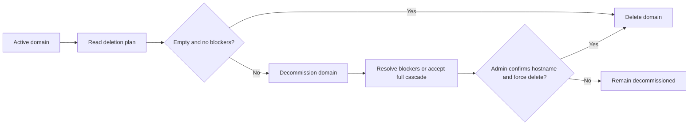

# RFC 0030: Safe Domain Deletion and Decommissioning

**Author:** Codex
**Status:** Proposed
**Date:** 2026-03-31
**Updated:** 2026-03-31
**Tracking Issue:** #178  

## 0. Current Status

As of 2026-03-31, RFC 0030 is proposed and no safe domain decommission/delete contract is shipped on `main` yet.

Current runtime context:

- tenant onboarding, identity, and domain-scoped supervision are now much stronger than before
- the schema still contains wide tenant-owned cascade graphs, so a naive domain delete would remain unsafe
- this RFC is the current design direction for turning raw SQL cleanup into an operator-safe lifecycle

## 1. Summary

WordClaw can now create and onboard tenant domains easily, but it still lacks a safe, operator-facing way to retire or remove them. A naive `DELETE /api/domains/:id` would be dangerous because `domains.id` is the root foreign key for a large part of the runtime and many dependent records already use `ON DELETE CASCADE`.

This RFC proposes a safe domain lifecycle contract built around three principles:

- preview the blast radius before deletion
- decommission a tenant before irreversible removal
- preserve operator auditability outside the domain-owned cascade graph

The proposed flow is REST-first and supervisor-first. It adds a deletion-plan read path, a decommission step, and a guarded hard-delete path with explicit confirmations and blockers for high-risk states such as active credentials, running work, or unsettled payment state.

## 2. Motivation

### 2.1 Current Pain

Issue [#178](https://github.com/dligthart/wordclaw/issues/178) exposed a practical operator gap:

- accidental or duplicate tenant creation has no cleanup path
- test tenants cannot be removed without dropping into SQL
- customer offboarding has no in-band contract
- a future hard-delete route would currently be too risky to expose without guardrails

### 2.2 Why a Naive Delete Is Unsafe

The `domains` table is not just a registry of hostnames. It anchors content types, content items, assets, API keys, webhooks, workflows, review state, jobs, payments, agent runs, and other runtime data. In the current schema, many of those relationships already cascade on delete.

That means a one-step delete route would:

- remove far more than content items
- revoke the tenant's operational history with little operator visibility
- likely delete the very audit records needed to explain what happened
- create a high-risk destructive path in REST, supervisor UI, and future MCP parity

### 2.3 Product Need

WordClaw needs a domain offboarding model that is:

- safe enough for hosted multi-tenant operation
- explicit enough for supervisor operators
- machine-readable enough for agents and automation
- auditable enough for post-incident review

## 3. Proposal

Introduce a domain lifecycle with two destructive stages:

1. `active`
2. `decommissioned`
3. `deleted` (terminal hard delete)

Deletion becomes a controlled process rather than a single mutation.



### 3.1 Operator Contract

The proposed operator flow is:

1. Inspect the domain impact summary.
2. Decommission the domain.
3. Revoke or invalidate tenant access automatically.
4. Delete immediately only if the domain is empty.
5. Require stronger confirmation for force deletion when data still exists.

### 3.2 REST-First Surfaces

Phase 1 should add:

- `GET /api/domains/:id`
- `GET /api/domains/:id/deletion-plan`
- `POST /api/domains/:id/decommission`
- `DELETE /api/domains/:id`

The semantics should be:

- `GET /api/domains/:id/deletion-plan`
  - returns a machine-readable impact summary
  - returns blockers, warnings, and whether empty delete is allowed
  - returns whether force delete is allowed
- `POST /api/domains/:id/decommission`
  - marks the domain inactive for tenant work
  - revokes or disables active tenant credentials
  - hides the domain from normal operator selection by default
- `DELETE /api/domains/:id`
  - succeeds without `force=true` only when the domain is empty enough for safe removal
  - requires explicit confirmation and stronger authorization for cascade delete

### 3.3 Empty Delete vs Force Delete

This RFC distinguishes between:

- **empty delete**
  - intended for accidental bootstrap/test tenants
  - allowed when domain-owned runtime state is effectively absent
- **force delete**
  - intended for explicit offboarding or cleanup of populated tenants
  - allowed only after decommission and explicit confirmation

Empty delete should be the default. Force delete should be exceptional and noisy.

## 4. Technical Design (Architecture)

### 4.1 Schema Changes

Add lifecycle metadata to `domains`:

- `status` (`active` | `decommissioned`)
- `decommissioned_at`
- `decommission_reason`
- `decommissioned_by_actor_id`
- `decommissioned_by_actor_type`
- `decommissioned_by_actor_source`

Add a new non-cascading lifecycle ledger, for example `domain_lifecycle_events`:

- `id`
- `domain_id` (nullable after hard delete, or stored as a plain integer snapshot)
- `hostname`
- `name`
- `action` (`deletion_plan`, `decommission`, `delete`)
- `actor_id`
- `actor_type`
- `actor_source`
- `reason`
- `force`
- `impact_summary` (`jsonb`)
- `created_at`

This ledger is important because the current per-domain audit tables are domain-owned. If the domain is hard-deleted, those records are likely to disappear with it.

### 4.2 Deletion Plan Service

Add a dedicated service, for example `buildDomainDeletionPlan(domainId)`, that computes:

- domain identity snapshot
- lifecycle state
- record counts by area
- explicit blockers
- explicit warnings
- allowed actions

Suggested impact summary categories:

- `apiKeys`
- `webhooks`
- `contentTypes`
- `contentItems`
- `assets`
- `forms`
- `workflows`
- `reviewTasks`
- `jobs`
- `agentRuns`
- `offers`
- `payments`
- `entitlements`
- `auditLogs`

Suggested response shape:

```json
{
  "domain": { "id": 7, "name": "Epilomedia", "hostname": "epilomedia.com", "status": "active" },
  "summary": {
    "apiKeys": 3,
    "webhooks": 1,
    "contentTypes": 4,
    "contentItems": 142,
    "assets": 38,
    "payments": 2,
    "auditLogs": 219
  },
  "blockers": [
    { "code": "DOMAIN_NOT_EMPTY", "detail": "Domain still owns content and assets." },
    { "code": "DOMAIN_HAS_UNSETTLED_PAYMENTS", "detail": "Outstanding payment records must be settled, cancelled, or explicitly force-deleted." }
  ],
  "warnings": [
    { "code": "DOMAIN_DELETE_REMOVES_AUDIT_HISTORY", "detail": "Per-domain audit history will be removed from tenant-owned tables." }
  ],
  "allowedActions": {
    "decommission": true,
    "deleteEmpty": false,
    "forceDelete": false
  }
}
```

### 4.3 Decommission Semantics

Decommissioning is reversible only until hard delete. It should:

- block tenant-scoped API keys from further runtime use
- revoke or mark active API keys as decommissioned
- block new content, asset, job, workflow, webhook, and payment mutations in that domain
- keep supervisor/admin read access for cleanup and review
- exclude the domain from default `/api/domains` results unless `includeInactive=true`
- expose a deterministic error such as `DOMAIN_DECOMMISSIONED` when tenant credentials try to use the runtime

This gives operators a safe holding state between "still live" and "gone forever."

### 4.4 Delete Semantics

`DELETE /api/domains/:id` should support two modes:

- default delete
  - only succeeds when the deletion plan reports no destructive blockers
- force delete
  - requires `force=true`
  - requires the domain already be `decommissioned`
  - requires an explicit confirmation field such as `confirmHostname`
  - requires stronger authorization than ordinary tenant operations

Suggested delete blockers:

- domain not found
- domain still active when `force=true`
- running jobs or active agent runs
- unsettled payment or entitlement state
- missing hostname confirmation
- attempt to delete the currently selected supervisor domain without explicit re-targeting

### 4.5 Authorization Model

Add explicit policy operations:

- `tenant.delete.plan`
- `tenant.decommission`
- `tenant.delete`

Recommended authorization:

- deletion plan: `admin` or same-domain `tenant:admin`
- decommission: `admin` or same-domain `tenant:admin`
- force delete: `admin` only

This keeps tenant operators able to inspect and prepare their own offboarding path while reserving irreversible cascade delete for platform-grade administrators.

### 4.6 Cross-Protocol Scope

This RFC intentionally recommends **REST and supervisor UI first**.

Non-goals for the first phase:

- no MCP force-delete tool
- no default CLI shortcut that bypasses preview and confirmation
- no GraphQL mutation parity until the REST safety model is proven

Read-only parity can follow later:

- CLI `wordclaw domains deletion-plan --id <n>`
- MCP `get_domain_deletion_plan`

### 4.7 Supervisor UX

The supervisor UI should expose deletion as a guided flow, not a single button.

Recommended UI sequence:

1. Show domain summary and impact counts.
2. Show blockers and warnings inline.
3. Offer `Decommission` first.
4. Reveal `Delete` only after impact preview.
5. Require hostname re-entry for force delete.

This should reuse the existing UI feedback model for remediation-rich errors instead of raw confirm dialogs only.

## 5. Alternatives Considered

### 5.1 Naive `DELETE /api/domains/:id`

Rejected because the current cascade graph is too large and too implicit. It would create an unsafe operator footgun.

### 5.2 Soft Delete Only

Rejected as the only mechanism because it does not solve test-domain cleanup, duplicate bootstrap recovery, or real offboarding where data must be removed.

### 5.3 Manual SQL Runbook

Rejected because it bypasses policy, auditability, and product contracts. It also makes hosted and supervisor-led operation weaker than it should be.

### 5.4 Immediate Force Delete for Admins

Rejected because even trusted admins benefit from preview, blockers, and lifecycle snapshots. The risk is not just malicious use; it is operational error.

## 6. Security & Privacy Implications

- **Accidental destructive action:** mitigated by preview, decommission gate, and explicit hostname confirmation.
- **Tenant isolation drift:** decommissioned domains must no longer authenticate as active tenants.
- **Audit loss:** mitigated by a non-cascading lifecycle ledger that survives hard delete.
- **Financial and entitlement integrity:** deletion must not silently erase still-active payment or entitlement state without explicit force semantics.
- **Agent misuse:** destructive delete should not be exposed over MCP in the first phase.

## 7. Rollout Plan / Milestones

1. Add domain lifecycle fields plus the non-cascading lifecycle event table.
2. Implement the deletion-plan service and `GET /api/domains/:id/deletion-plan`.
3. Implement `POST /api/domains/:id/decommission` and auth/runtime blocking for decommissioned tenants.
4. Implement empty-domain `DELETE /api/domains/:id`.
5. Add guarded force delete with hostname confirmation, blocker checks, and lifecycle snapshotting.
6. Wire the supervisor UI to preview, decommission, and delete flows.
7. Evaluate CLI and read-only MCP parity after the REST contract is stable.

## 8. Success Criteria

- Operators can clean up accidental or test tenants without SQL.
- Duplicate-domain recovery no longer depends on manual database intervention.
- No hard delete can occur without an impact preview and explicit confirmation.
- Deleting a domain preserves a durable lifecycle event outside the tenant-owned cascade graph.
- Decommissioned tenant credentials stop working deterministically with a documented error contract.
