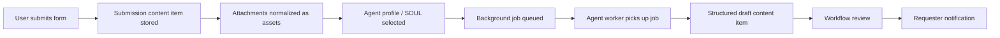

# RFC 0032: Multimodal Agent Intake and Draft Generation Pipelines

**Author:** Codex
**Status:** Partially Implemented
**Date:** 2026-03-31
**Updated:** 2026-04-01
**Tracking Issue:** #183

## 0. Current Status

As of 2026-04-01, RFC 0032 is partially implemented on `main`, but it is not finished as a broad intake-to-agent product lane.

Current runtime context:

- forms, public write lanes, assets, jobs, workflows, and webhook follow-up already ship on `main`
- forms can now enqueue `draft_generation` jobs directly, and those jobs can target tenant-scoped workforce agents or direct SOUL/provider config
- tenant-scoped AI provider provisioning now exists for `openai`, `anthropic`, and `gemini`
- tenant-scoped workforce agents now exist with stable ids/slugs, purpose, SOUL, and provider/model defaults
- the supervisor UI now exposes provider/workforce provisioning in `/ui/keys` and draft-generation form wiring in `/ui/forms`
- draft-generation completion and terminal failure callbacks now reuse the existing form webhook lane
- multimodal intake is intentionally image-only for now: referenced image assets can be forwarded natively into OpenAI, Anthropic, and Gemini requests, while non-image files are still out of scope
- the implementation direction remains intentionally conservative: reuse the current runtime instead of introducing a large new subsystem

## 1. Summary

WordClaw already has most of the primitives needed for a strong intake-to-draft product lane:

- forms
- public write lanes
- domain-scoped assets
- workflows and approvals
- structured content types
- background jobs and agent-run direction
- audit and notification hooks

What is missing is a first-class contract that composes those primitives into one repeatable pattern:

1. a user submits a request through a website or app
2. the request may include multimodal evidence such as text, files, screenshots, images, audio, or links
3. WordClaw routes the request to a specific AI agent profile or "SOUL"
4. a background job is created and picked up by the agent worker
5. that agent generates a structured draft
6. the draft enters workflow review
7. the requester is notified when the draft is ready or needs follow-up

Example:

- a prospect fills out a proposal request form
- they describe requirements and attach background files
- a software-proposal agent profile turns the intake into a draft proposal
- the draft is stored as governed content
- a supervisor reviews and approves it
- the requester is notified by email or another configured channel

This RFC proposes making that pipeline a first-class WordClaw capability rather than bespoke glue built separately for each deployment.

The implementation constraint is important: this should primarily reuse current WordClaw capabilities and avoid adding a large new subsystem.

## 2. Motivation

### 2.1 Real Product Need

This pattern appears naturally across many domains:

- software proposal drafting
- RFP or brief response generation
- onboarding document creation
- marketing copy generation from intake forms
- requirements-to-spec drafting
- support-case summarization into structured drafts
- agent-assisted content authoring from uploaded references

In all of these cases, the core shape is the same:

- external input arrives through a structured form
- an AI agent transforms it into governed content
- the result should not bypass workflow, review, or audit

### 2.2 Current Gap

Today WordClaw can already model most of this flow:

- forms already create bounded submissions backed by content items
- public write lanes already accept controlled public input
- workflows already handle supervised draft review
- jobs already provide deferred background execution
- webhooks already provide follow-up notification hooks

The real gap is not missing foundations. The real gap is that these existing pieces are not yet composed into a standard intake-to-agent-draft pattern.

That means each deployment has to rebuild:

- submission capture
- asset and attachment handling
- agent selection logic
- prompt and output contracts
- workflow entry
- requester notification

### 2.3 Why Multimodal Matters

For proposal and document generation in particular, plain text input is often insufficient. Users may need to provide:

- screenshots
- PDFs
- spreadsheets
- voice notes
- diagrams
- brand assets
- reference links

If WordClaw wants to be the runtime where agents do governed work for real operators and customers, it should support this richer intake shape natively.

## 3. Proposal

Introduce an optional **Multimodal Intake to Draft Pipeline** capability that is intentionally built from existing runtime pieces:

1. **Form Definition**
   - the existing bounded public or authenticated intake contract
2. **Submitted Intake Record**
   - ideally the existing content item created by the form submission path, not a brand-new intake storage model
3. **Asset Attachments**
   - reused from the current asset model and upload flows
4. **Agent Profile / SOUL**
   - initially a lightweight configuration choice attached to the intake flow, not necessarily a new top-level persisted entity
5. **Background Job**
   - the queued unit of work the agent worker picks up asynchronously
6. **Draft Output Content Item**
   - a normal structured content item in the target content type
7. **Workflow and Notification Follow-up**
   - reused from current workflow transitions and webhook/email-style follow-up

This keeps the model specific and useful. It is not a generic chatbot or unconstrained agent sandbox.



### 3.1 Plain-English Flow

1. A website visitor opens a proposal request form.
2. They enter requirements, upload screenshots and supporting files, and submit.
3. WordClaw stores the request in the tenant domain using the existing form-submission and content-item path, with attachments linked through the asset model.
4. A configured agent profile for "software development proposal creation" is selected.
5. The runtime queues a background job for draft generation.
6. An agent worker picks up the job and runs the configured profile.
7. The agent reads the intake, interprets multimodal context, and writes a structured proposal draft.
8. The draft is validated and submitted into the configured workflow.
9. Once complete, the requester is notified by email, webhook, or another configured channel.

## 4. Technical Design (Architecture)

### 4.1 Core Runtime Concepts

The pipeline should favor existing runtime concepts first and only add minimal glue where needed.

#### Form Definition

Defines:

- what fields a requester can submit
- whether the form is public or authenticated
- what attachment types are allowed
- which agent profile receives the intake
- which content type the draft should target
- which workflow should apply after generation
- how the requester should be notified

This already maps closely onto the existing `form_definitions` contract.

#### Submitted Intake Record

The first implementation should prefer using the content item already created by the form submission path rather than inventing a brand-new intake entity.

It should capture or derive:

- normalized requester identity data
- raw field payload
- linked assets and attachment metadata
- selected or resolved agent profile
- processing status
- linked output content item ids
- notification status

#### Agent Profile / SOUL

In this RFC, "SOUL" means a bounded agent profile:

- prompt and role framing
- supported modalities
- tool and capability access
- target output schema
- generation strategy
- follow-up question behavior

Example profiles:

- `software-proposal-writer`
- `marketing-brief-drafter`
- `requirements-to-spec`
- `case-study-drafter`

Phase 1 should not require a large new profile-management subsystem. It can start as a configuration value on the form definition, job payload, or deployment-specific routing layer.

#### Draft Generation Run

This should be asynchronous and auditable. It should capture:

- input snapshot
- model/tool usage
- execution status
- intermediate reasoning artifacts where safe
- structured output
- failure class and remediation

#### Background Job

The intake pipeline should explicitly use the existing jobs direction in the product.

That means:

- form submission should enqueue work instead of blocking on model execution
- the HTTP request should return quickly with a submission or tracking id
- an agent-capable worker should pick up the queued job in the background
- retries, failure classes, and backoff should live in the job/runtime layer rather than in ad hoc request code

The preferred implementation shape is to extend the current jobs worker with one additional agent-draft lane or equivalent minimal handler, rather than building a separate orchestration system for this use case.

This makes the pipeline operationally safer and aligns with how long-running multimodal generation should behave in production.

#### Notification Contract

This should be an explicit final step, not an afterthought.

Supported channels can evolve, but the model should allow:

- email
- webhook
- supervisor inbox
- future messaging integrations

### 4.2 Suggested Data Flow

The runtime path should be:

1. intake arrives through the existing form or public write lane
2. the submission creates or updates a bounded content item as it does today
3. attachments are ingested as domain-scoped assets using current asset patterns where possible
4. a background job is queued
5. an agent worker picks up the job
6. the agent profile resolves the prompt and tools
7. the generated draft is validated against the target content schema
8. the output is stored as a content item or similar structured artifact
9. the configured workflow transition is applied
10. the requester and/or operator is notified

### 4.3 Multimodal Input Model

Inputs should be normalized into a small set of intake evidence types:

- `text`
- `file`
- `image`
- `audio`
- `url`
- `structured_form_data`

This avoids writing each pipeline around raw browser payloads and keeps the model compatible with the current asset/runtime design.

The agent profile should declare which evidence types it can use safely.

### 4.4 Jobs and Worker Ownership

The pipeline should be jobs-backed by default.

Suggested responsibilities:

- **request path**
  - validate and store the submission
  - ingest attachments
  - enqueue the generation job
- **job worker**
  - resolve the agent profile
  - run multimodal drafting
  - write draft output
  - transition workflow state
  - emit completion or failure notifications

This avoids long-lived browser requests and keeps multimodal execution compatible with future worker scaling.

The design goal is reuse:

- reuse current form submission endpoints
- reuse current content-item storage
- reuse current asset storage
- reuse current jobs worker
- reuse current workflow submission and review
- reuse current webhook-based follow-up where possible

Only the thin composition layer should be new.

### 4.5 Output Contract

The output must not be free-form blob text by default. It should map into governed WordClaw content structures.

Example output targets:

- a `proposal` content type
- a `requirements_brief` content type
- a `draft_email` content type
- a `spec_document` content type

The output contract should define:

- target content type
- required fields
- optional generated sections
- confidence or completeness metadata
- whether the output stays draft-only until review

### 4.6 Workflow Integration

The generated draft should enter the existing workflow model rather than bypass it.

Suggested statuses:

- `submitted`
- `processing`
- `draft_generated`
- `awaiting_review`
- `approved`
- `rejected`
- `needs_clarification`
- `failed`

This allows supervisors and requesters to reason about the pipeline clearly.

### 4.7 Requester Notification

The intake pipeline should define a notification policy up front:

- notify on receipt
- notify on completion
- notify on approval
- notify when clarification is required
- notify on failure

The simplest first phase is probably:

- receipt acknowledgment
- completion or clarification notice

### 4.8 Example Proposal Pipeline

Example configuration shape:

```json
{
  "form": "proposal-request",
  "agentProfile": "software-proposal-writer",
  "targetContentType": "proposal",
  "workflow": "proposal-review",
  "allowedEvidence": ["structured_form_data", "file", "image", "url"],
  "notifications": {
    "channel": "email",
    "events": ["received", "draft_generated", "approved"]
  }
}
```

Example submission:

```json
{
  "companyName": "Acme",
  "contactEmail": "buyer@acme.example",
  "projectSummary": "We need a member portal with Stripe billing and SSO.",
  "budgetRange": "50k-100k",
  "deadline": "2026-05-15",
  "references": ["https://example.com/reference-app"]
}
```

The agent profile then uses that evidence plus attachments to generate a structured proposal draft instead of an ungoverned document blob.

## 5. Safety, Governance, and Privacy

### 5.1 Tenant and Policy Boundaries

All intake submissions, attachments, runs, and outputs must remain tenant-scoped.

The agent profile must inherit the same tenant boundary and output permissions as the intake pipeline configuration. A public form must never imply broad runtime access.

### 5.2 Prompt-Injection and Attachment Risk

User-provided files and links are adversarial by default.

The runtime should therefore:

- normalize and classify attachments before agent use
- limit which tools are available to intake agents
- keep privileged actions out of the intake profile unless explicitly allowed
- preserve auditable provenance from submission to generated draft
- preserve auditable provenance from submission to queued job to generated draft

### 5.3 Human Review

For high-value outputs such as proposals, contracts, or external deliverables, the default should be:

- generate draft
- enter workflow
- require human approval before final external delivery

### 5.4 PII and Customer Data

The pipeline may process sensitive customer information. The implementation should therefore support:

- explicit field-level storage policies
- redaction where appropriate in logs
- attachment retention controls
- clear audit trails for who or what generated the output

## 6. Alternatives Considered

### 6.0 Build a Large New Intake Platform Inside WordClaw

Rejected for the first slice.

This RFC should not imply:

- a new generic submission engine
- a new standalone agent orchestration framework
- a new blob-storage path separate from assets
- a large new profile-management system before the pattern is validated

The better first step is to compose the runtime features that already exist.

### 6.1 Build This Entirely Outside WordClaw

Rejected as the default path because it throws away WordClaw's strongest differentiators:

- structured content validation
- workflow review
- tenant isolation
- audit provenance
- reusable forms and assets

### 6.2 Use a Generic Chat UI Instead of Structured Intake

Rejected for this lane because proposal and document generation usually need:

- predictable fields
- attachments
- stable output schema
- auditable workflow handoff

A free-form chat surface can still exist elsewhere, but it should not replace structured intake for governed business documents.

### 6.3 Let the Browser Call the Model Directly

Rejected because it weakens:

- model and tool governance
- tenant and policy control
- auditability
- workflow integration

## 7. Rollout Plan

### Phase 1: Text-First Intake to Draft

Deliver:

- one intake form built on the existing forms surface
- one agent routing rule or SOUL selection config
- one target content type
- one additional jobs-backed drafting handler
- draft creation plus workflow handoff
- basic webhook or email-style notification reuse

This phase should work with minimal new product surface area and prove that the existing runtime can already support the core business flow.

### Phase 2: Multimodal Evidence

Deliver:

- attachment-backed inputs
- asset normalization for images, documents, and links
- modality declarations on agent profiles
- stronger evidence provenance in audit trails

### Phase 3: Operator and Customer Experience

Deliver:

- status tracking for submissions
- clarification loops
- reusable intake-pipeline templates
- supervisor UI for inspecting submissions, outputs, and notifications

## 8. Open Questions

- Should intake submissions be modeled as dedicated runtime entities, as form-submission records, or as content items of a special type?
- Should agent profiles be a new persisted concept, or should they build on the emerging autonomous-run and guidance contracts already in the repo?
- Should notifications be limited to webhook plus email first, or should other delivery channels be in scope early?
- Should requester-facing status pages exist in the product, or should notification be one-way at first?
- How much multimodal preprocessing should WordClaw own directly versus delegating to external workers?

## 9. Recommendation

Accept this as a focused product lane:

- WordClaw should support **multimodal intake-to-draft pipelines**
- the pipeline should be structured, auditable, tenant-scoped, and workflow-aware
- "SOULs" should map to bounded agent profiles rather than unconstrained autonomous behavior
- the implementation should primarily compose existing forms, assets, jobs, content, workflows, and webhook follow-up rather than add a large new subsystem

That gives WordClaw a concrete real-world story:

- users submit requirements
- agents produce governed drafts
- supervisors retain oversight
- customers get notified when work is ready

This is a stronger and more product-shaped direction than treating forms, agents, and workflows as separate primitives that every deployment has to compose manually.
