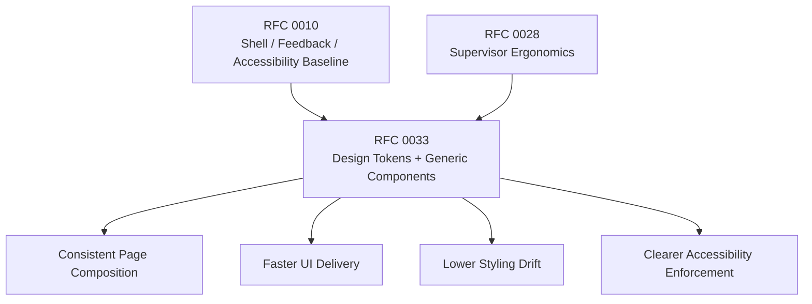

# RFC 0033: Supervisor UI Design System and Consistency

**Author:** Codex  
**Status:** Proposed  
**Date:** 2026-04-03

## 0. Current Status

As of 2026-04-03, the Supervisor UI already has a partial foundation on `main`:

- a responsive shell in `ui/src/routes/+layout.svelte`
- base UI primitives such as `Button`, `Input`, `Select`, `Textarea`, `Badge`, and `Surface`
- reusable feedback components such as `Toast`, `ConfirmDialog`, and `ErrorBanner`
- a shared `DataTable`
- broad route coverage across content, assets, jobs, approvals, keys, payments, forms, and agents

That foundation is useful, but it is still too low-level to produce a consistent operator-facing design system by default.

Current gaps:

- page headers and action bars are still hand-built per route
- cards, stat tiles, inspector sections, and metadata panels are repeated with slightly different spacing and hierarchy
- dialogs and drawers are mostly page-local implementations
- form labels, hints, errors, checkboxes, and selectable cards are inconsistent
- loading, empty, and error states are implemented differently across pages
- login and invite pages still bypass shared UI primitives
- route authors are still making visual and interaction choices that should be decided once

This RFC is a follow-on to RFC 0010. RFC 0010 established the shell, feedback, and accessibility baseline. RFC 0033 standardizes the next layer: the reusable generic components and composition rules that make the UI feel like one product instead of a set of individually styled pages.

## 1. Summary

This RFC proposes a Supervisor UI design-system layer for WordClaw.

The goal is not a visual rebrand and not a frontend rewrite. The goal is to make the current visual language composable and enforceable through reusable generic components, semantic design tokens, and a small set of page composition contracts.

The proposed system keeps the current Svelte + Tailwind stack and extends the existing primitive layer with standardized components for:

- page chrome
- cards and metric presentation
- dialogs and drawers
- forms and field wrappers
- loading, empty, and error states
- filters and active filter chips
- split-view inspector layouts
- metadata and structured detail presentation
- public auth pages

## 2. Dependencies & Graph

- **Builds on:** RFC 0010 (Supervisor UI Usability and Accessibility Hardening) for the responsive shell, shared feedback direction, and accessibility baseline.
- **Builds on:** RFC 0028 (Content Modeling and Supervisor Ergonomics) because structured browsing and editing flows need consistent operator-facing presentation.
- **Supports:** current and future supervisor pages, including approval workflows, asset inspection, content modeling, provider/workforce provisioning, and public supervisor-account flows.



## 3. Motivation

### 3.1 Operator Consistency Is Still Too Manual

The current UI foundation is strong enough to build pages, but not strong enough to keep them consistent without repeated manual effort.

Examples of repeated patterns now present in the codebase:

- page headers with eyebrow, title, description, and actions
- bordered metric tiles with nearly identical typography
- ad hoc modal shells for keys, agents, assets, and content
- repeated filter toolbars with search, selects, buttons, and filter chips
- duplicated empty and loading shells
- repeated inspector and master-detail layouts for assets, jobs, and content

### 3.2 Duplication Raises Product and Maintenance Cost

This duplication has direct consequences:

- new UI work is slower because authors restyle solved problems
- dark-mode and spacing parity regress page by page
- accessibility fixes have to be applied repeatedly
- interaction differences make the product harder to learn
- the codebase becomes harder to refactor because the visual system is expressed as copied utility strings instead of shared contracts

### 3.3 WordClaw Needs a Stable Mid-Level UI Layer

The current primitive layer is too atomic for the actual product.

WordClaw does not only need buttons and inputs. It also needs reusable product patterns:

- page headers
- stat cards
- dialogs
- field groups
- empty states
- inspector panels
- filter bars

Without those mid-level components, the design system exists only implicitly.

## 4. Proposal

Introduce a formal Supervisor UI design-system layer with three levels:

1. **Semantic Tokens**
   - colors, surfaces, borders, text roles, spacing, radii, shadows, and focus rings
2. **Reusable Generic Components**
   - page, form, feedback, data-display, and overlay components
3. **Page Composition Rules**
   - standard ways to assemble operational routes from those components

This RFC intentionally does not propose:

- a separate npm package
- a migration away from Tailwind or Svelte
- a new brand identity
- a full-page rewrite in one release
- a dependency on a large third-party UI kit

The design direction remains conservative: codify the current working visual language, reduce drift, and improve consistency through composition rather than reinvention.

## 5. Technical Design (Architecture)

### 5.1 Design Token Layer

Add semantic tokens for the Supervisor UI so shared components stop hardcoding the same values independently.

Scope:

- background layers
- surface layers
- muted surface layers
- border tones
- primary text, secondary text, tertiary text
- accent, success, warning, danger, and info roles
- focus ring color and offset behavior
- radii and shadow levels
- spacing scale used by headers, cards, forms, and dialogs

Implementation direction:

- keep token definitions in the existing UI styling entrypoint or a dedicated imported token file
- prefer semantic naming over palette naming
- support light and dark mode together
- update primitives to consume the same token vocabulary

This is not a mandate to remove every utility class. It is a mandate to stop making every component decide its own spacing and semantic colors independently.

### 5.2 Component Taxonomy

The design system should have two reusable layers above the primitives already present.

#### Foundation Components

Keep and evolve the existing base components:

- `Button`
- `Input`
- `Select`
- `Textarea`
- `Badge`
- `Surface`
- `DataTable`

Extend this layer with:

- `Alert`
- `Card`
- `Dialog`
- `Sheet`
- `Field`
- `Checkbox`
- `RadioCard`
- `LoadingState`
- `EmptyState`

#### Pattern Components

Add a more opinionated product-pattern layer:

- `PageHeader`
- `StatCard`
- `StatGrid`
- `FilterBar`
- `FilterChips`
- `MetadataList`
- `InspectorPanel`
- `SplitView`
- `SelectableCard`
- `AuthShell`

### 5.3 Proposed Generic Components

The following components are the minimum useful set.

| Component | Purpose | Primary Adoption Targets |
| --- | --- | --- |
| `PageHeader` | Standard route header with eyebrow, title, description, badges, and actions | forms, jobs, keys, agents, content, dashboard |
| `Card` family | Shared content container with header/content/footer and stat variants | dashboard, jobs, keys, assets, content |
| `Alert` | Severity-based inline feedback replacing page-local error boxes | all routes, replaces `ErrorBanner` over time |
| `Dialog` | Standard modal shell with title, body, footer actions, overlay, and focus behavior | keys, agents, assets, content |
| `Sheet` | Right-side inspector/drawer pattern | content item inspector, future approval/job detail flows |
| `Field` family | Label, hint, validation, and consistent control spacing | all forms, login, invite, provisioning dialogs |
| `CheckboxCard` / `RadioCard` / `SelectableCard` | Structured option selection with stronger visual affordance | schema picker, permissions, readiness checklist |
| `LoadingState` | Standard blocking/non-blocking loading presentation | forms, keys, jobs, content, assets |
| `EmptyState` | Standard empty-result or empty-product state | tables, lists, first-run routes |
| `FilterBar` | Search, filter controls, actions, and active-filter affordances | content, jobs, assets, audit logs |
| `StatGrid` / `StatCard` | KPI and summary presentation | dashboard, keys, jobs, L402 readiness |
| `MetadataList` | Standard label/value detail display | inspectors, endpoints, timestamps, delivery metadata |
| `SplitView` / `InspectorPanel` | Master-detail page structure | content, assets, jobs |
| `AuthShell` | Shared public-route wrapper and auth card layout | login, invite |

### 5.4 File Organization

Recommended structure:

```text
ui/src/lib/components/ui/
  Alert.svelte
  Badge.svelte
  Button.svelte
  Card.svelte
  Checkbox.svelte
  Dialog.svelte
  EmptyState.svelte
  Field.svelte
  Input.svelte
  LoadingState.svelte
  PageHeader.svelte
  RadioCard.svelte
  Select.svelte
  Sheet.svelte
  Surface.svelte
  Textarea.svelte

ui/src/lib/components/patterns/
  AuthShell.svelte
  FilterBar.svelte
  FilterChips.svelte
  InspectorPanel.svelte
  MetadataList.svelte
  SplitView.svelte
  StatCard.svelte
  StatGrid.svelte
  SelectableCard.svelte
```

This keeps the current repository shape understandable:

- primitives stay close to the existing `ui` layer
- opinionated page patterns are grouped separately
- routes become consumers of shared product patterns instead of owners of layout decisions

### 5.5 Interaction Contracts

The design system should define behavior, not only styling.

#### Dialog Contract

All dialogs should share:

- overlay styling
- title and description placement
- close affordance
- footer action alignment
- escape handling
- focus management
- async action loading states

`ConfirmDialog` should become a specialization of the same dialog shell rather than a parallel implementation.

#### Field Contract

All editable inputs should share:

- label position
- hint text styling
- validation/error presentation
- disabled state
- consistent vertical rhythm

Page authors should not hand-build label and spacing wrappers unless there is a documented exception.

#### State Contract

All route-level and panel-level states should prefer:

- `LoadingState`
- `EmptyState`
- `Alert`

instead of route-local one-off implementations.

#### Layout Contract

Operational routes should prefer:

- `PageHeader` for route chrome
- `Card` or `Surface`-based content sections
- `StatGrid` for compact metrics
- `SplitView` for master-detail flows
- `FilterBar` for searchable/filterable collections

### 5.6 Adoption Targets by Area

#### Immediate High-Value Targets

- `login` and `invite`
- `keys`
- `agents`
- `assets`
- `jobs`
- `content`

These pages currently contain the highest concentration of hand-rolled dialogs, field wrappers, filters, and inspectors.

#### Medium-Term Targets

- dashboard summary surfaces
- audit logs filtering/pagination shell
- L402 readiness checklist and status cards
- approvals page consistency pass

### 5.7 Documentation and Verification

This RFC does not require Storybook as a prerequisite.

Instead, the initial documentation and verification path should be:

- component usage docs in the repo
- route migrations that demonstrate intended composition
- targeted component tests where behavior matters
- visual/manual review against light and dark themes

If the component surface grows enough to justify it later, a dedicated preview/catalog can be introduced as a follow-on step.

## 6. Alternatives Considered

### 6.1 Continue with Ad Hoc Per-Page Refactors

Rejected because it preserves drift. It solves individual pages but never creates a reusable product language.

### 6.2 Adopt a Large Third-Party Component Library as the Product Standard

Rejected because WordClaw already has a usable visual direction and shared primitives. A heavy external layer would increase adaptation cost, create style mismatch, and reduce control over operator-specific patterns such as inspectors and schema-oriented filters.

### 6.3 Full Frontend Rewrite Around a New Design System

Rejected because it is too expensive relative to the problem. The current issue is not that the UI stack is wrong. The issue is that the reusable layer between primitives and pages is incomplete.

### 6.4 Keep Only Atomic Primitives

Rejected because it leaves too many product decisions at route level. Atomic primitives are necessary but insufficient for consistency at WordClaw's current page complexity.

## 7. Security & Privacy Implications

This RFC is primarily a UI architecture change and does not require new backend trust boundaries.

Security and privacy requirements still apply:

- destructive flows must continue to require explicit confirmation
- shared feedback surfaces must not expose secrets, raw credentials, or unsafe payload fragments
- shared metadata/detail components should support redaction-friendly rendering
- auth pages must not regress on password handling or browser autofill semantics
- any future UI telemetry added to evaluate adoption should remain aggregate and avoid PII

A consistent design system improves safety indirectly by reducing accidental action patterns and making destructive states easier to recognize.

## 8. Rollout Plan / Milestones

1. **Phase 1: Token and Shell Alignment**
   - add semantic tokens
   - introduce `PageHeader`, `Card`, `Alert`, `LoadingState`, and `EmptyState`
   - migrate dashboard, forms, and jobs headers and state shells
2. **Phase 2: Form and Auth Consistency**
   - introduce `Field`, `Checkbox`, `RadioCard`, and `AuthShell`
   - migrate `login`, `invite`, provisioning dialogs, and L402 checklist controls
3. **Phase 3: Overlay Standardization**
   - introduce `Dialog` and `Sheet`
   - migrate keys, agents, assets, and content modals/drawers
   - rebase `ConfirmDialog` on the shared dialog shell
4. **Phase 4: Data-Heavy Route Patterns**
   - introduce `FilterBar`, `FilterChips`, `StatGrid`, and `MetadataList`
   - migrate content, assets, jobs, audit logs, and dashboard stat treatments
5. **Phase 5: Split-View Standardization**
   - introduce `SplitView` and `InspectorPanel`
   - migrate content, assets, and jobs detail layouts
6. **Phase 6: Documentation and Guardrails**
   - document usage rules
   - add component-level tests for interactive patterns
   - add lightweight review guidance so new pages use shared patterns by default

## 9. Success Criteria

- new supervisor routes are assembled from shared generic components rather than hand-built layout shells
- no new route-local modal shell is introduced when `Dialog` or `Sheet` is applicable
- public auth routes use shared design-system components rather than isolated markup
- route-level loading, empty, and inline-error states converge on shared components
- spacing, hierarchy, and dark-mode behavior become materially more consistent across keys, agents, assets, jobs, content, and public auth flows
- the cost of adding a new operational route drops because page authors choose from existing patterns instead of inventing them
