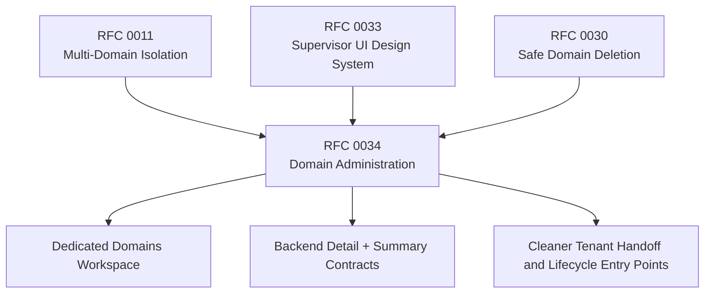

# RFC 0034: Domain Administration in UI and Backend

**Author:** Codex<br>
**Status:** Proposed<br>
**Date:** 2026-04-03<br>
**Updated:** 2026-04-03

## 0. Current Status

As of 2026-04-03, WordClaw already has multi-domain runtime support on `main`, but domain administration is still fragmented.

What is live today:

- row-level domain isolation is a core runtime invariant
- `GET /api/domains` lists accessible domains
- `POST /api/domains` creates a domain
- `POST /api/onboard` creates a domain plus its initial admin key and can optionally create a tenant-scoped supervisor
- platform-scoped supervisors can switch domains from the app-shell selector
- tenant-scoped supervisors are pinned to their assigned domain

What is still missing:

- no dedicated domain administration workspace in the supervisor UI
- no backend detail or summary read model for domain administration
- no first-class update flow for domain metadata such as name or hostname
- no coherent operator handoff flow tying together onboarding, access review, and follow-up administration
- no product-level hub for lifecycle actions, including the separate safe-deletion work from RFC 0030

The result is that the domain primitive exists technically, but not yet as a first-class administrable product object.

## 1. Summary

This RFC proposes a dedicated domain-administration layer across both backend and supervisor UI.

The goal is to turn domain administration into an explicit operator workflow instead of a collection of isolated capabilities spread across:

- the shell domain selector
- the API Keys onboarding flow
- low-level REST routes
- direct SQL or manual inspection for anything beyond create/list/bootstrap

Primary objectives:

- make domain administration a first-class operator workflow
- reduce reliance on manual SQL or route-local admin affordances for normal tenant operations
- give platform and tenant supervisors a supported place to inspect domain identity, readiness, access posture, and lifecycle state
- add backend detail and summary contracts that support UI administration without bloating the write model
- add backend and UI test coverage for the new administration flows

The proposal introduces:

- a dedicated supervisor workspace for domain administration
- backend detail, summary, and update routes for domains
- a unified place for onboarding handoff, access review, and next actions
- explicit integration with RFC 0030 for decommission and delete actions

This RFC does not replace RFC 0030. RFC 0030 remains the destructive domain lifecycle RFC. RFC 0034 defines the broader domain-administration experience around the domain as a first-class tenant object.

## 2. Dependencies & Graph

- **Builds on:** RFC 0011 (Multi-Domain Tenant Support) for domain isolation and request scoping.
- **Builds on:** RFC 0033 (Supervisor UI Design System and Consistency) for shared page, dialog, filter, card, and inspector patterns.
- **Complements:** RFC 0030 (Safe Domain Deletion and Decommissioning) for decommission and delete semantics.
- **Supports:** hosted multi-tenant operation, tenant onboarding, supervisor handoff, and offboarding readiness.



## 3. Motivation

### 3.1 The Domain Is the Operational Boundary

The `domains` table is the tenant boundary for content, assets, credentials, workflows, jobs, payments, supervisors, invites, and delivery policy.

That makes domain administration a product concern, not just a schema concern.

Operators need to answer routine questions such as:

- what this tenant is
- who can operate it
- whether it is fully bootstrapped
- how active it is
- what its next administrative action should be
- whether it is healthy enough to hand off or retire

Today those questions require jumping across unrelated pages or falling back to direct database inspection.

### 3.2 Current Administration Is Fragmented

The current runtime effectively exposes four domain-oriented actions:

- list
- create
- onboard
- switch active domain

That is enough for bootstrap, but not enough for actual administration.

Current gaps include:

- no domain inventory page
- no domain detail page
- no supported rename/update flow
- no central view of supervisors, invites, keys, or usage counts
- no single page from which an operator can move into keys, forms, content, assets, or lifecycle actions

### 3.3 Hosted Multi-Tenant Operation Needs a Better Operator Contract

In a hosted or agency-style deployment, platform administrators need more than initial setup:

- inspect tenant readiness
- hand off access safely
- review access posture without exposing secrets
- begin cleanup or offboarding from an auditable UI
- avoid hiding tenant administration inside pages whose primary purpose is something else

The current placement of tenant onboarding inside the API Keys page is a symptom of this problem. Credential management and tenant administration are related, but they are not the same workflow.

## 4. Proposal

Introduce a first-class **Domain Administration** surface spanning both backend and supervisor UI.

### 4.1 Product-Level Goals

The domain should become a manageable object with one coherent workflow:

1. create or onboard a domain
2. inspect its identity and current state
3. review access posture and handoff readiness
4. navigate into the tenant's operational surfaces
5. update metadata safely
6. begin decommission or delete through the RFC 0030 lifecycle when needed

### 4.2 Scope

This RFC covers:

- domain inventory and detail UX
- backend detail, summary, and update contracts
- moving create/onboard affordances into a domain-focused UI surface
- access and readiness summaries
- lifecycle entry points that integrate RFC 0030

This RFC does not cover:

- DNS registrar automation
- certificate issuance or TLS management
- external hosting automation for the tenant's website
- replacing existing keys, forms, content, or assets pages with a monolithic admin screen

The scope is WordClaw's internal tenant domain object, not external DNS management.

### 4.3 Supervisor UI Changes

Add a dedicated `/ui/domains` workspace.

The workspace should support:

- domain inventory for platform-scoped supervisors
- current-domain detail for tenant-scoped supervisors
- create and onboard actions
- identity, access, usage, readiness, and lifecycle sections
- direct links into related pages such as keys, supervisors, invites, forms, content, assets, and jobs

The shell domain selector remains a quick context switcher, but it should no longer be the only domain-oriented UI.

### 4.4 Backend Changes

Add a domain-administration contract that goes beyond simple list/create:

- `GET /api/domains`
- `GET /api/domains/:id`
- `GET /api/domains/:id/summary`
- `PATCH /api/domains/:id`
- `POST /api/domains`
- `POST /api/onboard`

Integration with RFC 0030:

- `GET /api/domains/:id/deletion-plan`
- `POST /api/domains/:id/decommission`
- `DELETE /api/domains/:id`

This RFC treats the RFC 0030 lifecycle routes as part of the domain-administration surface once they exist, but it does not redefine their semantics.

## 5. Technical Design (Architecture)

### 5.1 Keep the Write Model Small, Add Better Read Models First

The current `domains` table is intentionally small:

- `id`
- `hostname`
- `name`
- `createdAt`
- `updatedAt`

That simplicity is useful and should not be expanded casually.

Phase 1 should prefer **aggregated read models** over speculative schema growth. The UI needs richer administration data, but most of that data can be derived from related tables rather than stored directly on the domain record.

If RFC 0030 lands first, the administration read model may also expose lifecycle status derived from the domain lifecycle metadata introduced there.

### 5.2 Inventory Contract

`GET /api/domains` should evolve from a minimal list into a proper inventory contract.

Recommended fields:

- `id`
- `name`
- `hostname`
- `status`
- `createdAt`
- `updatedAt`
- optional lightweight readiness or usage indicators suitable for list rows

Recommended query options:

- `q`
- `includeInactive`
- `limit`
- `offset`

Authorization semantics:

- platform-scoped supervisors can see the full inventory
- tenant-scoped supervisors continue to see only their bound domain

The route should remain lightweight enough for the shell selector while also supporting the dedicated domains page.

### 5.3 Detail Contract

Add `GET /api/domains/:id`.

This route returns the canonical domain record and actor-appropriate policy metadata needed for the detail page and edit flows.

Use cases:

- detail-page header
- edit form defaults
- authorization-aware action rendering
- validation that the actor is allowed to inspect the requested domain

Suggested response shape:

```json
{
  "domain": {
    "id": 7,
    "name": "Epilomedia",
    "hostname": "epilomedia.com",
    "status": "active",
    "createdAt": "2026-04-03T10:00:00.000Z",
    "updatedAt": "2026-04-03T10:00:00.000Z"
  },
  "permissions": {
    "canUpdate": true,
    "canOnboard": true,
    "canDecommission": false,
    "canDelete": false
  }
}
```

### 5.4 Summary Contract

Add `GET /api/domains/:id/summary`.

This is the main backend read model for domain administration. It should aggregate the information operators actually need without forcing the UI to stitch together a dozen unrelated API calls.

Suggested summary sections:

- `access`
- `usage`
- `activity`
- `readiness`
- `lifecycle`

Suggested counters:

- tenant supervisors
- pending supervisor invites
- active API keys
- admin-scoped API keys
- content types
- content items
- assets
- forms
- jobs
- webhooks
- payments
- audit events

Suggested readiness warnings:

- no tenant-scoped supervisor exists
- no active admin key exists
- no content model exists yet
- domain is decommissioned

Suggested response shape:

```json
{
  "domain": {
    "id": 7,
    "name": "Epilomedia",
    "hostname": "epilomedia.com",
    "status": "active"
  },
  "access": {
    "tenantSupervisors": 2,
    "pendingInvites": 1,
    "activeApiKeys": 4,
    "adminApiKeys": 1
  },
  "usage": {
    "contentTypes": 5,
    "contentItems": 212,
    "assets": 39,
    "forms": 3,
    "jobs": 17,
    "webhooks": 2,
    "payments": 4,
    "auditLogs": 218
  },
  "activity": {
    "lastAuditEventAt": "2026-04-03T11:20:00.000Z"
  },
  "readiness": {
    "warnings": []
  },
  "lifecycle": {
    "status": "active"
  }
}
```

### 5.5 Update Contract

Add `PATCH /api/domains/:id`.

Initial editable fields:

- `name`
- `hostname`

Write semantics:

- `name` is a normal metadata update
- `hostname` is a higher-risk update and must remain unique
- hostname changes should be validated, conflict-checked, and audited explicitly

Suggested guardrails for hostname change:

- explicit hostname format validation
- deterministic conflict error when another domain already owns the hostname
- stronger UI confirmation when the hostname changes
- operator-facing warning that callbacks, integrations, or tenant expectations may depend on the old hostname

This RFC intentionally keeps the editable surface narrow. The initial improvement is operational clarity, not a broad tenant metadata system.

### 5.6 UI Information Architecture

Recommended route structure:

- `/ui/domains`
- `/ui/domains/[id]`

Recommended composition:

- inventory table for platform-scoped supervisors
- current-domain detail card for tenant-scoped supervisors
- summary cards for access, usage, readiness, and lifecycle
- dialogs for create, onboard, and edit
- quick actions for switch domain, open keys, open supervisors, open invites, open forms, open content, and open lifecycle actions

The page should use the shared design-system direction from RFC 0033, especially:

- `PageHeader`
- `Card` or `Surface`
- `StatGrid`
- `Dialog`
- `Alert`
- `FilterBar`
- `MetadataList`

### 5.7 Onboarding and Handoff Changes

Tenant onboarding should become a domain-administration action, not a hidden side effect of the API Keys page.

That means:

- `POST /api/onboard` remains a backend bootstrap contract
- the primary UI entry point for onboarding moves to `/ui/domains`
- the API Keys page remains focused on credential management after bootstrap

The domain detail page should make handoff state visible:

- whether a tenant-scoped supervisor exists
- whether invites are pending
- whether an initial admin key was issued
- which next actions are recommended

This lets operators complete tenant handoff without having to remember where each follow-up operation lives.

### 5.8 Relationship to Existing Pages

This RFC does not collapse tenant operations into a single admin page.

Instead, `/ui/domains` becomes the hub that links into existing domain-scoped workspaces:

- API keys
- supervisors and invites
- agents
- forms
- content
- assets
- jobs

The domain page should answer:

- what this tenant is
- who can operate it
- how active it is
- whether it looks under-configured or ready
- where the operator should go next

### 5.9 Access Model

Recommended access rules:

- **Platform-scoped supervisors**
  - full inventory
  - create
  - onboard
  - update
  - lifecycle actions subject to RFC 0030 policy
- **Tenant-scoped supervisors**
  - view only their bound domain
  - no cross-tenant inventory
  - no cross-tenant update
  - no access to destructive lifecycle actions unless a later policy explicitly adds them

This keeps the workspace useful for tenant operators without weakening cross-tenant isolation.

### 5.10 Auditing

Every domain-administration mutation should be audit-linked:

- create
- onboard
- rename
- hostname change
- decommission
- delete

Summary reads do not need dedicated audit entries. Mutations do.

## 6. Alternatives Considered

### 6.1 Keep Domain Management Split Across Existing Pages

Rejected because it preserves the current problem. The shell selector, onboarding modal, and low-level routes are individually useful, but together they still do not form a coherent administration workflow.

### 6.2 Build Only Backend Routes Without a Supervisor Workspace

Rejected because the main operator gap is discoverability and workflow fragmentation. API parity helps, but it does not solve the human administration problem by itself.

### 6.3 Expand RFC 0030 to Cover All Domain Administration

Rejected because RFC 0030 is specifically about safe decommission and deletion. Domain administration is broader than destructive lifecycle and deserves its own product-level contract.

### 6.4 Add Many New Domain Metadata Fields Up Front

Rejected for the first phase. The immediate need is better administration and visibility, not a large speculative domain-profile schema. Read models and narrow update contracts are the lower-risk path.

## 7. Security & Privacy Implications

This RFC affects tenant administration and tenant metadata, so authorization boundaries are critical.

Security requirements:

- platform-only actions must remain platform-only
- tenant-scoped supervisors must never gain cross-tenant inventory access
- hostname changes must remain unique and auditable
- the summary model must expose posture and counts, not raw secret material
- lifecycle actions must preserve RFC 0030 guardrails rather than bypass them through a friendlier UI

Privacy considerations:

- summary responses should default to counts and status, not secret values
- any related-actor display should expose only identities the requesting actor is allowed to see
- UI surfaces must avoid turning API-key or invite management into a secret-leak path

## 8. Verification & Test Coverage

This RFC should land with both backend and UI test coverage.

Backend:

- route contract tests for inventory, detail, summary, and update behavior
- authorization tests for platform versus tenant-scoped supervisors
- conflict tests for duplicate hostname updates
- lifecycle integration tests once RFC 0030 routes exist

UI:

- inventory rendering tests for platform-scoped supervisors
- tenant-scoped detail rendering tests
- loading, empty, and error-state tests for the domains workspace
- dialog tests for create, onboard, and edit flows
- role-based visibility tests for action gating
- route-level coverage that confirms the new domains workspace becomes the supported entry point for onboarding and administration

## 9. Rollout Plan / Milestones

1. **Phase 1: Backend Read Models**
   - add `GET /api/domains/:id`
   - add `GET /api/domains/:id/summary`
   - enrich `GET /api/domains` for inventory use
2. **Phase 2: Supervisor Domains Workspace**
   - add `/ui/domains`
   - add platform inventory and tenant read-only detail surface
3. **Phase 3: Metadata Update Flow**
   - add `PATCH /api/domains/:id`
   - add UI edit flow for name and hostname
4. **Phase 4: Onboarding and Handoff Consolidation**
   - move the primary tenant onboard action into `/ui/domains`
   - add readiness and handoff guidance in domain detail
5. **Phase 5: Lifecycle Integration**
   - integrate RFC 0030 deletion-plan, decommission, and delete flows into the domain detail surface once shipped
6. **Phase 6: Test Coverage and Hardening**
   - add backend contract coverage
   - add UI route coverage for inventory, detail, edit, and role gating

## 10. Success Criteria

- platform administrators can create, inspect, update, and hand off domains without SQL
- tenant-scoped supervisors can inspect their bound domain through a supported UI surface
- the supervisor UI exposes a dedicated domains workspace instead of relying on the shell selector and API Keys page alone
- the backend exposes detail and summary contracts suitable for UI administration
- hostname and name changes are validated and audited
- onboarding is discoverable from the domains workspace rather than hidden inside a credential-management route
- lifecycle actions, when available, are discoverable from the domain administration flow instead of requiring ad hoc operator knowledge
- backend and UI tests cover the core administration flows
