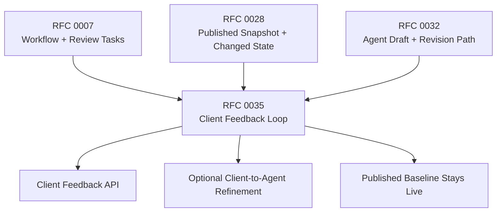

# RFC 0035: External Feedback and Client Prompt Loops for Published Content

**Author:** Codex<br>
**Status:** Proposed<br>
**Date:** 2026-04-03<br>
**Updated:** 2026-04-03

## 0. Current Status

As of 2026-04-03, WordClaw already has most of the runtime primitives needed for governed post-delivery iteration:

- workflow-governed review tasks and approval decisions from RFC 0007
- immutable content versions and published-snapshot reads from RFC 0028
- derived `publicationState` values: `draft`, `published`, and `changed`
- item-level comments with actor metadata fields
- provider-backed draft generation plus supervisor-driven AI revision prompts for generated drafts

That foundation is enough for:

- author or agent creates a draft
- supervisor reviews it
- approved content becomes published
- supervisor can request another AI revision while a review task is pending

What is still missing is the clean client-facing loop after publication.

Today a trusted downstream app can approximate that loop by:

1. adding a comment
2. calling `POST /api/content-items/:id/submit`
3. having a supervisor or agent revise the draft manually

That works mechanically, but it is not a good product contract:

- there is no first-class API for client feedback on already-published items
- there is no canonical way to attribute the feedback to the real client actor
- the review queue cannot clearly distinguish initial review from client-triggered follow-up
- there is no first-class option for the client to keep refining the result with the agent instead of routing every iteration through a human

Important clarification:

- RFC 0028 already gives WordClaw the right publication behavior for this flow
- when a newer working copy exists and a published snapshot is available, published-only reads can already return the published snapshot while the working copy continues forward as `publicationState = changed`

This RFC should reuse that behavior, not invent a second publication model.

## 1. Summary

This RFC proposes a minimal first-class contract for client feedback loops on already-published governed content.

The core requirement is straightforward:

1. a client reviews a published item, such as a proposal
2. the client submits structured feedback and optionally a free-form refinement prompt
3. WordClaw records that feedback as an auditable event attributed to the client
4. WordClaw either:
   - routes the change request to a human-supervised review loop, or
   - lets the client continue refining the working copy directly with the agent
5. the published snapshot remains the live version until a replacement is approved through the existing workflow

The key addition is an optional refinement mode:

- `human_supervised`: the client feedback becomes a supervisor-facing revision brief
- `agent_direct`: the client prompt is handed to the existing agent revision path so the client can continue refining with the agent instead of waiting on a human for every iteration

This RFC intentionally stays narrow:

- it does not introduce a generic chat product
- it does not add a new publication-state system
- it does not require GraphQL or MCP parity in phase 1
- it does not change the existing approval requirement for publishing unless a tenant's workflow already allows that

## 2. Dependencies & Graph

- **Builds on:** RFC 0007 (Policy-Driven Editorial Workflow) for review tasks and approval decisions.
- **Builds on:** RFC 0028 (Content Modeling and Supervisor Ergonomics) for published-snapshot versus working-copy reads.
- **Builds on:** RFC 0032 (Multimodal Agent Intake and Draft Generation Pipelines) for workforce-agent-backed draft generation and prompt-based AI revision.
- **Touches lightly:** RFC 0033 (Supervisor UI Design System and Consistency) for queue labels and inspector presentation, but this RFC is primarily a backend/runtime proposal.



## 3. Motivation

### 3.1 Published Delivery Is Often the Start of the Real Loop

For proposal delivery and similar workflows, publication is not the end state.

The common sequence is:

1. a proposal is generated and approved
2. the proposal is delivered to the client
3. the client responds with notes, questions, or requested changes
4. the proposal needs one or more refinement rounds before the final version is accepted

That loop belongs inside the governed content system when the resulting artifact is still a governed content item.

### 3.2 Comments Plus Submit Is Not a Product Contract

The current stopgap requires downstream apps to compose low-level primitives on their own:

- write a comment
- call submit
- ask a human or supervisor to interpret the comment

That is too loose for a repeatable client loop because it leaves several important questions unresolved:

- who actually submitted the change request?
- was this a client acceptance, a request for changes, or a free-form prompt?
- should the next step go to a human or directly to the agent?
- which queue item exists because of this event?

### 3.3 The Missing Piece Is the Loop Contract, Not Another State Machine

WordClaw already has the core publication semantics it needs.

The missing piece is the contract for moving from:

- published content visible to the client

to:

- client feedback or prompt
- working-copy refinement
- governed approval of the next published version

This is mainly a feedback-entry and orchestration problem, not a new content-state problem.

## 4. Proposal

Introduce a first-class **external feedback submission** action for published content, with an optional **client-direct agent refinement** mode.

### 4.1 Core Product Behavior

For a published governed content item:

1. a trusted downstream experience presents the published version to the client
2. the client submits any combination of:
   - a structured decision
   - a comment
   - a free-form prompt describing what to change
3. WordClaw records that submission as a first-class external feedback event
4. if the submission requests revision, WordClaw keeps the last published snapshot live and continues work on the working copy
5. the submission follows one of two modes:
   - `human_supervised`
   - `agent_direct`
6. any replacement publication still follows the existing workflow approval path unless the tenant already has a workflow that says otherwise

### 4.2 Route Contract

Add a canonical route:

- `POST /api/content-items/:id/external-feedback`

Suggested request body:

```json
{
  "decision": "changes_requested",
  "comment": "The scope is close, but we want a slower rollout and clearer support boundaries.",
  "prompt": "Revise the proposal to phase onboarding over two sprints and tighten the support assumptions.",
  "submitter": {
    "actorId": "proposal-contact:123",
    "actorType": "external_requester",
    "actorSource": "proposal_portal",
    "displayName": "Jane Smith",
    "email": "jane@client.com"
  },
  "refinementMode": "agent_direct"
}
```

Validation rules:

- the item must belong to the current tenant
- the item must already have a published snapshot
- at least one of `decision`, `comment`, or `prompt` must be present
- `refinementMode` defaults to `human_supervised`
- `agent_direct` is only valid when the item can reuse an existing agent-backed revision path

Suggested initial decision values:

- `accepted`
- `changes_requested`

`decision` can be omitted for prompt-only or comment-only feedback.

### 4.3 Feedback Modes

#### `human_supervised`

Use when the client should hand feedback back to a human-led review loop.

Behavior:

- record the feedback event
- append a readable comment attributed to the external actor
- create or update a pending review task classified as external feedback
- surface the prompt and comment to the supervisor as the revision brief
- do not automatically invoke the agent

#### `agent_direct`

Use when the client should be allowed to keep refining the working copy directly with the agent.

Behavior:

- record the feedback event
- append a readable comment attributed to the external actor
- reuse the same bounded revision path already used by `POST /api/review-tasks/:id/revise`
- keep the revision constrained to the existing target schema, workforce agent, and provider strategy
- leave final publication approval to the existing workflow unless the tenant has explicitly configured otherwise

Important constraint:

- "without human supervision" in this RFC means the iterative refinement step can go directly from client to agent
- it does not imply that a newly revised version bypasses the existing publication approval policy

### 4.4 Data Model

Add a dedicated table, for example `external_feedback_events`.

Suggested fields:

- `id`
- `domainId`
- `contentItemId`
- `publishedVersion`
- `decision` nullable
- `comment` nullable
- `prompt` nullable
- `refinementMode` (`human_supervised`, `agent_direct`)
- `actorId`
- `actorType`
- `actorSource`
- `actorDisplayName`
- `actorEmail`
- `reviewTaskId` nullable
- `createdAt`

Why a dedicated table is still worth it even in a narrow RFC:

- client prompts and decisions are operational events, not just discussion text
- the queue needs to know which task came from client feedback
- the system needs an append-only audit trail of client-driven iterations
- every client prompt can be represented as another feedback event without introducing a full chat-thread subsystem

Comments should still be written for readability, but the feedback-event row is the source of truth.

### 4.5 Runtime Flow

For feedback that does not request revision, for example `accepted` with no prompt:

1. verify tenant and item ownership
2. verify a published snapshot exists
3. record the feedback event
4. append a readable comment
5. return without creating a new review task

For feedback that requests revision:

1. verify tenant and item ownership
2. verify a published snapshot exists
3. record the feedback event
4. append a readable comment with external actor attribution
5. create or update a pending review task classified as `external_feedback`
6. move the working copy into the normal under-review lane as needed
7. keep the published snapshot as the live read source through the existing `publicationState = changed` behavior

If `refinementMode = agent_direct` and a prompt is provided:

1. resolve the existing draft-generation or agent-revision context for the content item
2. reuse the current bounded AI revision path
3. write the revised working copy back to the content item
4. keep or create the pending review task for the resulting revision if workflow approval is still required

If no reusable agent-backed revision context exists:

- return a clear error for `agent_direct`
- the caller can retry with `human_supervised`

### 4.6 Review Task Extensions

To keep queue semantics clear without adding a new derived state model, extend review tasks with minimal source metadata:

- `source` (`author_submit`, `external_feedback`)
- `sourceEventId` nullable

That is enough for the queue and inspector to distinguish:

- initial approval
- client-requested follow-up

This RFC does **not** introduce a new `reviewState` read model in v1.

Existing `publicationState` plus task source metadata is sufficient for the core use case.

### 4.7 Publication-State Behavior

The publication behavior in this RFC should stay aligned with RFC 0028:

- the last approved published snapshot remains the published read source
- the newer working copy continues forward separately
- read surfaces already capable of published-only reads should continue to expose the last published snapshot
- the item naturally appears as `publicationState = changed` while the working copy is newer than the published snapshot

This means phase 1 should add contract tests around published-item feedback and revision, not a brand-new publication-state abstraction.

### 4.8 Minimal Supervisor UI Changes

The supervisor UI only needs a small extension for this RFC:

- a queue label such as `Client feedback`
- the client decision, comment, and prompt shown in the inspector
- visible external actor attribution
- a clear indication that the item is already published and the current work is a replacement candidate

This is enough for the first pass.

The RFC does not require a broader portal-status dashboard or a full conversation UI.

### 4.9 Non-Goals

This RFC does not cover:

- a generic chatbot or threaded conversation product
- anonymous public writes directly into published-item feedback without a trusted caller boundary
- CRM, billing, contract-signature, or commercial state management
- broad protocol parity in phase 1
- a second publication-state or review-state system

## 5. Alternatives Considered

### 5.1 Keep Using Comments Plus Submit

Rejected as the main product contract.

It is workable as a stopgap, but it leaves attribution, task source, and client-to-agent refinement undefined.

### 5.2 Build a Full Conversation/Thread System

Rejected for v1.

The core requirement is not "chat."
The core requirement is:

- capture client feedback
- optionally pass client prompts to the agent
- keep the result inside the governed content lifecycle

Append-only feedback events are enough for that first step.

### 5.3 Make Every Client Prompt Go Through a Human

Rejected as the only mode.

That would satisfy auditability, but it would miss the main product advantage in proposal-style workflows:

- after delivery, the client can often refine the document faster by continuing directly with the same bounded agent

The human-supervised mode still exists. It just should not be the only option.

## 6. Security & Privacy Implications

### 6.1 Trusted Caller Boundary

External feedback on published content must remain a trusted write path.

Phase 1 should assume a trusted downstream caller such as:

- a tenant-scoped app/backend
- another authenticated integration under tenant control

Direct anonymous feedback is out of scope.

### 6.2 Actor Attribution and Spoofing

When a trusted caller submits feedback on behalf of a client, WordClaw should record:

- the trusted caller identity
- the asserted external actor identity
- the source integration

That keeps "integration acted" separate from "client said this."

### 6.3 Prompt Safety

Client prompts in `agent_direct` mode must stay within the existing bounded generation setup.

The client prompt should influence the draft revision, but it should not:

- change the workforce agent identity
- expand tool access
- bypass schema validation
- bypass publication approval

### 6.4 PII

Client comments and identity fields may contain personal or commercial data.

The feature should continue to rely on:

- tenant-scoped access control
- audit logging
- least-privilege reads in supervisor and integration surfaces

## 7. Rollout Plan / Milestones

### Phase 1: Core Feedback Contract

- add `external_feedback_events`
- add `POST /api/content-items/:id/external-feedback`
- record external actor metadata
- append readable review comments alongside feedback events
- add contract tests for published-item feedback submission

### Phase 2: Queue Source and Published-Item Tests

- extend review tasks with `source` and `sourceEventId`
- surface client-feedback origin in the approvals queue
- add tests that published-only reads still return the last published snapshot while revision continues

### Phase 3: Optional Client-Direct Agent Refinement

- allow `refinementMode = agent_direct`
- reuse the existing AI revision path for eligible items
- return clear errors for ineligible items or deterministic-only revision contexts
- add end-to-end tests for proposal-style loops:
  - proposal published
  - client submits prompt
  - agent revises working copy
  - supervisor approves replacement publication

## 8. Open Questions

- Should `accepted` with a prompt be treated as a revision request or rejected as contradictory input?
- Should `agent_direct` hard-fail when no reusable agent-backed revision context exists, or should the server optionally downgrade it to `human_supervised`?
- Do we want a second phase for signed client feedback tokens, or is a trusted downstream backend enough for the first production use cases?
