# RFC 0036: Workforce Agent Generated Graphics and Asset Attachments

**Author:** Codex
**Status:** Proposed
**Date:** 2026-04-05
**Updated:** 2026-04-05

## 0. Current Status

As of 2026-04-05, WordClaw already has the main storage and authoring primitives needed for agent-generated graphics, but not the composed product lane.

Current runtime context:

- RFC 0023 media asset storage is shipped on `main`
- schema-aware `asset` and `asset-list` fields already exist and validate same-domain `assetId` references
- asset records already support `public`, `signed`, and `entitled` delivery through the existing asset runtime
- form-backed draft generation and tenant-scoped workforce agents already ship on `main`
- draft-generation jobs can already forward referenced intake images into OpenAI, Anthropic, and Gemini requests as input context
- workforce-agent-backed draft generation can now also use same-domain semantic retrieval for supporting context
- there is still no first-class core path for workforce agents to generate new graphics, persist them as WordClaw assets, and attach those assets to generated content

That means the current system can consume images but cannot yet produce governed image output as part of the same workforce generation flow.

## 1. Summary

This RFC proposes extending workforce-agent-backed draft generation so agents can generate graphics such as hero images, diagrams, illustrations, or galleries, store them through WordClaw's existing asset runtime, and attach them back into schema-bound content using normal `asset` and `asset-list` fields.

The key constraint is intentional:

- generated graphics must become first-class WordClaw asset records
- generated content must reference those assets through validated schema-aware asset references
- delivery must continue to flow through the existing asset access model instead of bypassing it with raw hosted URLs

In plain language:

1. a workforce agent generates text for a content item
2. the same run can also generate one or more graphics
3. each generated graphic is persisted as a WordClaw asset
4. the final content payload stores `{ "assetId": ... }` references in the target fields
5. the resulting item can be reviewed, published, and served through the normal asset and content runtime

## 2. Motivation

### 2.1 Product Need

The current workforce-agent lane is already useful for structured text drafting, but many real publishing flows need visual output too:

- landing-page hero images
- campaign artwork
- proposal cover graphics
- case-study diagrams
- blog thumbnails
- product or feature illustrations
- simple generated image sets or galleries

Without this capability, teams have to stitch together a second system for image creation, then manually upload and attach the results afterward.

### 2.2 Why This Should Stay Inside WordClaw

WordClaw already owns the right primitives:

- schema-first content validation
- tenant and domain isolation
- first-class asset storage and access control
- background jobs
- workforce-agent routing and provider provisioning
- workflow review and auditability

If image generation happens outside this runtime:

- asset lifecycle drifts away from content lifecycle
- audit and provenance become weaker
- delivery policy becomes inconsistent
- generated content may reference brittle raw URLs
- supervisors lose a coherent review surface

### 2.3 What Is Missing Today

The missing capability is not storage. It is orchestration.

Today the runtime can:

- receive asset references from intake
- inline supported image assets into model prompts
- validate output content against schema
- store and serve asset records

Today the runtime cannot:

- ask a workforce agent to produce image output for target content fields
- persist those generated bytes through the asset service
- replace generated placeholders with real `assetId` references before final content validation

## 3. Proposal

Introduce an optional **Generated Graphics for Workforce Agents** capability built directly on top of the current draft-generation and asset runtime.

The product shape should be:

1. a form or workflow-triggered workforce generation run targets a normal content type
2. the target schema may contain `asset` or `asset-list` fields
3. the form or workforce agent config declares which of those fields are eligible for generated graphics
4. the text-generation phase produces both structured content and image intents
5. the image-generation phase turns those intents into binary image output
6. the runtime stores each image as an asset in the current domain
7. the final content payload is rewritten to use schema-valid `{ assetId }` references
8. the resulting content item continues through normal review, publication, and delivery flows

This should remain a bounded content pipeline, not a generic free-form image playground.

```mermaid
flowchart LR
  A["Form submission or review-triggered revision"] --> B["Draft generation job queued"]
  B --> C["Workforce text generation"]
  C --> D["Image intents resolved for eligible target fields"]
  D --> E["Image provider generates bytes"]
  E --> F["WordClaw asset records created"]
  F --> G["Final content payload rewritten with assetId references"]
  G --> H["Schema validation"]
  H --> I["Draft stored and optionally submitted to review"]
```



## 4. Design Goals

### 4.1 Use Existing Asset Primitives

Generated graphics must be stored as ordinary WordClaw assets, not a separate media table or opaque blob record.

### 4.2 Keep Schema Safety

Only fields declared as `asset` or `asset-list` should be writable by this feature. The final content payload must still pass the normal same-domain asset-reference validation rules.

### 4.3 Preserve Delivery Policy

Generated assets must use the existing access model:

- `public`
- `signed`
- `entitled`

This RFC does not introduce a parallel image-serving contract.

### 4.4 Keep the Draft Lane Auditable

The full path from prompt intent to created asset IDs must be inspectable through jobs, audit logs, and final content state.

### 4.5 Avoid Unnecessary Subsystems

This should extend the existing `draft_generation` job lane rather than inventing a second agent-image orchestration framework unless experience later proves that split is required.

## 5. Technical Design

### 5.1 Configuration Model

The capability should be opt-in and bounded from configuration attached to the same workforce or form path that already drives draft generation.

Recommended shape:

- keep workforce agents responsible for the broad drafting behavior and provider defaults
- keep form draft-generation config responsible for field-level output mapping and target-schema coupling
- allow either side to contribute image-generation defaults, with form-level config taking precedence when needed

Illustrative configuration shape:

```json
{
  "draftGeneration": {
    "targetContentTypeId": 42,
    "workforceAgentId": 7,
    "provider": { "type": "openai", "model": "gpt-4.1" },
    "imageGeneration": {
      "enabled": true,
      "provider": { "type": "openai", "model": "gpt-image-1" },
      "defaults": {
        "accessMode": "public",
        "mimeType": "image/png",
        "background": "auto"
      },
      "fields": [
        {
          "targetField": "heroImage",
          "kind": "asset",
          "promptStrategy": "model-authored",
          "required": false
        },
        {
          "targetField": "gallery",
          "kind": "asset-list",
          "promptStrategy": "model-authored",
          "count": 3
        }
      ]
    }
  }
}
```

The core point is not the exact JSON shape. The core point is that image generation must be declared field-by-field against known schema targets.

### 5.2 Eligible Schema Targets

Only target fields with the following schema kinds should be eligible:

- `x-wordclaw-field-kind: "asset"`
- `x-wordclaw-field-kind: "asset-list"`

The runtime should reject configuration that points image generation at:

- string URL fields
- unknown fields
- nested targets that are not schema-safe to rewrite
- fields whose cardinality conflicts with the requested generation count

### 5.3 Two-Phase Generation

The current draft-generation path should expand into two phases:

#### Phase 1: Structured Text and Image Intent Generation

The workforce agent produces:

- normal structured text fields
- image intents for configured asset targets

An image intent should carry only the data needed to produce an asset safely, for example:

- target field name
- prompt text
- optional style or aspect hints
- requested count for list fields
- optional alt or caption suggestions

#### Phase 2: Asset Materialization

For each image intent:

1. call the configured image provider
2. receive image bytes plus basic metadata
3. create a first-class asset through the existing asset service
4. attach optional metadata describing origin and provenance
5. rewrite the content payload field with the resulting `{ assetId }` or asset list entries

After all asset writes complete, the runtime validates the final content payload against the target schema.

### 5.4 Image Generation Service

Add a dedicated image-generation service rather than burying image API calls directly inside the jobs service.

Responsibilities:

- normalize image provider config
- build the image request from the image intent
- call the provider API
- normalize returned bytes and MIME type
- enforce file-size and output-type bounds
- return an in-memory binary result ready for asset persistence

This keeps provider-specific image logic separate from:

- text draft generation
- job orchestration
- asset persistence

### 5.5 Asset Persistence

Persist generated images through the existing asset service rather than direct storage writes.

That guarantees:

- domain isolation
- access-mode consistency
- audit logging
- future provider fallback behavior
- lifecycle parity with manually uploaded assets

Recommended metadata on generated assets:

```json
{
  "source": "workforce_image_generation",
  "workforceAgentId": 7,
  "formId": 12,
  "intakeContentItemId": 88,
  "generatedForField": "heroImage",
  "jobId": 123,
  "provider": {
    "type": "openai",
    "model": "gpt-image-1"
  }
}
```

This should remain metadata, not a new relational subsystem.

### 5.6 Final Content Shape

The stored content should continue to use standard asset references.

Single image example:

```json
{
  "title": "Autonomous Workflow Guide",
  "heroImage": {
    "assetId": 144
  }
}
```

Gallery example:

```json
{
  "title": "Feature Launch Kit",
  "gallery": [
    { "assetId": 201 },
    { "assetId": 202 },
    { "assetId": 203 }
  ]
}
```

This RFC deliberately avoids introducing asset URLs into the canonical content shape.

## 6. Runtime Behavior

### 6.1 Draft Generation Jobs

The existing `draft_generation` job kind should remain the orchestration lane for the first supported implementation.

Recommended behavior:

- reuse the current queue and retry model
- extend the job payload with image-generation config or resolved image-generation context
- record generated asset IDs in the job result
- include generated asset metadata in draft-generation completion webhooks where useful

Illustrative result shape:

```json
{
  "generatedContentItemId": 144,
  "generatedStatus": "draft",
  "reviewTaskId": null,
  "generatedAssets": [
    {
      "targetField": "heroImage",
      "assetId": 301,
      "mimeType": "image/png",
      "accessMode": "public"
    }
  ]
}
```

### 6.2 Review-Time Revisions

Review-triggered AI revisions should not blindly regenerate all graphics on every edit.

Default rule:

- preserve existing generated asset references unless the revision prompt explicitly requests image changes or a configured policy demands a full visual refresh

This avoids:

- unnecessary provider cost
- asset sprawl
- unstable content diffs
- churn in review cycles where only text changed

An explicit follow-up mode can later support:

- keep visuals unchanged
- selectively regenerate one field
- fully regenerate all generated visuals

### 6.3 Failure Handling

Failure modes should be explicit and inspectable:

- text generation succeeded but image generation failed
- some images succeeded and some failed
- image generation succeeded but final content validation failed
- asset persistence failed after provider output returned

The initial supported behavior should favor fail-closed semantics for required image targets:

- if a required generated image field cannot be materialized, the job fails
- if an optional generated image field fails, the field may be omitted if the configuration explicitly allows that

## 7. API and Discovery Surfaces

This capability should be visible through the same discovery model as the rest of draft generation.

### 7.1 Capability Discovery

Update capability and deployment manifests to report:

- whether image generation is supported at all
- which providers are supported
- whether generated graphics require tenant-level provisioning
- supported output MIME types
- supported target field kinds

### 7.2 REST and MCP

At minimum, the existing form, workforce-agent, and provider-management surfaces should be extended so operators can:

- configure image-generation behavior
- inspect whether it is provisioned
- see generated asset IDs in job and webhook outcomes

This RFC does not require a public generic "generate image" endpoint as a first milestone. The core requirement is workforce-pipeline integration.

## 8. Security, Policy, and Privacy

### 8.1 Domain Isolation

All generated assets must be created in the same `domainId` as the workforce draft job.

### 8.2 Access Mode Control

Operators must be able to choose whether generated assets are:

- `public`
- `signed`
- `entitled`

The default should be explicit, not inferred from provider behavior.

### 8.3 Prompt and Metadata Hygiene

Generated asset metadata should preserve provenance, but prompts and model-side request details may need light sanitization to avoid storing sensitive intake details more broadly than necessary.

### 8.4 Policy Enforcement

If the runtime later grows more granular policy hooks for image generation, they should bind to the same tenant and workforce boundaries already enforced for draft generation and asset writes.

## 9. Alternatives Considered

### 9.1 Store Raw Image URLs in Content

Rejected.

This bypasses:

- schema-aware asset validation
- asset lifecycle controls
- delivery-mode policy
- coherent provenance and usage graphs

### 9.2 Create a Separate Generated Media Table

Rejected for the first implementation.

The existing asset model is already the right canonical store for generated binary output.

### 9.3 Create a Separate Job Kind for Images

Deferred.

A separate job kind may become useful later for large batch media workflows, but the first implementation should stay inside `draft_generation` to keep the operator experience coherent and avoid fragmenting orchestration too early.

### 9.4 Regenerate Visuals on Every Revision

Rejected as the default.

This creates unnecessary cost, unstable review diffs, and asset churn.

## 10. Rollout Plan

### Phase 1: Configuration and Validation

- add image-generation config to the workforce/form draft-generation lane
- validate configured target fields against `asset` and `asset-list` schema fields
- expose capability discovery for generated graphics

### Phase 2: Image Generation Service

- add a dedicated provider-backed image-generation service
- normalize image output into bytes and metadata suitable for asset persistence

### Phase 3: Draft-Generation Integration

- extend the existing `draft_generation` job to generate image intents
- materialize assets
- rewrite final content payloads with asset references
- include generated asset IDs in job results and notifications

### Phase 4: Review and Revision Semantics

- preserve generated visuals across text-only revisions
- support explicit visual-refresh prompts for targeted fields

### Phase 5: Hardening

- improve observability and retry classification
- add cost controls and quota posture where needed
- evaluate whether derivative variants or post-processing belong in the same lane

## 11. Acceptance Criteria

- workforce-agent-backed draft generation can create graphics for configured `asset` and `asset-list` target fields
- every generated graphic is persisted as a first-class asset in the current domain
- final content items store asset references as `{ assetId }` objects, not raw image URLs
- generated content still passes the normal schema validation path
- asset delivery continues to use the existing `public` / `signed` / `entitled` access model
- draft-generation job results and audit trails expose which assets were created
- review-time AI revisions preserve existing generated graphics unless explicitly asked to change them
- REST/MCP/capability discovery surfaces communicate whether generated graphics are supported and provisioned

## 12. Relationship to Existing RFCs

- **RFC 0023: Media Asset Storage**
  This RFC depends directly on RFC 0023 and intentionally reuses its asset runtime rather than extending around it.

- **RFC 0032: Multimodal Agent Intake and Draft Generation Pipelines**
  RFC 0032 made image assets valid intake context for workforce generation. This RFC extends that lane from image input to image output.
